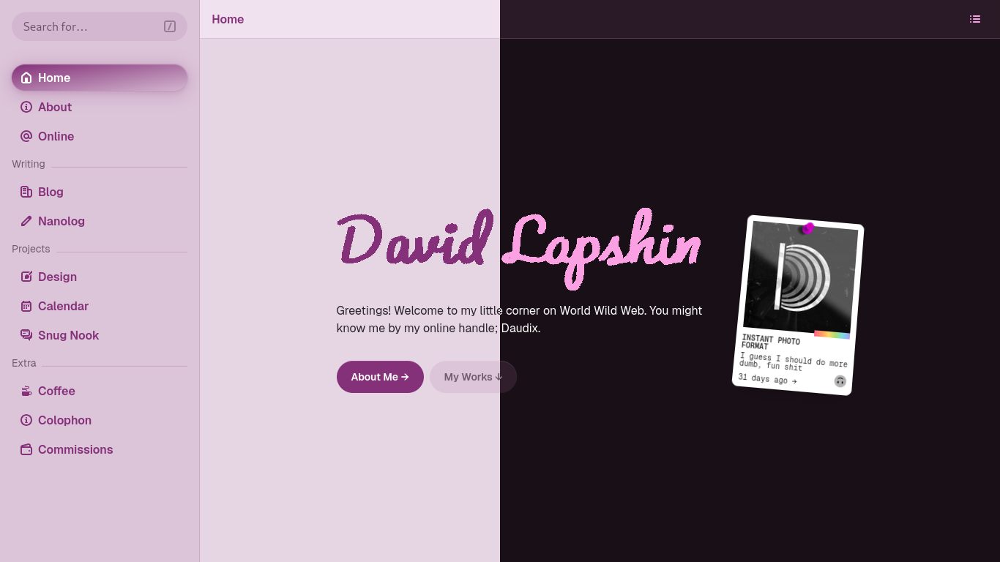

[](https://nogithub.codeberg.page)
[](https://mit-license.org)
[](https://ci.codeberg.org/repos/13333)

# [Daudix’s Blog](https://daudix.codeberg.page) 

This is my personal website. It is powered by [Zola](https://www.getzola.org) and [Duckquill](https://daudix.codeberg.page/duckquill).



## Setup local repository

*These are mostly for myself XD*

- Clone the repository recursively:

```sh
git clone --recursive git@codeberg.org:daudix/pages.git
```

- Checkout `main` branch for Duckquill:

```sh
cd pages/themes/duckquill/
git checkout main
```

- Set remote URL to SSH one:

```sh
git remote set-url origin git@codeberg.org:daudix/duckquill.git
```

## Know your rights

This website is under the MIT license:

- **Freedom to Use**: You have the right to use the software for any purpose, whether it's personal, academic, or commercial.
- **Freedom to Modify**: You can modify the source code of the software to suit your needs or preferences.
- **Freedom to Distribute**: You have the right to distribute the software, whether in its original form or modified, to others.
- **Collaboration**: You can collaborate with others on the software's development and improvement.
- **No License Compatibility Issues**: You can combine the MIT-licensed software with other software, even if they use different licenses.
- **No Usage Restrictions**: There are no restrictions on the technologies or fields of use, giving you maximum flexibility.
- **No Royalties**: You are not required to pay any royalties or fees for using, modifying, or distributing the software.

## Contributing guidelines

There are several ways to contribute to this project:

- Reporting issues
- Discussing potential improvements
- Contributing code
- Writing documentation
- Submitting feature requests
- Providing feedback

When making any sort of contribution, please make sure to follow [Forgejo's Code of Conduct](https://codeberg.org/forgejo/code-of-conduct). If you don't have the time to read it, just know that all you have to do is be nice, and you'll be just fine.

# Credits

- Card image: [Jeremy Thomas](https://unsplash.com/@jeremythomasphoto) on [Unsplash](https://unsplash.com/photos/the-stars-and-galaxy-as-seen-from-rocky-mountain-national-park-4dpAqfTbvKA)

*</> with <3 by [daudix](https://daudix.codeberg.page) | README based on [libreivan's](https://codeberg.org/libreivan/libreivan.com)*
