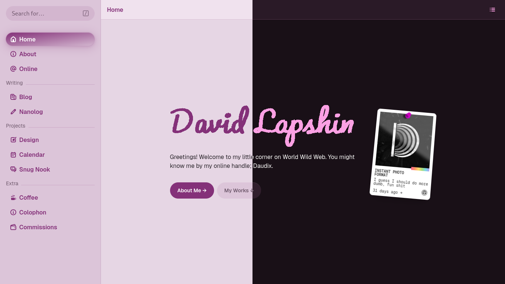

# [daudix.one](https://daudix.one)

The source code of my personal website. It is powered by [Zola](https://www.getzola.org) and [Ametrine](https://ametrine.daudix.one).



## Read Me, for Real

If you like how my website looks and want to make your own based on it: DON'T.

Seriously, just use the [Ametrine](https://ametrine.daudix.one) theme; I'm the author of it and it's literally the same thing minus all my content, custom elements, and the like. Save your nerves, I'm serious.

If you want to reuse *some* custom styles and stuff from here: go ahead! ...just don't borrow too much, I got to have some uniqueness x3

If I wasn't discreet enough: Please don't just copy-paste my site and replace your name with mine. I'm usually pretty chill regarding people copying my site, but sometimes it's just ridiculous. kthxbye.

## Setup Local Repository

Mostly for myself.

- Clone the repository recursively:

```bash
git clone --recursive git@github.com:daudix/daudix.one.git
```

- Checkout `main` branch for Ametrine:

```bash
cd daudix.one/themes/ametrine/
git checkout main
```

- Set the remote URL to an SSH one:

```bash
git remote set-url origin ssh://git@codeberg.org/daudix/ametrine.git
```

</> with <3 by [daudix](https://daudix.one)
