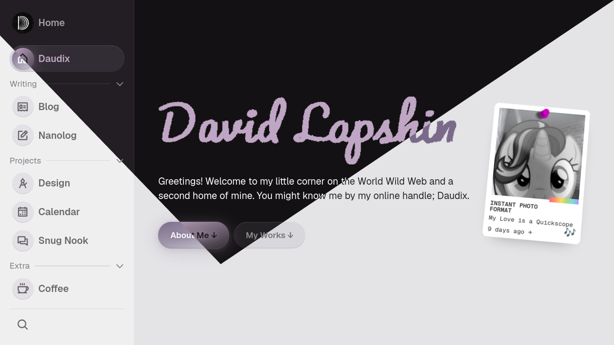

# [daudix.one](https://daudix.one)

[](https://app.netlify.com/projects/daudix/deploys)

The source code of my personal website. It is powered by [Zola](https://www.getzola.org) and [Ametrine](https://ametrine.daudix.one).



## Read Me, for Real

If you like how my website looks and want to make your own based on it: DON'T.

Seriously, just use the [Ametrine](https://ametrine.daudix.one) theme; I'm the author of it and it's literally the same thing minus all my content, custom elements, and the like. Save your nerves, I'm serious.

If you want to use some custom styles and stuff from here: go ahead! ...just don't make it *too similar,* I got to have some uniqueness x3

## Setup Local Repository

Mostly for myself.

- Clone the repository recursively:

```bash
git clone --recursive git@github.com:daudix/daudix.one.git
```

- Checkout `main` branch for Ametrine:

```bash
cd daudix.one/themes/ametrine/
git checkout main
```

- Set the remote URL to an SSH one:

```bash
git remote set-url origin ssh://git@codeberg.org/daudix/ametrine.git
```

</> with <3 by [daudix](https://daudix.one)
