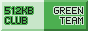

+++
title = "About"
description = "About me, what I do, and more."
+++

# David Lapshin { #header }

<small>Passionate designer, translator, and FOSS contributor.</small>

## About Me

Hello there! My name is David, you may know me by my online handle Daudix.

> Although Daudix may appear as just my online handle, it's actually slightly different persona; perhaps more silly and honest than the "official" David, but they're so tightly tied together so it's fine to use whatever you like.

I'm from the Siberian part of Russia, but currently live in <abbr id="abyss" title="If you know, you know">a̸͙͠b̴̛ͅȳ̴̜s̴̫̄s̸̞̒</abbr>.

Oh and I'm slightly shy.

Some things I like:

- Retro and vintage stuff, as well as retro-futurism
- Small/indie web
- Photography <small>(although I don't have much opportunity to shoot anything else than a view from my window)</small>
- Design
- Purple <small>(I know, it's shocking)</small>

Design is perhaps a bit more than just a thing I like, it's my hobby and I'm learning more about it every day, although lately I've been a bit burned out.

And, as you can see, I do some web development! I like working with CSS and HTML but that's about it, I have no clue how to work with JS :D

My favorite games are:

- Portal series <small>(all-time favorite)</small>
- The Stanley Parable
- Superliminal
- Untitled Goose
- Stardew Valley
- Cyberpunk 2077 <small>(I've only *played* it on YouTube)</small>

## Works

I mostly create and improve icons for around-GNOME apps, if app doesn't have a translation I do it, sometimes I help with UI design.

Currently member of [Nickvision](https://nickvision.org) and [Gradience](https://gradienceteam.github.io) teams as a designer and maintainer respectively.

Have a look at my [designs](@/design/index.md), mostly icons but also some wallpapers (one of them is even shipped with GNOME)

## Find Me

See the [find me](@/findme/index.md#contacts) page.

## This Website

See the [colophon](@/colophon/index.md) page.

## Small Web

Small Web is something I really like, I'm member of multiple tildes/pubnixes, although I don't do much there yet, I still like to be part of them.

Pubnixes/tildes:

- [exozy.me](https://exozy.me) (most used one by me, really cool thing)
- [envs.net](https://envs.net) (looks promising but I need to figure out the website build pipeline)

Gemini capsules:

- [flounder.online](https://flounder.online) - *finger* me at `daudix@flounder.online`

I also have a website on [neocities.org](https://neocities.org), [check it out](https://daudix.neocities.org).

## Buttons

<small>Seriously, they're awesome!</small>

If you like my website, feel free to link it by adding one of the buttons:

> Note: It's recommended to avoid hot-linking; instead place a copy on your own site.

Hey, you, yes, *you*. Got website and a button? I have a deal for you! Just [ping me somewhere](@/findme/index.md) and I'll add it here, piece of cake.

