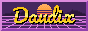

+++
title = "About"
description = "About me, what I do, and more."
+++

<div id="about-splash">


# David Lapshin { #header }

<small>Passionate designer, translator, and FOSS contributor.</small>
</div>

## About

Hello there! My name is David, you may know me by my online handle Daudix.

> Although Daudix may appear as just my online handle, it's actually slightly different persona; perhaps more silly and honest than the "official" David, but they're so tightly tied together so it's fine to use whatever you like.

I'm from the Siberian part of Russia, but currently live in <abbr title="If you know you know">▒▓░▒▓░</abbr>.

Oh and I'm slightly <span id="shy">shy</span>.

Some things I like:

- Photography <small>(although I don't have much opportunity to shoot anything else than a view from my window)</small>
- Design
- Open source
- Retro and vintage stuff, as well as retro-futurism
- Small/indie web

My favorite games are:

- Portal series
- Untitled Goose
- The Stanley Parable
- Stardew Valley
- Cyberpunk 2077 <small>(I've only *played* it on YouTube)</small>

Design is a perhaps a bit more than just a thing I like, it's my hobby that I learn more about every day.

I'm also in process of learning 3D modeling in Blender and Pixel art in Aseprite.

And, as you can see, I do some web development! I like working with CSS and HTML but that's about it, I have no clue how to work with JS :D

## Works

I mostly create and improve icons for around-GNOME apps, if app doesn't have a translation I do it, sometimes I help with UI design.

Currently member of [Nickvision](https://nickvision.org) and [Gradience](https://gradienceteam.github.io) teams as a designer and maintainer respectively.

Have a look at my [designs](@/design/index.md), mostly icons but also some wallpapers (one of them is even shipped with GNOME)

## Contacts

Currently it's <time><span id="clock"><noscript>JavaScript required</noscript></span></time> <small>(UTC+3)</small> for me, so take that into consideration if I don't respond promptly.

> **Tip:** Check my online status on the [home](@/_index.md) page in the form of a small dot on the avatar.

Feel free to send me a message on any of these. Whether you're bored or need someone to listen to you, I'm always open!

<small>From most preferred to the least ↓</small>

- [Matrix](https://matrix.to/#/@daudix:envs.net)
- [Discord](https://discord.com/users/650757995378114581)
- [Telegram](https://t.me/ddaudix)
- [Mail](mailto:daudix@envs.net)
- ~~[Signal](https://signal.me/#eu/0KKOAPEjDPbNVKFfWbNu9AHZE2od2quKOO5NxLmFqf/xA9940S5JKZbOhTwoa2wP)~~ <small>(my phone is burnt so don't use it, I won't recieve the message)</small>
- ~~[XMPP](xmpp:daudix@nixnet.services)~~ <small>(admin is a pedo, so currently looking for a different server)</small>

## Socials

List of places where you can ~~stalk~~ find me on:

> This is not a complete list but rather places where I'm somewhat active. You can find me on other platforms as well, although make sure it's the real me by [asking](@/about/index.md#contacts) first.

<small>From most active to the least ↓</small>

- [Mastodon](https://social.treehouse.systems/@daudix)
- [Akkoma](https://pleroma.envs.net/daudix)
- [Pixelfed](https://pixelfed.social/Daudix)
- [Lemmy](https://lemmy.zip/u/daudix)
- [YouTube](https://www.youtube.com/@ddaudix)

I have changed (and will change) the Fediverse instance I'm on, so to make sure nothing is lost, here is my Fediverse timeline:

<small>From newest to oldest ↓</small>
<ol id="timeline">
	<li><small>05 May 2024 - Today<br><a href="https://vmst.io/@daudix">vmst.io</a> • <span>Main profile</span></small></li>
	<li><small>08 Jan 2024 - Today<br><a href="https://pleroma.envs.net/daudix">pleroma.envs.net</a> • <span>Personal profile</span></small></li>
	<li><small>20 Nov 2023 - 07 May 2024<br><a href="https://social.treehouse.systems/@daudix">social.treehouse.systems</a> • <span>Main profile</span></small></li>
	<li><small>01 Sep 2022 - 20 Nov 2023<br><a href="https://mstdn.social/@Daudix">mstdn.social</a> • <span>Main profile</span></small></li>
</ol>

## Forges

I were using GitHub from the very start of my FOSS journey, but recently I've [migrated to Codeberg](@/blog/migration-from-github-to-codeberg/index.md) because I didn't like where the GitHub is heading.

- [Codeberg](https://codeberg.org/daudix)
- [GitHub](https://github.com/daudix)
- [GitLab](https://gitlab.com/daudix)
- [GitLab (GNOME)](https://gitlab.gnome.org/daudix)

## This Website

If you couldn't tell already, this website is made with love and attention, is contantly updated to be as good as possible, and it tries to be very lightweight and compatible with older browsers (at very least it works on iOS 15 and macOS High Sierra; which I'm sure a lot of people still use)

This website used to be hosted on [GitHub pages](https://web.archive.org/web/20220920130408/https://daudix-ufo.github.io/), then on [Codeberg Pages](https://daudix.codeberg.page), then on [exozy.me](https://daudix.exozy.me), and now it's hosted on Codeberg Pages again.

Why all this mess? well at first I [migrated to Codeberg](@/blog/migration-from-github-to-codeberg/index.md), then I joined [exozy.me](https://exozy.me) which provided way faster CI and overall easier workflow, in addition to prettier domain, but then I found out that only exozyme members can open issues/pull requests, which is not a good thing for a FOSS project like [Duckquill](https://daudix.codeberg.page/duckquill), so I have set up a two-way mirror at [Forgejo Next](https://next.forgejo.org), since [Codeberg](https://codeberg.org) doesn't allow two-way mirrors to prevent high load on infrastructure. Everything worked well until one day, when Forgejo Next wiped all the data; accounts and repos. I had to do something, and I moved back to Codeberg. Now I joined [envs.net](https://envs.net) which provides git hosting with open registrations (as far as I can tell), so maybe I'll move this website there, I still need to see if it's good :)

I'm not good at writing blog posts nor coming up with ideas for them, so it's a bit empty. But hey, who knows when inspiration will kick in, right?

## Small Web

Small Web is something I really like, I'm member of multiple tildes/pubnixes, although I don't do much there yet, I still like to be part of them.

Pubnixes/tildes:

- [exozy.me](https://exozy.me) (most used one by me, really cool thing)
- [envs.net](https://envs.net) (looks promising but I need to figure out the website build pipeline)

Gemini capsules:

- [flounder.online](https://flounder.online) - *finger* me at `daudix@flounder.online`

I also have a website on [neocities.org](https://neocities.org), it's not in a good shape right now, but still, you can see it [here](https://daudix.neocities.org)

[](https://pleroma.envs.net/notice/AeJ5ACKLIOl1bCj2lU)

## Buttons

<small>Seriously, they're awesome!</small>

<div id="netscape-buttons-container">

[](https://512kb.club)
[](https://duckduckgo.com)
[](https://getfirefox.com)
[](https://getimiskon.xyz)
[](https://yesterweb.org/no-to-web3/)
[](https://seirdy.one)
[](https://status.cafe)





</div>

If you like my website, feel free to link it by adding the button:

```html
<a href="https://daudix.codeberg.page" target="_blank"></a>
```

> Note: It's recommended to avoid hot-linking; instead place a copy on your own site.

Hey, you, yes, *you*. Got a nice website? Got nice buttons?  Got any buttons? I have a deal for you! Just [ping me somewhere](@/about/index.md#contacts) and I'll add your button here, piece of cake.

<script type="text/javascript">
	function updateClock() {
		const options = { timeZone: 'Europe/Moscow', hour: '2-digit', minute: '2-digit', hour12: false };
		const now = new Date().toLocaleString('en-US', options);
		const clockElement = document.getElementById('clock');
		clockElement.textContent = now;
	}

	setInterval(updateClock, 1000);
	updateClock();

	function handleClick() {
		const img = document.createElement('img');
		img.id = 'fluttershy';
		img.className = 'transparent no-hover';
		img.src = 'fluttershy.gif';
		const siteNav = document.getElementById('site-nav');
		setTimeout(() => {
			siteNav.parentNode.insertBefore(img, siteNav);
		}, 500);
		setTimeout(() => {
			document.body.removeChild(img);
		}, 2500);
	}

	document.getElementById('shy').addEventListener('click', handleClick);
</script>
