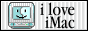

+++
title = "About"
description = "About me, what I do, and more."
[extra]
stylesheets = ["about.css"]
+++

	
  

# David Lapshin { #header }

<small>Trying out things since 2007.</small>

## About Me

Hello there! My name is David, you may know me by my online handle Daudix.


Although Daudix appears to be just my online handle, it's actually a slightly different persona; perhaps more silly and authentic than the "official" David, but it's fine to use whatever you like.


I'm from the Siberian part of Russia, but currently live in <abbr id="abyss" title="If you know, you know">a̸͙͠b̴̛ͅȳ̴̜s̴̫̄s̸̞̒</abbr>.

Things that I like:
- Retro/-futurism and vintage stuff
- Minor details and references
- Smol/indie web
- Photography <small>(although I don't have much opportunity to shoot anything else than a view from my window)</small>
- Design
- Purple <small>(I know, it's shocking)</small>
- Aesthetics:
  - [Vaporwave](https://aesthetics.fandom.com/wiki/Vaporwave)
  - [Cyberpunk](https://aesthetics.fandom.com/wiki/Cyberpunk)
  - [Liminal Space](https://aesthetics.fandom.com/wiki/Liminal_Space)
- Games:
  - Portal <small>(all-time favorite)</small>
  - Celeste
  - Teardown
  - Superliminal
  - Stardew Valley
  - Untitled Goose
  - The Stanley Parable

Design is perhaps a bit more than just a thing I like, it's my hobby and I'm learning more about it every day, although lately I've been a bit burned out.

And, as you can see, I do some web development! I like working with CSS and HTML but that's about it, I have no clue how to work with JS :D

Oh and I'm slightly shy.

## Works

I mostly create and improve icons for around-GNOME apps, if app doesn't have a translation I do it, sometimes I help with UI design.

Currently member of [Nickvision](https://nickvision.org) and [Gradience](https://gradienceteam.github.io) teams as a designer and maintainer respectively.

Have a look at my [designs](@/design/index.md), mostly icons but also some wallpapers (one of them is even shipped with GNOME).

## Small Web

Small Web is something I really like, I'm member of multiple tildes/pubnixes, although I don't do much there yet, I still like to be part of them.

Pubnixes/tildes:

- [exozyme](https://exozy.me)
- [envs](https://envs.net)

I have an alt website on [neocities](https://neocities.org), [check it out](https://daudix.neocities.org).

I also have a [Gemini capsule](gemini://gmi.daudix.one) on [flounder](https://flounder.online), but I recently changed it to serve as a place for jotting down small notes rather than being a mirror of this website. See [this post](@/blog/2024-07-13-repurposing-gemini-capsule/index.md) for the reasons behind this decision. <small>(you can also *finger* me at `daudix@flounder.online`)</small>

## Buttons

<small>Seriously, they're awesome!</small>

If you like my website, feel free to link it by adding one of these buttons:


It's recommended to avoid hot-linking; instead, place a copy on your own site.


Hey, you, yes, *you*. Got website and a button? Just button? I have a deal for you! [Ping me somewhere](@/find/index.md#contacts) so I can add it here, piece of cake.

