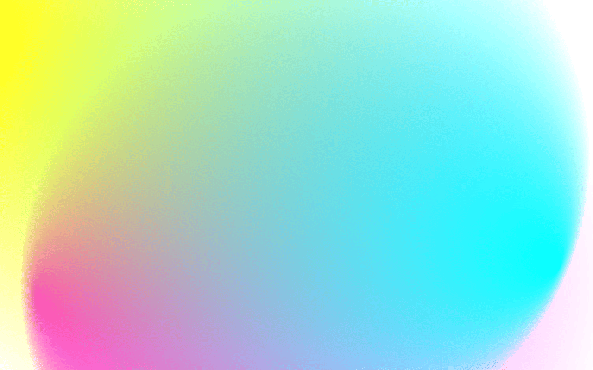

+++
title = "Site and Blog Devlog"
description = "Some behind-the-scenes of the blog update."
[taxonomies]
tags = ["Devlog", "Website"]
[extra]
toc = true
[extra.comments]
host = "mstdn.social"
user = "Daudix"
id = "110882489740462163"
+++

This blog was born two month ago, and since the first revision a lot- no, that's not enough, **hella lot** of stuff has been changed, tweaked and redone from scratch, so here I will list them and my plans for the future of this blog.

## «The Index»

The Index is not only home page, it's also a showcase, info and screensaver pages, they all live in the same `pages` repository, while blog is a completely separate thing with its own repository.

One important change have happened to the Index, now all its pages use the same base, `style.css`, and only page-specific tweaks are specified in page <abbr title="Cascading Style Sheets">CSS</abbr>, e.g showcase page style has `@import url("style.css");` in the beginning instead of exact copy of `index.css`, not only this makes the file size smaller, but also makes the tweaking process a breeze, since stuff can be changed in one place and be applied to every page.

<figcaption>VSCodium screenshot showing off import of base style and some «body» styles</figcaption>

### Home

Home page is a very important page, this page links to all other pages, it gives some basic info about me and some contact links. It didn't change a lot but there are some work been done.

- Proper dark mode have been implemented (well, it were already there but I replaced it with filter hack,more on it in blog section. Now it's enabled back and all the custom stuff have been fixed to support it).
- Background color are a bit different (taken from Libadwaita).
- Added shadows to all cards to give them some depth.

<figcaption>Blog link card with newely added shadow</figcaption>

- Added hover effect for cards that act like a button (blog and showcase).

<video alt="Blog card hover" controls src="blog-card-hover.webm"></video>
<figcaption>Blog link card being hovered with cursor</figcaption>

- Active state for cards (when you click/press on card) have been removed since it looked weird

And more, these are that I could remember.

### Showcase

Showcase have been updated to include more icons, info overlay closing animation have been fixed (previously it just disappeared without any animation) and assets were optimized.

<video alt="Works info overlay" controls src="works-info-overlay.webm"></video>
<figcaption>Demo of opening/closing info overlay</figcaption>

### Info

Info page were completely redesigned, inspired by the design of [Felipe  
Kinoshita's](https://felipekinoshita.com) site. It is more similar to the blog in terms of typography, has nice animated stripes background and a lot of info about me. Compared to the previous version it has way less links - only ones that I actually use.

<video alt="Info page" controls src="info-page.webm"></video>
<figcaption>Me scrolling through the whole page</figcaption>

### Screensaver

Screensaver is a brand-new page, the name is self-explanatory, it's just a pretty screensaver with colorful circles floating around, it is made around [this codepen](https://codepen.io/alvarotrigo/pen/qBMMyxz) by [Álvaro](https://codepen.io/alvarotrigo), from interesting it has «Enter Fulllscreen» button.

<figcaption>Pretty colorful circles blending with each other</figcaption>

## «The Blog»

The blog have seen the most of the changes, it all were flipped upside down to be prettier, and as fast as before.

- Proper dark mode have been implemented from scratch, previously <abbr title="Cascading Style Sheets">CSS</abbr> invert filter with hue rotation were used, it worked but had too much issues: images became unsaturated, emojis creepy, shadows glowing and etc.
- Navigation bar have been added, it has pretty glassy look and shadow. Inspired by the navigation bar of [Micah Ilbery's](https://micahilbery.com) site. I really like how it looks :3

<figcaption>Navigation bar with content behind it being blurred</figcaption>

- Added <abbr title="American Standard Code for Information Interchange">ASCII</abbr> style, now instead of boring code block it uses pretty gradient fill and has this neon glow on hover.

<figcaption>Regular state, it's filled with gradient going from bottom to top, with the bottom being black and top being transparent</figcaption>

<figcaption>Hovered state, it becomes fully black and gains purple-blue glow</figcaption>

- Images now scale up on hover and have round corners.

<video alt="image hover" controls src="image-hover.webm"></video>
<figcaption>Image zooming in on hover, with it loosing rounded corners</figcaption>

- Code blocks now have some filters applied in dark mode for better visibility, the code blocks themselves are now more round and have shadows.

<figcaption>Code block in light mode</figcaption>

<figcaption>...And in dark</figcaption>

- Some colors have been changed, all in all should be more pleasant to the eye.
- Everything now respects global variables, so e.g you can change accent color, roundness, shadows and maximum content width without going through the whole 1200+ <abbr title="Lines Of Code">LOC</abbr> <abbr title="Cascading Style Sheets">CSS</abbr>, this is made not only to keep myself sane but also for _you_ to make it easier to build upon ;)

<video alt="color variables" controls src="color-variables.webm"></video>
<figcaption>Me changing 2 color variables and site respecting this</figcaption>

- The structure have been changed, now uses recommended Jekyll structure for posts.
- Posts now have tags, and tags have its own page.
- Posts now have its own page.
- Posts list on index page now generates automatically on build, this allowed to display tags and publication date.

<figcaption>Automatically generated list of posts on index page</figcaption>

- Table of contents are now generated on build, now I don't have to create it for every page manually.
- Hovering over `© Daudix's Blog, 2023` in footer now displays last built date.

<figcaption>You guess it, last built date is displayed on hover</figcaption>

- Atom Feed is here!

<figcaption>Screenshot of NewsBlur with this blog</figcaption>

- Added Johnvertisements.
- Probably most exiting addition, Mastodon (and any other ActivityPub/​Fediverse account) powered comments! you can _right now_ scroll down and comment! all thanks goes to Cassidy James for [Mastodon-powered Blog Comments](https://cassidyjames.com/blog/fediverse-blog-comments-mastodon) ❤️

<figcaption>Mastodon post about my migration to Codeberg blog post being used as a comment</figcaption>

## One More Thing™

<button class="audio" onclick="playAudio('drum-roll.mp3')">Drum Roll</button> I have a new site at Neocities! it will not replace this one, it's just a silly playground that has this old look. You know... Geocities and stuff.

It's empty <abbr title="At The Moment">ATM</abbr>, but it has [AD-HD button](https://mstdn.social/@Daudix/110872543493210479)!

[Visit it here](https://daudix.neocities.org)

<figcaption>The Neocities website!</figcaption>

## The Future

We'll see, I plan to publish more posts, at least I have an idea for the next one, I'm thinking about making the whole blog a Jekyll template (Duck Template, DuckQuill), but this will mean that I'll need to maintain one more site basically, not sure really, I could sync it with this blog once a month so it doesn't annoy much, idk, will see.

## Conclusion

Phew, that's a lot, 2 months of work! truly happy how it all comes up, hope you too, this is most long-lived site thingy yet, I have learned a lot about <abbr title="Cascading Style Sheets">CSS</abbr> and <abbr title="HyperText Markup Language">HTML</abbr>, and I really like doing this!

