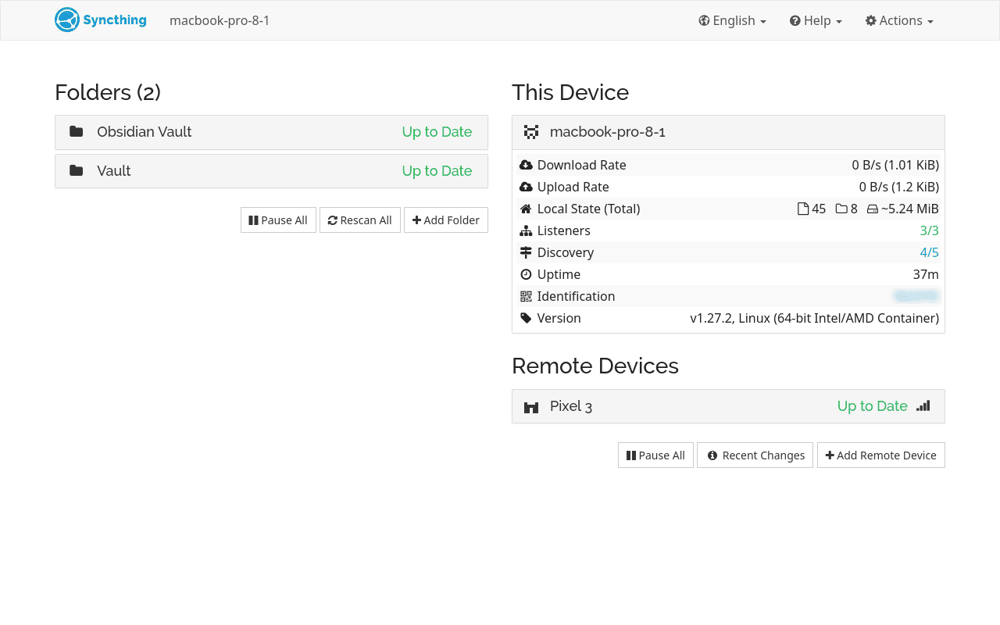

+++
title = "Running Syncthing from inside Toolbx"
description = "Yet another way of using Syncthing on Silverblue."
[taxonomies]
tags = ["Silverblue", "Syncthing", "Toolbx"]
[extra.comments]
host = "social.treehouse.systems"
user = "daudix"
id = "111957654155839059"
+++

Today I wanted to reduce the amount of layered packages on my Silveblue install, sure thing it was easy to do, but there was one thing that wasn't this easy, Syncthing.

The issue is that it needs to autostart on login, otherwise it's useless. Autostart using the GNOME Tweaks from inside Toolbx didn't work, because it points to the regular binary location instead of Toolbx.


There are [a few](https://www.qualityology.com/tech/syncthing-in-toolbox-on-fedora-silverblue-with-systemd/) [solutions](https://mmarco94.github.io/linux-guides/immutable-os/syncthing), and there's also [SyncThingy](https://github.com/zocker-160/SyncThingy), but I wanted to have the *original* Syncthing and easy way of solving things; manually creating Podman container when we have Toolbx seemed like overengineering.


And so I backed up the `~/.config/autostart/syncthing-start.desktop` before uninstalling the Syncthing overlay, located the Toolbx binary using `whereis toolbox`, replaced `/usr/bin/syncthing` in the backed up Syncthing desktop file with `/usr/bin/toolbox run syncthing`, put it back and logged out...

And it worked! Here's the final contents of `~/.config/autostart/syncthing-start.desktop`:

```ini
[Desktop Entry]
Name=Start Syncthing
GenericName=File synchronization
Comment=Starts the main syncthing process in the background.
Exec=/usr/bin/toolbox run syncthing serve --no-browser --logfile=default
Icon=syncthing
Terminal=false
Type=Application
Keywords=synchronization;daemon;
Categories=Network;FileTransfer;P2P
```



It's available at <http://127.0.0.1:8384> just like on normal installation.

*By the way, turns out that [Toolbx website](https://containertoolbx.org) got a refresh, and it looks really nice, check it out.*
