+++
title = "Rewriting My Neocities Website Was Fun!"
description = "Almost a year later, I got my hands on it."
updated = 2024-06-22
[taxonomies]
tags = ["100DaysToOffload", "Devlog", "Website", "Neocities"]
[extra.comments]
id = "112555378913783711"
+++

> This is my first [#100DaysToOffload](https://100daystooffload.com) post; what this means is that I'll post more and about more diverse stuff. My drafts folder are nearly exploding so it's about time! A dedicated post about this will be published soon (hopefully *nervous giggling*).


It's been [published](@/blog/2024-06-08-100-days-to-offload/index.md) (4 days later and not in half a year!).



This post has been [featured in exozyine](https://zine.exozy.me/posts/2024/june-2024/#website-rewriting-adventures)!


As you might know, [almost a year ago](@/blog/2023-08-13-site-and-blog-devlog/index.md) I got a website on [Neocities](https://neocities.org): the modern-age [Geocities](https://en.wikipedia.org/wiki/GeoCities) with not so modern personal websites. I always liked the idea of having website there, but never actually got my hands on it... until now, woo-hoo!

On the 31st of May I started rewriting it. 4 days later, it seems to be better than what it was in every aspect, so I decided to write this post sharing some insights on how it was done ^\_^

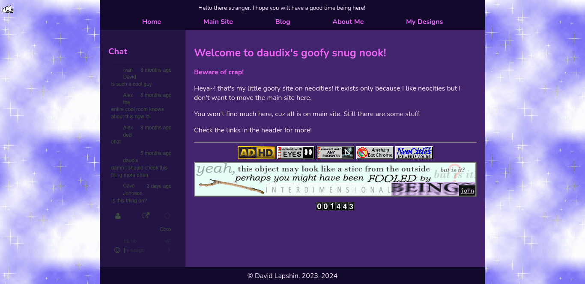
<figcaption>The pre-rewrite state; boring and sad</figcaption>

All started by copy-pasting [sadgrl](https://goblin-heart.net/sadgrl/)'s [Simple Skinny 00s](https://codepen.io/sadness97/pen/mdXjExq) layout, since I _suck_ at this. The layout seemed perfect so I started tweaking it. After stealing the button shading styles from DeviantArt and getting this nice background from the same sadgrl's website, I had this:

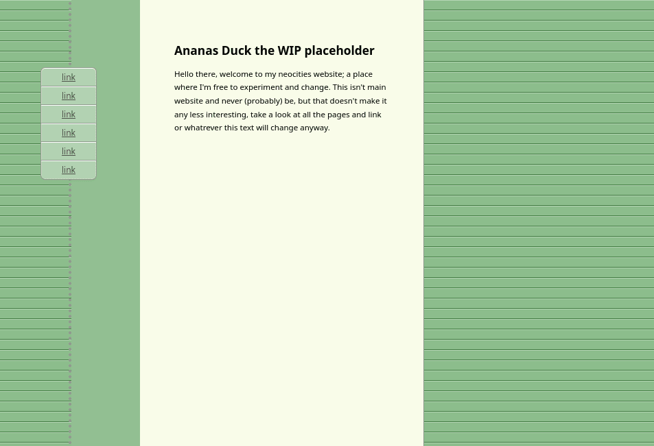
<figcaption>First steps; empty and sad</figcaption>

Fast-forward a few hours, I had some very basic thingy going!

The icons are from [Tango](https://en.wikipedia.org/wiki/Tango_Desktop_Project), an icon theme that had it's last release 15 years ago, back in 2009. Project's website is down, but download link still works somehow: <http://tango.freedesktop.org/releases/tango-icon-theme-0.8.90.tar.bz2>

<video alt="first demo" controls src="first-demo.webm"></video>
<figcaption>First demo; navbar got icons and footer was added</figcaption>

See that footer? yes, it uses a deprecated marquee HTML element, it's just too good to _not_ be used. I even [posted about it](https://vmst.io/@daudix/112532737670738850) on Mastodon.

<iframe src="https://vmst.io/@daudix/112532737670738850/embed" class="mastodon-embed" style="max-width: 100%; border: 0" width="400" allowfullscreen="allowfullscreen"></iframe>

At this point it was 4:00 AM and I had to go sleep 0_0

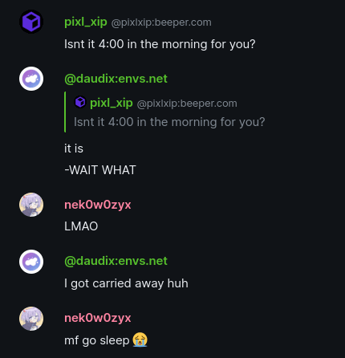
<figcaption>Group chat forces me to go sleep</figcaption>

Yeah, I enjoyed the rewrite a bit too much.

Aaanyway, the next day I added the [cbox](https://www.cbox.ws) chat, polished the footer, and [teased it](https://vmst.io/@daudix/112533590357822496) to my Mastodon followers.

<iframe src="https://vmst.io/@daudix/112533590357822496/embed" class="mastodon-embed" style="max-width: 100%; border: 0" width="400" allowfullscreen="allowfullscreen"></iframe>

About chat box: cbox doesn't allow adding custom CSS in the free plan, so I couldn't add the text shadow for the carved text effect, what I did is applied a `drop-shadow()` filter to the whole `<iframe>` which did the job.

Then I added a fake music player to the top-right corner (which was an absolute pain to create, I could've used CSS grid to avoid all the alignment issues, but it's just confusing so I settled on this hacky unresponsive mess), further polished the design, fixed the mobile version, removed the ability to move and resize the chat box (it was buggy and quite useless), and drawn a favicon and a bookmark inspired by one on the [old DeviantArt](https://web.archive.org/web/20131126002716/http://www.deviantart.com/). In fact, a lot of things were inspired by DeviantArt of 2010's

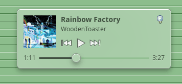
<figcaption>Fake music player with some brony music</figcaption>
 

| Mobile                                      | Tablet                                      |
| ------------------------------------------- | ------------------------------------------- |
| 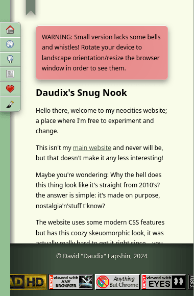 | 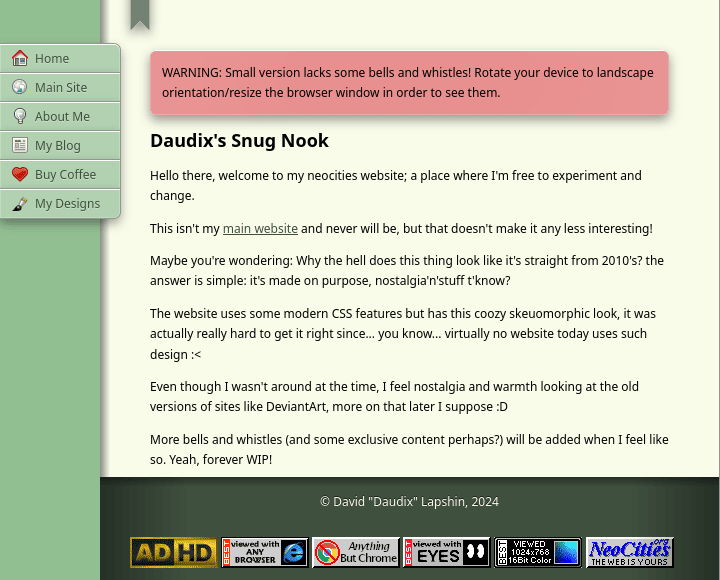 |


The music player initially displayed [PrinceWhateverer](https://www.youtube.com/@princewhateverer)'s [Miscommunication](https://www.youtube.com/watch?v=r0P67hLrFHI) as it's very relatable, but since I aimed for the 2010's vibe, I decided to change it to [WoodenToaster](https://www.youtube.com/@WoodenToaster)'s [Rainbow Factory](https://www.youtube.com/watch?v=YRx_iXgLAyw) since it was released in 2011 and were quite popular back then.


| DeviantArt                                      | Mine                                |
| ----------------------------------------------- | ----------------------------------- |
| 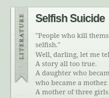 | 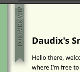 |


Initially the bookmark said "Work In Process", but I realised that it won't exit this state anytime soon, so it were changed to "Forever WIP"


And that's about it! there's one issue that bothers me, the footer; it's absolute positioned relatively to the "paper" and it overlays on top of the scrollbar, which is meh.

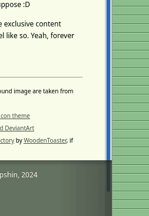
<figcaption>Footer's opacity is changed for demo purposes</figcaption>

One more thing I want to mention is [Neocities CLI](https://neocities.org/cli). If you have ever used Neocities you know the pain of upload files to it via the web interface, it does provide [WebDAV mount](https://neocities.org/site_files/mount_info) for supporters, BUT there's another way, the official CLI tool!

It allows pushing local files or whole directories directly to your Neocities website, it's distributed as a Ruby gem but it works just fine.

_Seriously, this thing saved my nerves._

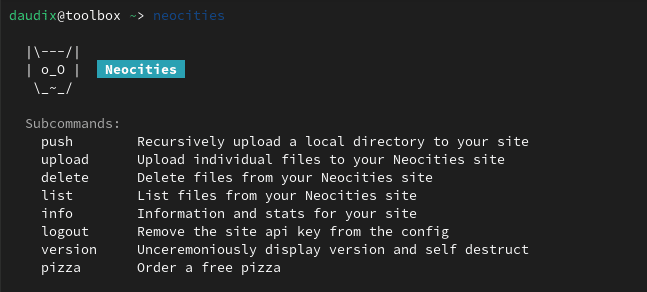
<figcaption>Help page; love the humor</figcaption>

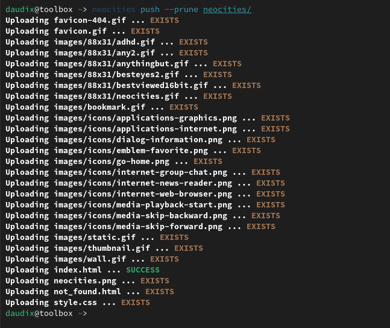
<figcaption>Pusing local directory to Neocities with deletion of files not present locally</figcaption>

Thanks for reading! Visit the website [here](https://daudix.neocities.org) and feel free to drop something in the chat box ;)

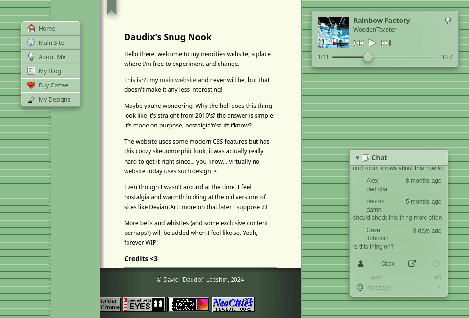
