+++
title = "MacBoy Chronicles: The Complete Edition"
description = "The most complete story of my previous laptop that one can get, DLCs included."
updated = 2024-07-13
[taxonomies]
tags = ["100DaysToOffload", "MacBoy"]
categories = ["Featured"]
[extra]
toc = true
[extra.comments]
id = "112595182527799666"
+++

Today's that time of the year called WWDC, so I thought it's a perfect opportunity to publish this longstanding draft about my MacBook. Enjoy the roller-coaster!

## The BigMac Era

### Backstory

Once upon a time, there was a chonky 15-inch MacBook Pro, but friends simply called him BigMac. He was manufactured in 2011 and was happy to be a MacBook running macOS, up until one day, when Apple betrayed him and stopped providing him with updates.

Since then, he was stuck with macOS High Sierra. He thought this was the end, that he would never see the night mode introduced in Mojave, nor the big icon redesign of Big Sur. Hell, he wouldn't even get any security updates anymore! All he had to do was wait for the unavoidable death.

But something outrageous happened one day.

He was put on sale.

"I AM BEING SOLD!?" he exclaimed, but no answer followed, as he's just a silly BigMac that cannot speak.

Little did he know what was about to happen.

### Second Chance

Time passed, people asked about him, but in the end, no one bought him. He lost all hope of ever being useful again, until one day, someone called the seller for details. He didn't hope this would lead to anything, but surprisingly, it did.

In a few days, BigMac's owner arrived at our place. My dad and I asked some things about him, turned him on, and checked some basic things like the system info window, webcam, and charger, but nothing more, since it was our first encounter with such a machine.

Promptly, we agreed on the price and he was ours. BigMac was shocked by all this; did he just regain his purpose? I showed him off to the rest of the family, played some YouTube videos to see how good the screen and speakers were. I was super happy that day, and so was BigMac.

### Plans Change

Later that day, I realized the problem with High Sierra: it's an old version and BigMac doesn't receive updates anymore. After some quick googling, I found out about something called macOS patchers. An hour later, I had a USB stick with macOS Mojave in hand. I booted BigMac into it, installed Mojave only to discover an issue: his GPU was malfunctioning. A quick lookup revealed it was a common and expensive issue to fix. So the next day, the previous owner and my dad agreed on returning the device without any change in price, and it was returned the same day. Fortunately, all went smoothly.

BigMac's history is unknown beyond this point. Hopefully, he became useful to someone in one form or another.

## The MacBoy Era

### New Life

Once upon a time, there was a small 13-inch MacBook Pro, but friends simply called him MacBoy. The story begins the same way as [BigMac's](#backstory), but the difference starts at the point of purchase.

Dad and I arrived at MacBoy's owner's place, checked the same things as when BigMac was purchased: system info window, webcam, and charger. After agreeing on the price and coming home, flashing a patched Mojave USB and installing it, the journey continued.

<figure>

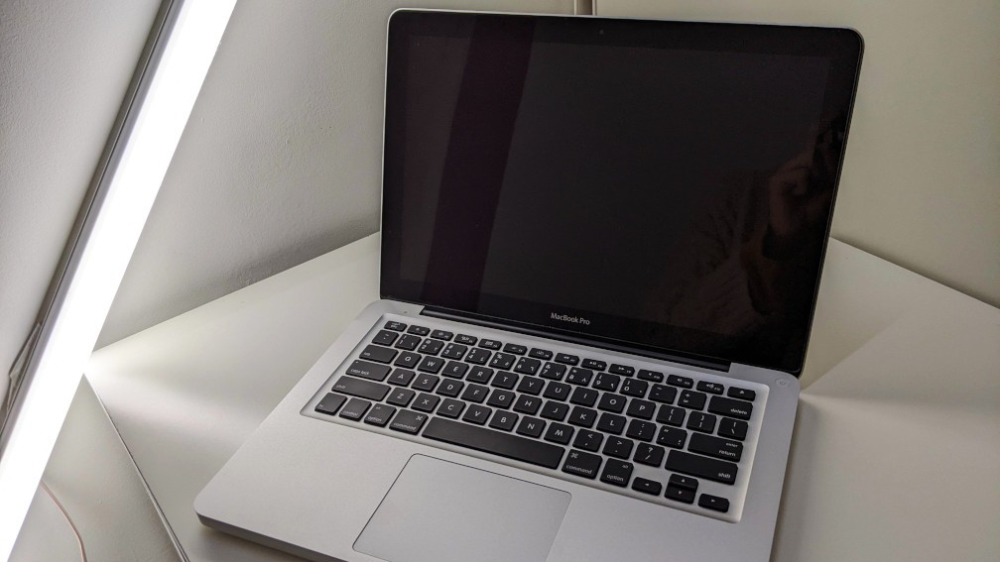
<figcaption>One of the photos I took when I tried to sell it at some point XD</figcaption>
</figure>

<figure>

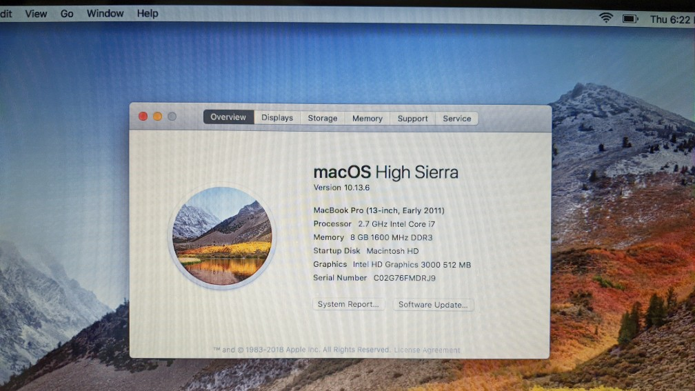
<figcaption>Ditto but with the screen on displaying the system info</figcaption>
</figure>

MacBoy was shocked: "Did I not just become useful again, but also become up-to-date again? My sensors aren't lying?"

It was, in fact, real. I was incredibly happy to have a new friend, and so was MacBoy.

Time passed, macOS Catalina was released, and it was time for an upgrade. I repeated the same steps as when I installed Mojave. It had some glitches here and there, but otherwise, it was perfectly usable.

### Tea Is an Enemy

One day, an accident happened: I was working and somehow got into an argument with my little brother, in which he pushed me while I was sipping some sweet tea... MacBoy got soaked. Quickly, I turned it off and sideways for the tea to come out, then put some towels on the keyboard and placed it upside down. When it dried, fortunately, it was working, but the keyboard was, y'know, all sugary and not quite functional.

After trying to clean it without much success, we (my dad and I) went for a replacement. While at the parts shop, we got some upgrades for it: an optibay (a thingy that goes in place of the CD-ROM that allows putting a regular SATA drive in it) and an SSD. At home, I replaced the keyboard, with some struggle but still, upgrades were installed, and it was working like a charm.

### Rebirth

Then Big Sur came out. I, of course, tried to perform the same trick only to find out that it worked horribly slow, had *all kinds* of graphics glitches, things like iMessage didn't work at all, and overall, it was a horrible experience.

And so, Catalina it was again. But then I remembered watching some videos about some OS that allowed nice customization, like you could make windows act like jelly and all that. So I found these videos and turned out that OS was Manjaro. Fast forward some time, I flashed a USB stick with Manjaro and installed it on MacBoy.

MacBoy was shocked, "What the hell is this thing? It doesn't look anything like my parent company's OS," he thought. Moments later, Manjaro was installing, and half an hour later, the installation was complete.

After a quick reboot, MacBoy was shocked to find himself so snappy and fresh, almost like he was a whole new computer. He was used like that for some time until some weird fullscreen glitch appeared and MacBoy was beeping at the same time, so I reinstalled it and looked for a different distro, since this shit scared the living hell out of me.

I then "distro-hopped"—changed the Linux distribution in search of the right one. Some of them were Ubuntu (the one with the hairy hippopotamus), EndeavourOS, Arch, Cloud Ready (ChromeOS), elementaryOS, Linux Mint, Manjaro, and Fedora. In the process, a lot of data was lost, so from now on I make backups and am very cautious.

The choice stopped on Fedora Workstation, as it provided a very clean desktop compared to the over-customized Ubuntu, was fast, and overall very nice, except for one problem (on first-ever install): Wi-Fi was not working. Quickly, MacBoy was connected to the network via Ethernet cable, and the long googling began.

The solution was eventually found; it needed a `broadcom-wl` driver, which required enabling the "RPM Fusion" repository for installation, which didn't make any sense to me at the time. After unsuccessful attempts to enable it, I found one [reply in Fedora forums](https://discussion.fedoraproject.org/t/sudo-dnf-install-broadcom-wl-problems/77982/3) mentioning some script to enable RPM Fusion and install `broadcom-wl`. It seemed like a solution, and it even worked somehow.

Everything was good now; MacBoy and I were happy to be together again, without the bad influence of his parent company. Time passed, new Fedora versions came out, I distro-hopped more, but every time returned to Fedora, migrated from Workstation to Silverblue, learned more about FOSS, and even started contributing translations and later on, even icons. But everything good comes to an end.

<figure>

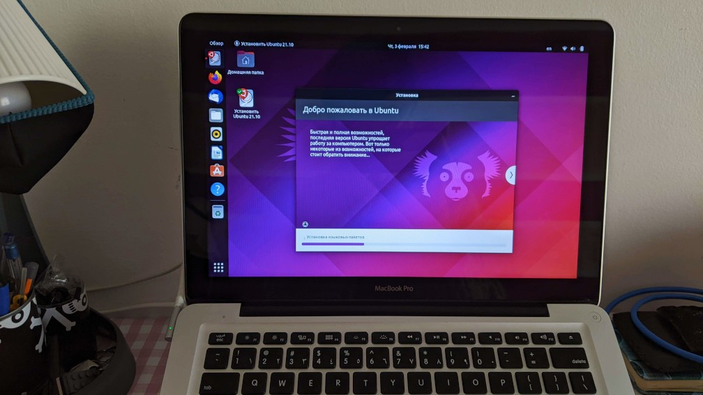
<figcaption>One of my Ubuntu installs, not the first one though</figcaption>
</figure>

<figure>

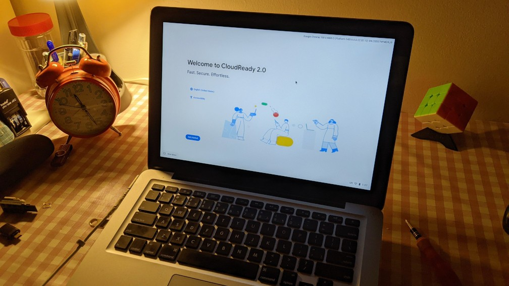
<figcaption>For some reason I decided to try ChromeOS, yes it was pure dogshit, even the Linux container didn't work</figcaption>
</figure>

<figure>

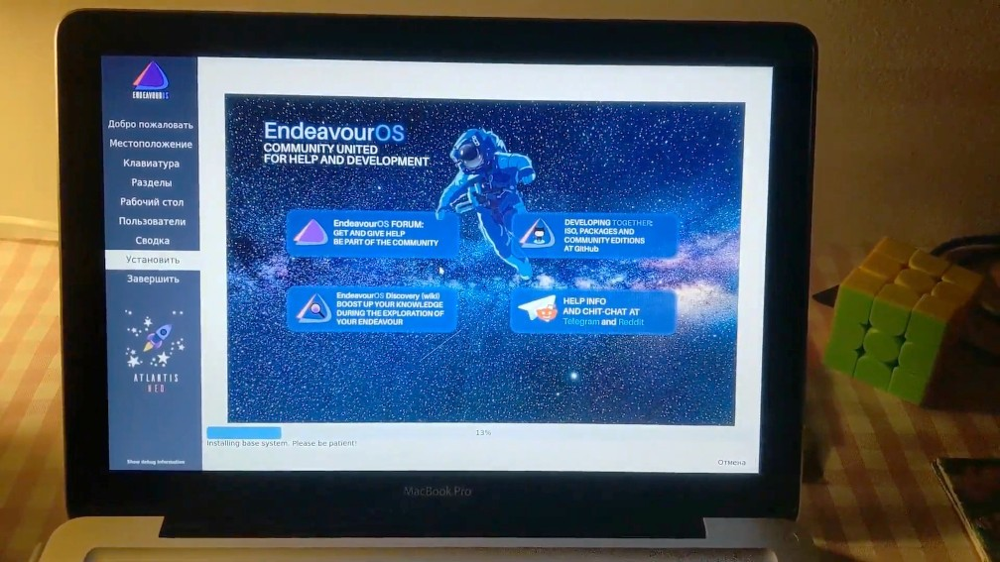
<figcaption>For some time I daily-drove EndeavourOS, such a good distro but not exactly for me</figcaption>
</figure>

<figure>

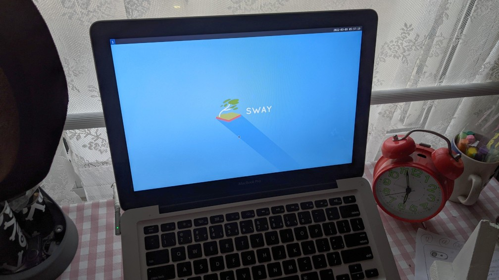
<figcaption>Trying out Sway since everyone kept talking about tiling managers, I wasn't impressed and moved back to GNOME</figcaption>
</figure>

<figure>

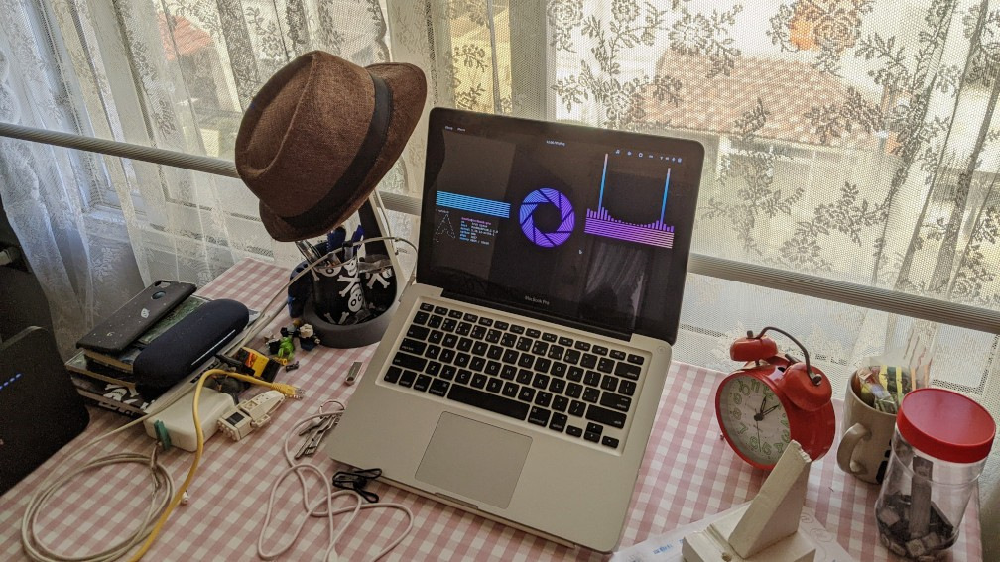
<figcaption>My first "rice" that I <a href="https://www.reddit.com/r/unixporn/comments/t8mxai/gnome_aperture_arch_rice_labs/">shared at r/unixporn</a></figcaption>
</figure>

### The Repair Hell

The charger started acting up: heating, sparking, and not charging. No wonder, it was in an awful state, tape made the rubber decompose entirely. It was clear that it was time for it to be replaced, but the financial situation didn't quite allow it, so what was left to do was to improvise. First, I knocked the charger a bit to make the pins come out, then sandpapered some metal from the MagSafe connector for the pins to be closer to the MagSafe connector. The issue, by the way, was in the connector pins; they were stuck inside since the spring forcing them outside became very loose or even broke.

| Charger                  | Closeup                                  | Connector                                                    |
| ------------------------ | ---------------------------------------- |------------------------------------------------------------- |
| 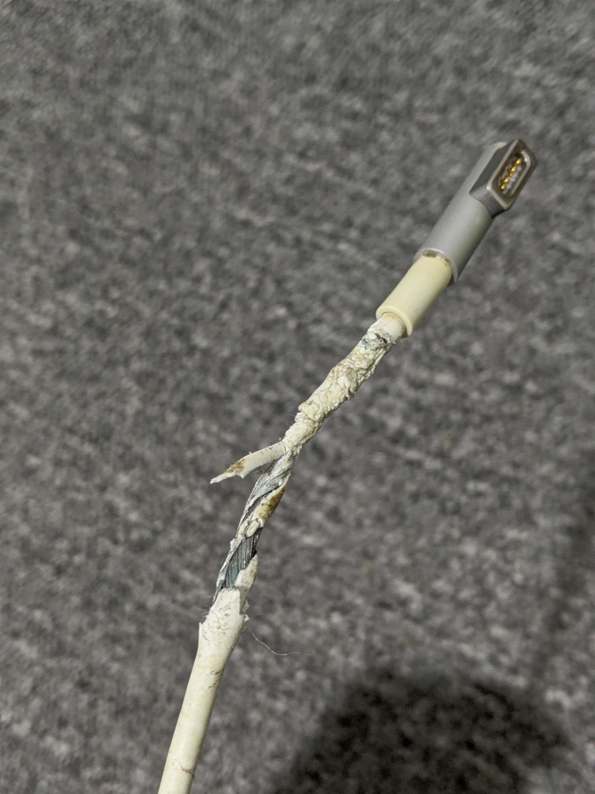 | 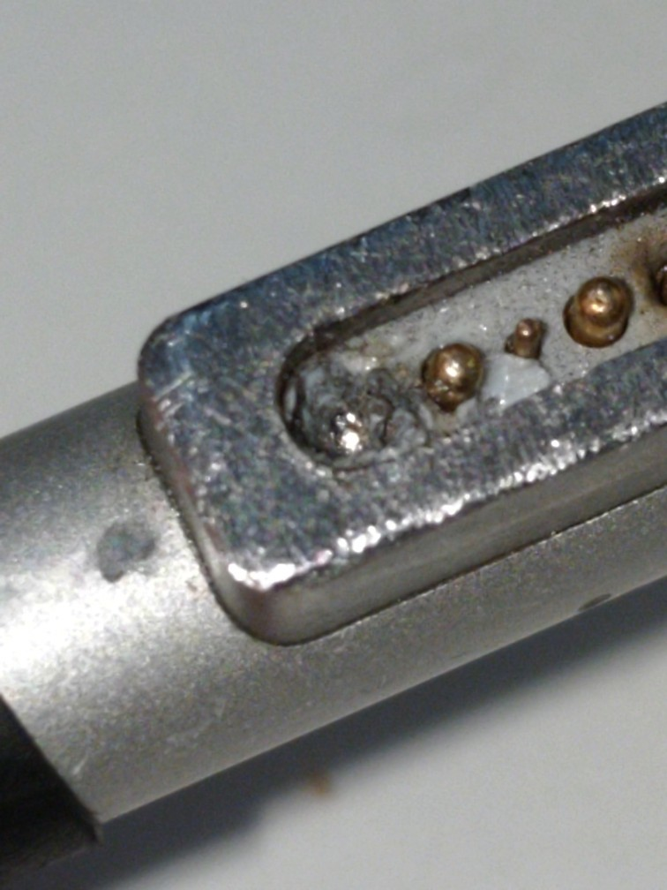 | 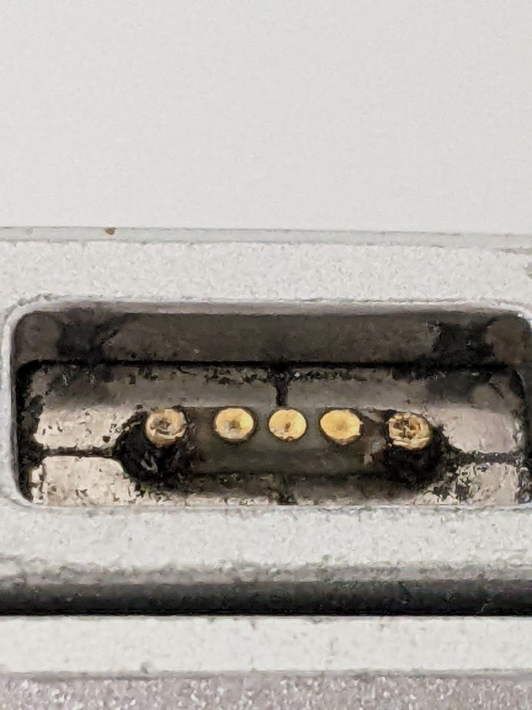 |

<figure>

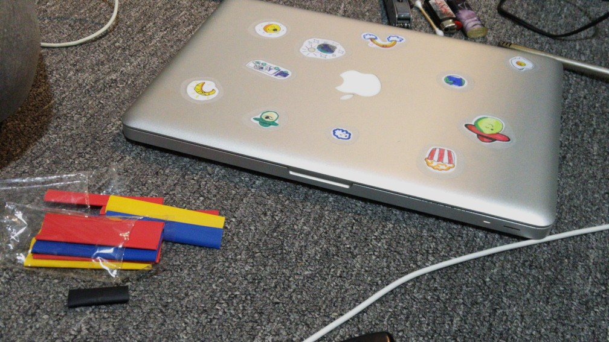
<figcaption>The last charger "repair", all serious this time, we even got this thermal thingy!</figcaption>
</figure>

I used it in this hacky way for a while. It was an unpleasant experience, but there's so much you can do in such a situation: constantly reconnecting the charger, pulling out the pins, sandpapering more and more metal from the connector. Then the unavoidable happened, it finally died.

<figure>

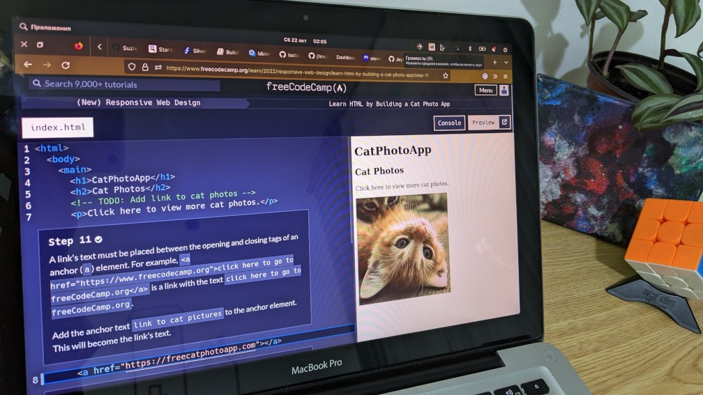
<figcaption>The start of my webdev learning, well, one of the unsuccessful attempts</figcaption>
</figure>

MacBoy was put in a drawer until better times when a new charger could be bought. In the meantime, I used my mom's laptop to not lose access to a computer entirely.

When the time came, a new charger was bought, and MacBoy was finally working again, but not for long. Very soon, he stopped charging. Since the charger was new, the suspicion fell on the battery, so I used it by powering it on without the battery by disconnecting the charger, holding the power button for 5 seconds, and, while holding it, connecting the charger and then releasing the power button after 5 seconds. Half a year later, a new charger was purchased. All this time, I used my mom's laptop.

The charger worked a single day and then stopped charging. After a month or so, some budget to go to the repair shop was available and we went there, showed the problem and—WAIT IT WORKS, WTF!? Yep, it does; "I will shove the old battery up Satan's ass," I thought. To not lose time on nothing, we replaced the noisy fan that became noisy in the period of waiting for a new charger, the broken HDD cable that unexpectedly died one day, and repasted the CPU. Then we went back home.

Since I used my mom's laptop for a while, I decided to reinstall Silverblue on MacBoy for it to be clean, then I moved the data back, and started using it.

ONLY FOR IT TO STOP CHARGING, *AGAIN!!!*

To say that I was sad is like saying nothing. I was absolutely crushed knowing that we're not in the best financial situation and that fucker kept sucking the family's money and my soul.

Anyhow, we went to the repair shop once again (of course after a while), and this time requested them to *actually* perform the full diagnosis to know why it doesn't fucking charge.

Ten days passed, no call from the repair shop, so Dad called first. The answer followed:

> Uh yeah, so I don't really know where exactly the issue is, but I *suspect* that it's the power controller. I can replace it, but it's **dangerous** and there will be a 30% chance that the motherboard will burn afterward. So yeah, it's up to you to decide.

The next day (or the next-next day, I don't remember), we went there to take it since that's not an answer one wants to hear. Like, what the hell does it mean there's a 30% chance of failure?

The repairman wasn't even at the shop when we arrived, so his coworker assembled MacBoy (yes, it was freaking disassembled) and gave it to us, asking if we would like him to see MacBoy instead but it would require 2-3 more days. Of course, we declined this offer; they had 10 days and still didn't even assemble it, and it was super dirty on top of that, really showing the level of "care" they put into the repair.

While still there (on a street filled to the brim with repair shops), we started searching for a different Mac repair shop. A lot of stores pointed to a shop of one talented man that does Mac repairs; "best in town." We went there, described our issue, and he immediately tried to fix it by resoldering the power controller (the one that the previous repair shop said would have a failure chance if resoldered), but unfortunately, it didn't help. So he asked us to leave it for a few days since a more in-depth diagnosis needs time.

Two weeks later, no call from the repair shop, so Dad once again called first. The answer:

> So yeah, I tried everything, but no luck. Sorry man. I'm quite certain that the motherboard is dead.

Sooo we went and took it back. Since it was clear that trying further was pointless, we decided to return some of the parts from earlier visits; after all, they were only used for a few days at best. A *lot* of arguing later, we agreed on returning the charger, HDD cable, fan, and battery for half the price we bought them for, so we got back ~$110 in total. It was a good deal and a good start for saving up for a new laptop.

While still there, we checked all the nearby stores if they would like to buy it for parts. No one did, unfortunately (or fortunately).

## Conclusion

It was a long and interesting journey, but everything comes to an end. MacBoy was put in a drawer until better times when we can get another same MacBook and take the motherboard from it and put it in MacBoy, resulting in a FrankenBook. Until then, the story ends here.

<figure>

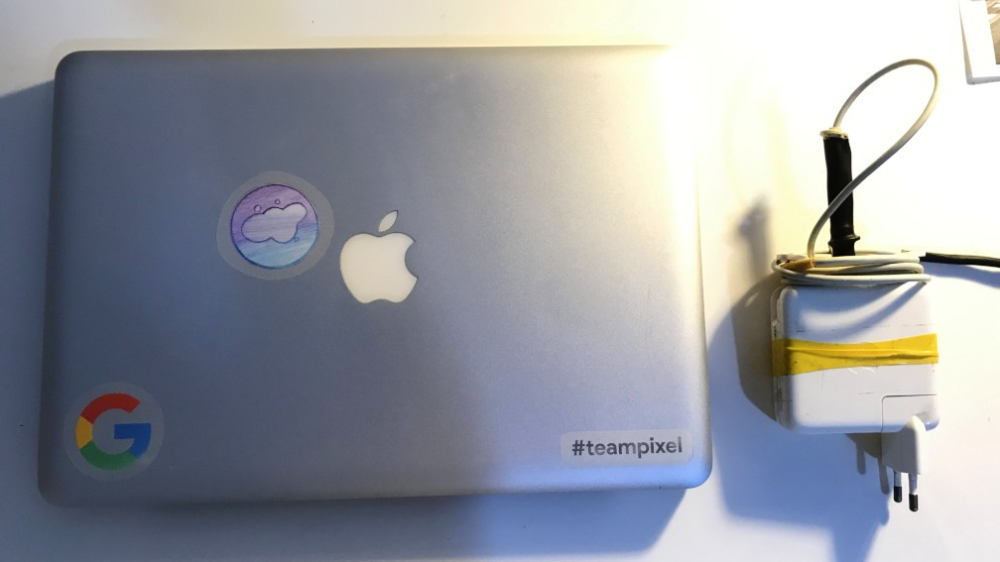
<figcaption>Current state, it turns on for a few minutes using the direct power method and old charger, but that's about it</figcaption>
</figure>

*Laughs* GOTCHA! It doesn't. We already got the new laptop, more on that in the next post. Stay tuned!

<figure>

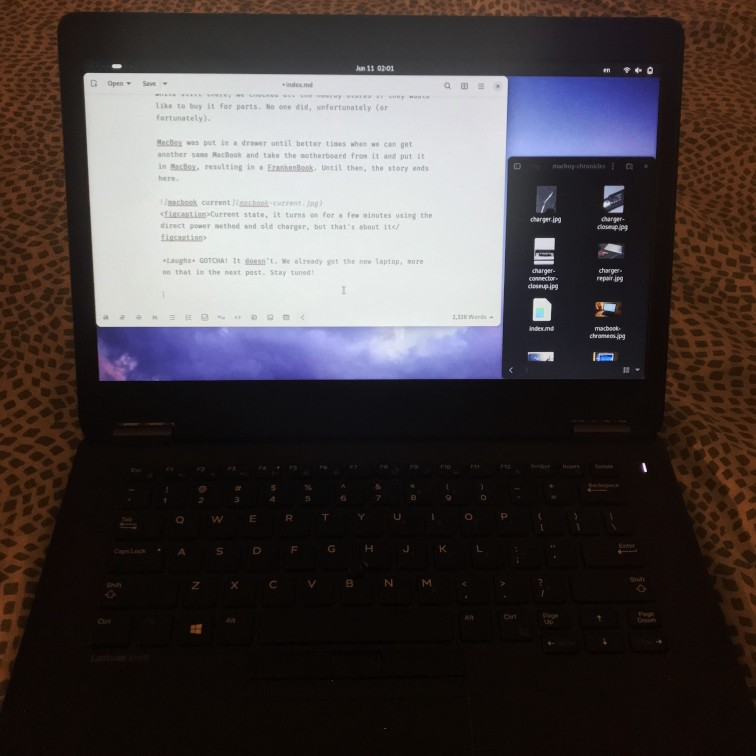
<figcaption>This post's draft open on said new laptop, Dell Latitude E7470</figcaption>
</figure>
