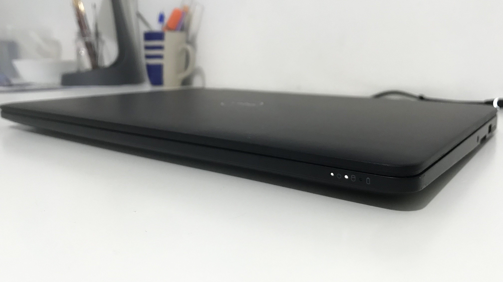

+++
title = "Latitude and Longitude or My New Daily Driver"
description = "A little story about my new (for me) laptop."
updated = 2024-06-25
[taxonomies]
tags = ["100DaysToOffload", "MacBoy", "Latte"]
[extra]
banner = "blog/not-that-latitude/banner.png"
toc = true
[extra.comments]
id = "112640483364403774"
+++


It was quite hard to get the expressions right, [first version](https://codeberg.org/daudix/website/src/commit/e39dd708a4d39012ce54f23673cb13460210bc75/content/blog/not-that-latitude/header.png) had them very sadge, so I changed them to be a bit more restrained.


## Backstory

As you know from the [previous post](@/blog/2024-06-11-macboy-chronicles/index.md), my previous laptop passed away recently and I got a new one to replace it. I teased that I would tell more about it in the next post, and well, this is that post :)

*Clears throat* alright, where did we stop last time... *paper noises*, aha!

After returning the unneeded parts, we got back $110, which was a good starting point for saving up for the next laptop. Why a laptop and not a PC? As silly as it sounds, I simply *cannot* sit in the same spot for longer than 10 minutes, *especially* if that spot is a desk, so a laptop is a requirement, not a choice.

Some boring money saving later, we (me, Mom, and later on Dad) started the search. Initially, we searched for ThinkPads since ~~ThinkPad cult members~~ people say they are very durable, upgradable, have good Linux support, and overall they are the best thing in the world (to be fair they do look badass).

A few listings and some [Notebookcheck](https://www.notebookcheck.net) review reading later, it became clear that virtually all ThinkPads in the desired price category (~$210) suffer from the same issue: sRGB coverage around 56%. This isn't a big deal if the only thing you do is write reports in Microsoft Word and scroll through Facebook memes, but it's crucial if you do even basic design work.

So we decided to look at Dell; my Mom had a Dell laptop before and it was a good machine. After scrolling through all listings from our city and checking every single one of them on Notebookcheck for the sRGB coverage, it became clear that the situation was somewhat similar to ThinkPads, but there was one listing that was interesting... (I've skipped the boring false positives).

Dell Latitude E7470 - 2017 ultrabook in great condition, with decent specs, and, most importantly, 96% sRGB coverage (at least so I thought)! MacBoy had full sRGB coverage, but still, it was very close, and comparing it to other laptops with 56% coverage it was the best variant. The price was sane as well: $230.

<figure>

<figcaption>Feels good to hold a laptop that is twice as thin and light as MacBoy</figcaption>
</figure>

<figure>

<figcaption>Even though its screen is 14 inches it's just as compact as MacBoy; thin bezels compensate the screen size</figcaption>
</figure>

## It's Time

The next day - 5th of June - while I was asleep, Mom told Dad about this variant, and he promptly called the seller to not miss such an opportunity. He asked if the machine in the listing was the same one, and it was indeed the same machine and all was OK, so he agreed on the purchase and delivery (which was free) the same day.

I woke up only to hear the surprising like snow-in-the-summer news, and I was happy and nervous at the same time—hapvous.

A few hours of painful sociophobic waiting later, the seller finally called me (since Dad already went to work) that he was on the way and would arrive within an hour. An hour later he called me again to say he had arrived at our place. I went out, took a deep breath, took the briefcase with the laptop from the seller's car trunk, opened it, took out the laptop, opened it, gave it a quick glance just to make sure it wasn't an empty chassis or in an unacceptable state (I was super nervous so I didn't even check if the model was the right one), said "y-yeah all good, hopefully", gave the money and ~~rushed~~ headed home at a steady pace.

Being excited, I turned the laptop on, disgusted by Windows and its awful design, scrolling, ads in the start menu—*distant cough* oh yeah, I got a little carried away. I went to YouTube and searched for "Costa Rica HDR" and turned *that one* video on, doing the same on Mom's Sony Vaio that I used for the last year. And something unexpected happened.

## A Fly in the Ointment

You ready? *sighs* The screen turned out to be dogshit. Yes, the very reason why I dismissed all the nice ThinkPads and Dells. I mean, I'm grateful and all, but it's not even close to 96% sRGB; heck, it's even slightly less saturated than the bootleg replacement screen on said Sony Vaio!

I was disappointed and saddened, another "yes, but-" moment, all the searching was pointless as I could've got the first powerful ThinkPad for the same price, since the screen is the same level shit anyways, but it was late for the smart thoughts, so I just went along with it.

The crucial detail that I didn't give enough attention to is the fact that the Latitude in Notebookcheck was the high-end configuration; with the 4K touch screen, fingerprint scanner, and Intel Core i7 instead of i5 like in my unit. For some reason, I thought that the only difference between the touch 4K version and the FHD matte screen version was the resolution and the absence of, you know, the touch, but no, only the touch screen version has good color accuracy. The ones with matte screens (1920x1080 and 1366x768) have a generic sRGB coverage for this type of laptop - 50-something percent (for some reason there's virtually no reviews for these versions, so no exact numbers). My ignorance has played a bad trick against me once again.

Then I discovered that closing the lid doesn't put it in sleep mode. I thought it was a Windows issue, so I didn't give it much attention.

## The Good

Bad things aside, I flashed a new Fedora Silverblue USB and installed it, which was an absolute breeze; no need to install `broadcom-wl` to get the WiFi working, no need for RPM Fusion for `broadcom-wl` and all the trickery needed to enable it on Silverblue, no need to add `acpi_backlight=auto` kernel argument to make the minimal screen brightness not burn your eyes, everything "just worked" out of the box. I knew Dell shipped some laptops with Linux and they're (way) more Linux-friendly than Apple, but damn, I didn't expect it to be this good.

<figure>

<figcaption>How can one talk about a new laptop with Linux installed and not show a <del>neofetch</del> neowofetch screenshot!?</figcaption>
</figure>

After the installation, I opened Software to update the system, and... BIOS AND FIRMWARE UPDATES!? Fwupd is good huh.

Then I opened Settings to check the Device Security tab, just for fun and giggles, and IT'S ALL GREEN!? On MacBoy it was all red, since no secure boot and such.

Then I decided to watch some videos, connected the headphones and A HEADPHONE TYPE SELECTOR POPPED OUT!? MacBoy didn't have this as well, it was a headset all the time. Here, on the other hand, I can connect it as headphones, a headset, or just a microphone.

I used it for hours moving data from Vaio and MacBoy, and the battery didn't drain. I can do 3 hours of work and watch some YouTube videos and it will still have 20% left. I still can't get used to it after two weeks, it feels so good after the absence of battery and constant issues with the charger.

The keyboard has a longer travel distance than MacBoy and doesn't have the slight key drift that makes keys make an annoying sound. It feels so good to write blog posts on it. The touchpad is decent as well, not the same glass trackpad though, it has a bit harsh scrolling (in the sense that it doesn't scroll pixel by pixel but rather 2-3 pixels at a time) and it doesn't click, meaning I need to either tap to click or use the dedicated buttons, which are present on both top and bottom of the touchpad at least. It still annoys me a little even 2 weeks later.

One brand new thing for me was the trackpoint. This thing was so weird and confusing at first, but I slowly started to get it. It's super useful in Blender and, to my surprise, Portal 2 :3

All these little things made my mood better and I no longer regretted the purchase. Sure, the screen wasn't the one I wanted, sleep on closed lid doesn't work since apparently the bezel was replaced and the magnet in it is absent and there's no "Dell" typed on it, soft touch plastic collects all the dust and fingerprints by just looking at it and is constantly sticky no matter what you do, but it's not critical.

## Conclusion

Overall, I *love* this laptop. MacBoy was a good machine, but this one is a whole new level.

P.S. While making the final edits to this post I've come up with a name for Latitude - Latte!

P.P.S. The next post is already in the drafts, and it will be about my switch to a dumbphone or how my Pixel 3 burned violently without warning. (You can never have too many stories about my devices dying, right?)
