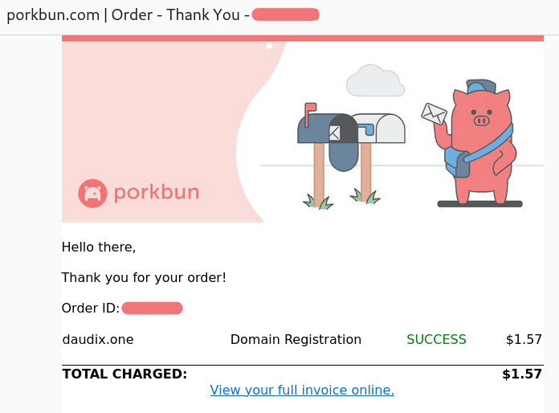
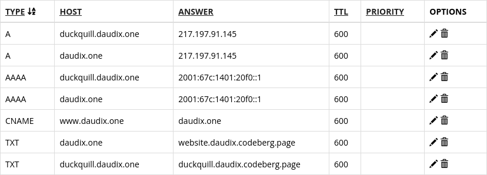

+++
title = "One Little Domain or How I Got My First Domain"
description = "One of my little dreams finally came true! But how?"
updated = 2024-07-02
[taxonomies]
tags = ["100DaysToOffload", "Website", "Devlog"]
[extra.comments]
host = "vmst.io"
user = "daudix"
id = "112675082269886749"
+++


I know I said in the [previous post](@/blog/2024-06-19-not-that-latitude/index.md) that the next post would be about how my Pixel 3 committed suicide, but I didn't quite feel like publishing 3 posts in a row about my devices dying and being replaced, plus I haven't researched the topic enough and don't have much to tell about the replacement, so it will stay in the drafts folder for a bit longer.

I do have another post in the works and expect it to be quite interesting, so yeah!


Today—I mean, the 22nd of June—I fulfilled my little dream: I got my very own domain!

Yes, you read that right. My dream was to have my own domain. I don't know what's wrong with me; I just wanted it so badly.

At first (back in the ["Space" theme era](https://web.archive.org/web/20221030010150/https://daudix-ufo.github.io/)), I thought I'd get daudix.space, but later on changed my mind since I'm not really into astronomy, it felt a bit lengthy and I didn't plan on hosting public services, which are usually associated with this <abbr title="top-level domain">TLD</abbr>. I considered other options, but they were expensive. Then I remembered about [zagura.one](https://zagura.one) and [seirdy.one](https://seirdy.one), what was common about them is this nice TLD: one.

It was perfect: *one* of the cheapest options, *one* of a kind, and not a boring *one*.


Only after getting the domain, I realized it's actually a huge [one](https://www.youtube.com/watch?v=EE4mslnibzQ) reference. So yes, the pun was not in fact intended.


A while later, I finally decided it was time, even if I might not be able to pay for the next year.

And so, in the early morning of June 22nd, I started the research with serious intentions. First, I checked [Porkbun](https://porkbun.com) since I heard good things about it and [exozyme](https://exozy.me) (the coziest community) uses it as far as I know. Surprisingly, daudix.one was super cheap—just $1.57 (renewal will cost $13.88, which is still cheaper than many other options).

For fun, I also checked daudix.io, which cost a whopping $40! Then I checked [Cloudflare Registrar](https://www.cloudflare.com/learning/dns/what-is-cloudflare-registrar/) since apparently they charge only the required fees without any markup, but it didn't have .one TLD, so I checked [Namecheap](https://www.namecheap.com/), where daudix.one cost $2.60 or something like that. So I settled on Porkbun.

One registration and payment later, I got *that* email from Porkbun!

<figure>


<figcaption>The long-awaited Porkbun invoice stating that I have just successfully purchased a daudix.one domain</figcaption>
</figure>

"Hooray!" - thought I. Promptly I tried connecting it to [Codeberg Pages](https://codeberg.page), but it didn't go well, so I went to sleep.

In the evening of the same day, I tried to finish the setup, but after countless attempts, I gave up and had to refund it :<

Just kidding, Porkbun doesn't accept refunds.

I asked for help in Codeberg's Matrix room and promptly got some suggestions. They didn't work on their own, but putting my issue into words helped me realize something: I used an obscure method of deploying Codeberg pages by pushing static files to the `pages` branch of the `pages` repo, while the `main` branch is supposed to be used for static files. This confused the Pages server, causing it to spit out some unhelpful error messages. After renaming the repository to `website` and re-adding some scary IP addresses and TXTs into Porkbun one more time... it still didn't work.

I was super tired and had no will to mess with this that day, so I kinda forgot about it and gone to do some other stuff.

Only to return and find it working!

Yes, apparently it needed a bit more time than 15 minutes to fully propagate. In the end, everything was working, so I repeated the steps to make Duckquill use its own subdomain. It was a bit of a pain (mostly me making silly typos), but I got it working eventually.

<figure>


<figcaption>The final DNS setup for this site and Duckquill</figcaption>
</figure>

The next day, I created the `pages` repository and added a `_redirects` file to make the old daudix.codeberg.page address redirect to the new one, while keeping the path (so e.g. `daudix.codeberg.page/ananas-duck` becomes `daudix.one/ananas-duck` and not just daudix.one).

```txt
/*  https://daudix.one/:splat  302
```

Yup, that's the entire file! It doesn't work perfectly though; links have a double slash after the domain (`daudix.one//blog/`), but it doesn't seem to affect page loading, so it's fine, I guess?


Awesome [Anthony](https://unnamed.website) suggested me to try removing the slash between the domain and `:splat` (so it becomes `https://daudix.one:splat`), and it worked!



Changed HTTP response from 302 "Moved Temporarily" to 301 "Moved Permanently". The final `_redirects` is:

```txt
/* https://daudix.one:splat 301
```


And that's about it! I'm super happy to be a real internet citizen and, in the long run, to be able to move the site between different hosting services without constantly changing links everywhere.
