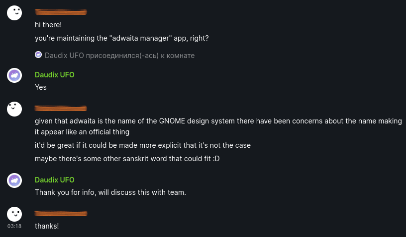
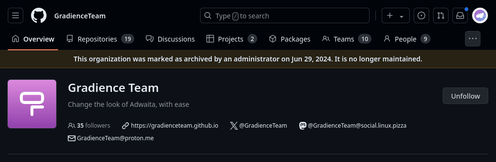

+++
title = "Gradience Autopsy: Rise and Set"
description = "The most complete history of Gradience you'll ever find."
[taxonomies]
tags = ["100DaysToOffload", "Gradience"]
[extra]
banner = "banner.webp"
disclaimer = """
- This post doesn't mention some names; this post is not meant to offend anyone or make them uncomfortable, but to give an idea of what was going on.
- This post doesn't link to some of the mentioned resources because I used to be a different person at the time, and find it very cringey.
"""
toc = true
+++

<small>Photo by [Clyde RS](https://unsplash.com/@imclyde) on [Unsplash](https://unsplash.com/photos/clouds-under-clear-blue-sky-during-daytime-4XbZCfU2Uoo).</small>

## Backstory

Two years ago today, a project called AdwCustomizer emerged; a libadwaita app that allowed users to recolor their libadwaita and GTK3 apps (if the [adw-gtk3](https://github.com/lassekongo83/adw-gtk3) theme was present) using an easy-to-use interface.


My stance on theming hasn't changed; I still believe that distributions should *not* ship theming out of the box. It's up to the user to decide whether or not they are comfortable with broken applications. See ["please don't theme our apps"](https://stopthemingmy.app).



Personally, I've stopped theming my desktop for a while; I've been using vanilla GNOME for about a year now, with only a few extensions that add some missing features that I really need, like automatic dark mode at sunset.


I was absolutely thrilled to be one of the first to discover this amazing app! I had been thinking about such an app literally just a few days prior to this. I even posted about this app on [r/gnome](https://old.reddit.com/r/gnome/comments/w2ehe2/libadwaita_and_adwgtk3_recoloring_demo_using/)!

### First Contributions

The same day, I opened an issue regarding the project name and its change, since it didn't follow the [GNOME HIG](https://developer.gnome.org/hig/guidelines/app-naming.html). [ArtyIF](https://github.com/ArtyIF)–developer of the project–quickly responded, stating that the suggested "Adwaita Manager" sounded quite good, and very soon, the project was renamed.

Then I created an issue about the app's icon and even tried to design something (in retrospect: the icon turned out to be utter shit, just like every other icon at the time), got into a little heated argument with another designer, and even did some UI mockups (which, you guessed it, looked like shit).

### New Duty

Then something unexpected happened: the developer announced that he was looking for a new (co-)maintainer. This was shocking to me because I really liked the project, so I did what any reasonable human being would do: commented that I would like to maintain it, and no, I didn't say that I'm not a programmer and a joke of a designer...

To make things worse, I took responsibility into my own hands and... made an announcement on [r/gnome](https://old.reddit.com/r/gnome/) and [r/linux](https://old.reddit.com/r/linux/) that the project was looking for a maintainer. Without asking ArtyIF first. *deep sigh* Somebody kill me, please.

No one came to maintain it from the Reddit post, but one guy commented under the initial developer's announcement on GitHub DIscussions and said he would like to maintain it. And so, I and this guy were soon added to the "AdwCustomizer Team" GitHub organization.

Since then, we continued to work on the project; the new maintainer implemented many of the requested features, such as Material You preset generation and refreshed the UI (following my mockups).

### Rename in Progress

A month later, the app was somewhat feature complete, and with the help of [Lyes](https://github.com/lyessaadi) we finally managed to upload it to Flathub (we hadn't done so before because Gradience used newly added liabdwaita message dialog widgets that weren't available in the stable release), so we did some thinking and decided to post an announcement about it on [TWIG](https://thisweek.gnome.org). Shortly after the TWIG post, one of the GNOME designers contacted me and asked if the project could use a name that wouldn't be confused with an official GNOME app.

<figcaption>Screenshot of the chat with GNOME designer asking about the rename</figcaption>

In retrospect, this makes perfect sense, but at the time I was... offended? Anyhow, I promptly opened a new discussion on GitHub and we started brainstorming the new name.

Since I was, um, dumber and didn't understand English well enough, it was an awkward experience. In the end, we came up with a couple of names, and ArtyIF suggested one more; Gradience. And so, we posted a Reddit poll for people to decide which one we should use. And the people chose... Gradience!

Again, being a dumb fuck, I really disliked the name, but people chose it, so there wasn't much I could do about it. Eventually I realized it's freaking perfect. Good thing it wasn't changed.

Promptly, we renamed all instances of Adwaita Manager in the project, and then moved the GitHub organization to the new name.

### Growing Responsibilities

Time passed, new features were added, I designed more UI mockups, icons, translated the project into Russian, spent a lot of time in the projects chat, and overall got deeply involved in the project. Gradually more power and responsibility was put on my shoulders, but I didn't complain, since it's cool to "maintain" a big project, r-right?

## The Beginning of an End

New versions of GNOME came out, more and more presets (just a fancy name for Gradience color themes) were created, the app got more polished and powerful, someone contributed some legitimately great stuff, like GNOME Shell theming and backend rework, but otherwise, there wasn't much contributions from the outside. Then all of a sudden... the maintainer disappeared.

Well, it didn't happen suddenly, but gradually.

Some time later, the maintainer disappeared completely, and I was left alone to triage the issue tracker and answer all the questions in the support forum (there were lots, lots of them). I began to dislike all of this, and eventually burned out completely and simply muted all Gradience chats. I'd still come over and answer a question or two, but I really didn't want to spend my time there.

At the end of February of this year, the maintainer came back from his long hiatus and said that he would try to see what had happened in the last few months and build a roadmap for the next few months. As well as focus on the backend by fixing all the major performance issues, bugs and implementing what was discussed a few months ago and, and then take care of the UI.

Five months later and no work has been done whatsoever.

## The End

I understood that this couldn't go on forever. People *will* keep asking the same questions, they *will* keep asking for the new release date, and I *will* keep having to answer them. To be fair, some people did the work for me and answered those questions, so it wasn't quite as bad (you know who you are, thanks!).

The app was last updated over a year ago, and the new release wasn't ready, we just did a beta release to test the WIP GNOME Shell theming, so it was left at this `0.8.0-beta1` position.

Last month, I scraped up all the courage and the remaining social battery and did what I had been planning to do for a while; announced that the project was looking for a new maintainer. Again. Just like the first time.

But just like the first time, no one responded in two weeks, so I did what I had been thinking about and what one Reddit comment suggested: archived the project, the entire GitHub organization.

## Farewell

What does this mean? In short, there will be no further updates, and I will have a solid answer to all the questions that will be asked in the support forums.

I'm glad that I finally did it and that this weight has been lifted from my shoulders (to some extent), but I also feel kind of bad and sad about it. After all, this project has indirectly allowed me to meet a lot of wonderful people, communities, and overall become a better me. Gradience and its community will forever be in my heart, thank you all for these wonderful two years ^^

Special thanks to Gradience's off-topic "Water Cooler" room; it's such a nice place to chat with cool people about whatever you want (it's still there, by the way *wink-wink, nudge-nudge*).

This is the end. For now. Goodbye, Gradience.

Ha, no.

I thought so at the moment of writing the early draft. There's some promising work being done by one of my friends, it's still in the early stages, but I'm looking forward to it.

*What is it? You gave us the most ambiguous description one could possibly come up with!*

Okay okay! It's a rewrite of Gradience, you ready? in Rust. Called Chameleon. You satisfied?

There's some other things happening behind the scenes, but I can't say much just yet :P

And now that we are on a positive note, I can say: see you next time!
