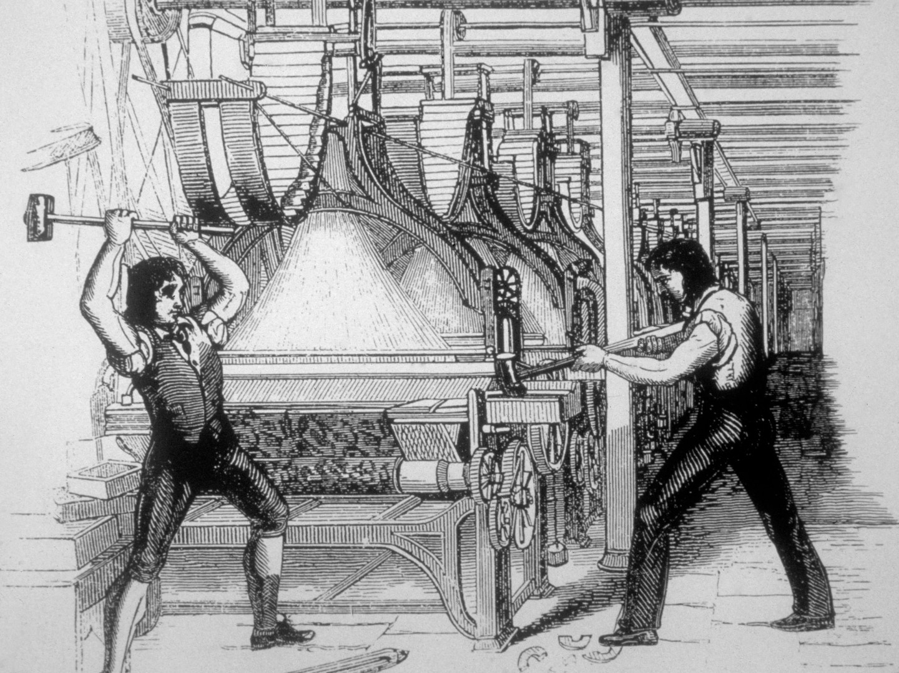

+++
title = "Neo-Luddism: How People Got Fed Up"
description = ""
draft = true
[taxonomies]
tags = ["100DaysToOffload"]
[extra]
banner  = "banner.webp"
[extra.comments]
id = ""
+++

## Backstory


I recommend giving [this article](https://www.smithsonianmag.com/history/what-the-luddites-really-fought-against-264412/) a read, it tells a story of Luddism in great details. It's been published back in 2011 but it's still the best article out of ones that I read when researching this topic.


Before we get to Neo-Luddism, we first need to understand what Luddism is.

Essentially, it's a movement of English textile workers who opposed the use of certain types of automated machinery due to concerns about lower wages for textile workers and a perceived reduction in the quality of output. It began in England in the early 1800s, during a period of increasing industrialization, hard economic times due to costly conflicts with France and the United States, and widespread unrest among workers.

They often smashed machines in textile factories in organized raids as a form of protest. They took their name from the story of Ned Ludd, a mythical weaver who supposedly smashed two knitting machines in a fit of rage. They would use it as a pseudonym in threatening letters to mill owners and government officials.

It's important to note that the Luddites didn't just smash machines "just because;" they only targeted machines owned by manufacturers who were known to pay low wages, disregard workers' safety, and/or speed up the pace of work.

Even within a single factory that contained machines owned by different capitalists, some machines were destroyed and others weren't, depending on the business practices of their owners.

The Luddites didn't oppose the new technology per se, but rather the misuse of it. The technology wasn't all that new, what was new was the steady replacement of workers with it.

In the end, the factory owners won: they convinced the state to make "frame breaking" a treasonable crime, punishable by execution and penal transportation. The Luddites existed for 5 years, until they were suppressed by legal and military forces.

But the idea continued to live on...

## Neo-Luddism

Now, Neo-Luddism. What is that and how it's different from the original Luddites?

Neo-Luddism (or New Luddism) is a leaderless movement of unaffiliated groups who oppose modern technologies and advocate a return of some or all technologies to a more primitive level. Neo-Luddites tend to have a broader and more general skepticism of technological improvement than the original Luddites. They are characterized by one or more of the following practices:

- Passively abandoning the use of technology.
- Harming those who produce environmentally harmful technology.
- Advocating simple living.
- Sabotaging technology.

The modern neo-Luddite movement has connections to the anti-globalization movement, anarcho-primitivism, radical environmentalism, and deep ecology. It is based on concerns about the effects of technology on individuals, their communities, and/or the environment; Neo-Luddism prescribes the use of the precautionary principle for all new technologies, insisting that technologies be proven safe before adoption, because of the unknown effects that new technologies may have.

As per 1990 [neo-Luddism manifest](https://theanarchistlibrary.org/library/chellis-glendinning-notes-toward-a-neo-luddite-manifesto), principles of it are:

> 1. *Neo-Luddites are not anti-technology.* Technology is intrinsic to human creativity and culture. What we oppose are the kinds of technologies that are, at root, destructive of human lives and communities. We also reject technologies that emanate from a worldview that sees rationality as the key to human potential, material acquisition as the key to human fulfillment, and technological development as the key to social progress.
> 2. *All technologies are political.* As social critic Jerry Mander writes in Four Arguments for the Elimination of Television, technologies are not neutral tools that can be used for good or evil depending on who uses them. They are entities that have been consciously structured to reflect and serve specific powerful interests in specific historical situations. The technologies created by mass technological society are those that serve the perpetuation of mass technological society. They tend to be structured for short-term efficiency, ease of production, distribution, marketing, and profit potential — or for war-making. As a result, they tend to create rigid social systems and institutions that people do not understand and cannot change or control.
>
> As Mander points out, television does not just bring entertainment and information to households across the globe. It offers corporations a surefire method of expanding their markets and controlling social and political thought. (It also breaks down family communications and narrows people's experience of life by mediating reality and lowering their span of attention.)

In the last 30+ years a lot have changed, but this manifest still holds up.

## So, What's The Deal?

In our age, when the Internet is flooded with AI-generated articles, images, and music, neo-Luddism is becoming more and more popular - people are fed up, not only with AI, but also with social media with its doomscrolling and fake realities, smartphones that are too smart, spyware advertised as privacy, and such, so they [move to dumbphones](@/blog/2024-07-08-using-dumbphone/index.md), install custom ROMs, move to smaller cities or even outside of them; join slow living movement, and generally trying to reduce their dependence on the new technology that turned out not to be as sweet as it seemed.

I think this is pretty neat. I could water down this article with my own thoughts about how fucked up our world is, but I'll leave this up to you, I just wanted to give you a brief introduction to Luddism and Neo-Luddism, since I think this should be more popular.

There are some nice articles about it and there's no need to re-type them here, just give them a read:

- [I'm a Luddite. You should be one too](https://theconversation.com/im-a-luddite-you-should-be-one-too-163172)
- [A Nod to Ned Ludd](https://thebaffler.com/salvos/a-nod-to-ned-ludd)
- [What's a Luddite? An expert on technology and society explains](https://theconversation.com/whats-a-luddite-an-expert-on-technology-and-society-explains-203653)
- [Will 2018 be the year of the neo-luddite?](https://www.theguardian.com/technology/2018/mar/04/will-2018-be-the-year-of-the-neo-luddite)
- [Rethinking the Luddites in the Age of A.I.](https://www.newyorker.com/books/page-turner/rethinking-the-luddites-in-the-age-of-ai)
- [The neo-Luddites: how much tech is too much?](https://cybernews.com/editorial/neo-luddites-how-much-tech-is-too-much/)
- And so on. These are just ones that I read during the research and thought are somewhat decent.
