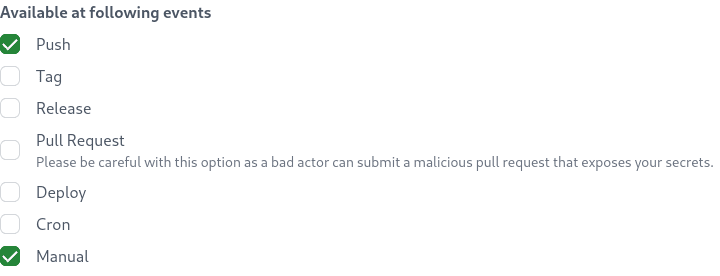

+++
title = "Deploying a Zola Website to Codeberg Pages"
description = "Step-by-step guide to deploying a Zola website using Codeberg Pages."
[taxonomies]
tags = ["100DaysToOffload", "Codeberg", "Zola"]
categories = ["Featured"]
[extra]
accent_color = ["hsl(218.57143 7% 39%)", "hsl(192.85715 18% 70%)"]
banner = "banner.webp"
toc = true
audio_button = true
[extra.fediverse]
host = "vmst.io"
user = "daudix"
id = "112956494344143118"
+++

<small>Photo by [Lubomir Minar](https://www.lubomirminar.com) on [Unsplash (archived)](https://web.archive.org/web/20210124002804/https://unsplash.com/photos/3K6ZkYBj2Xo).</small>

> [!NOTE]
> This guide focuses on the Zola <abbr title="Static site generator">SSG</abbr>, but other SSGs like Hugo and Jekyll should work with this guide as well.

This guide is intended to help with the process of getting a Zola website up and running using Codeberg and Codeberg pages; some of the steps are confusing, so this article tries to clear them up.

It assumes that you have Git set up and Zola installed already. If not, check the following [guide by GitHub](https://docs.github.com/en/get-started/getting-started-with-git/set-up-git) on setting up Git and [Zola's documentation](https://www.getzola.org/documentation/getting-started/installation/) on installing it.

## What Is Codeberg?

Codeberg is a free forge for free and open source projects. A forge is a web-based collaborative software platform for both developing and sharing various software projects.

You may be familiar with GitHub, and well, it's pretty much the same thing, except it doesn't compromise user privacy, it doesn't violate license agreements, and it doesn't train its AI on code that users host there. I [moved away from GitHub](@/blog/2023-07-15-migration-from-github-to-codeberg/index.md) myself some time ago, and have no regrets.

See [Give Up GitHub!](https://sfconservancy.org/GiveUpGitHub/) and [Please don’t upload my code to GitHub](https://nogithub.codeberg.page) to get a better understanding of why GitHub is bad.

## Sign up on Codeberg

This one is pretty straightforward, you just go to [codeberg.org](https://codeberg.org) and press that big "Register now." button. The rest is self-explanatory.


## Create the Repository

Now you can create a repository for your website. A repository is like a public folder with your project that you and others can work on.


Now name the repository `pages` if you don't plan on using custom domain, otherwise you need to choose a different name, e.g. `website`. That's because Codeberg pages don't work well with custom domains and `pages` repository with the `pages` branch. It's confusing so just know that such combo won't work.


I also recommend checking this "Initialize repository" box to save some time later.


Now you can go and smash that "Create repository" button and proceed to the next step.

## Initializing Zola Website

To be completely unbiased, I will use my own [Duckquill](https://duckquill.daudix.one) Zola theme in this example {{ emoji(path="troll.png") }}

Jokes aside, you can use any theme from [getzola.org/themes](https://www.getzola.org/themes/), but to make sure we're on the same page we'll use Duckquill.

First, clone the newly created repository and then `cd` into it.

```bash
git clone <repository_url>
cd <repository_name>
```

Then, initialize a new Zola site with `zola init --force`. You can simply spam <kbd>Enter ↵</kbd> since we'll use our own configuration anyway. (The reason why the `--force` flag is used is that Zola doesn't like the presence of Git files in the folder and doesn't want to proceed otherwise)

Now you'll need to add the Duckquill theme as a Git submodule:

> [!NOTE]
> A Git submodule is a repository inside another repository. When you add a submodule, Git adds it to a special `.gitmodules` file, which can then be read by Git somewhere else and clone the needed repository in place, which will be helpful later when we set up the <abbr title="Contineventuous integration">CI</abbr> workflow.

```bash
git submodule init
git submodule add https://codeberg.org/daudix/duckquill.git themes/duckquill
```

Now we need to switch to the latest release instead of the unstable `main` branch:

```bash
cd themes/duckquill
git checkout tags/v4.2.1
```

> [!TIP]
> You can check the latest release here: <https://codeberg.org/daudix/duckquill/releases>

Now you can try serving the site locally:

```bash
zola serve
```


Hm, doesn't look quite right...

That's because we first need to add some bare-bones configuration to `config.toml`:

```toml
title = "Demo"
base_url = "https://pages-demo.daudix.codeberg.page"
description = "Demo site for a blog post."
theme = "duckquill"
```

And let's create a homepage by creating an `_index.md` file under `content` with the following contents:

```markdown
+++
+++
```

And we get...


Alright, perhaps our config is too bare-bones, let's enable navbar and a footer:

```toml
[extra.nav]
links = [
  { url = "https://example.org", name = "Example" },
]

[extra.footer]
show_copyright = true
show_powered_by = true
show_source = false
```

And add something to the homepage:

```markdown
+++
title = "I'm a homepage, look at me!"
+++

# Hello There!

I'm just a demo, I like to **demo**nstrate stuff, **demo**lish stuff, and I'm a **demo**crat (no actually, I'm just a silly demo)
```


Much better. You can customize it further by looking at [Duckquill's config](https://codeberg.org/daudix/duckquill/src/branch/main/config.toml).

Now we can push the changes to Codeberg and set up the CI to build and deploy our site to Codeberg pages.

## Setting up the CI

> [!IMPORTANT]
> Before we get to setting up the CI, we first need to get access to it. You'll need to fill [the following form](https://codeberg.org/Codeberg-e.V./requests/issues/new?template=ISSUE_TEMPLATE%2fWoodpecker-CI.yaml) at [Codeberg-e.V./requests](https://codeberg.org/Codeberg-e.V./requests) repository and wait for approval. After your request been approved, we can proceed further.

Copy [the following Woodpecker workflow](https://codeberg.org/Codeberg-CI/examples/src/branch/main/Zola/.woodpecker.yaml) example from [Codeberg-CI/examples](https://codeberg.org/Codeberg-CI/examples) and put it in the `.woodpecker.yaml` file in the root of your project. If you want the CI to be able to run manually, add `manual` to steps that have the `push` events in them.

```yaml
# Takes a repository with Zola source, generates the static site and
# pushes the result to the pages branch of the same repository
#
# Must be set in Woodpecker configuration:
# mail: Your email address used by Codeberg
# codeberg_token: Codeberg access token with "write:repository" permission
#
# .domains file can be put inside static folder in Zola source
#

# Exclude the pipeline to run on the pages branch
when:
  branch:
    exclude: pages

# Clone recursively to fully clone the themes given as Git submodules
clone:
  git:
    image: woodpeckerci/plugin-git
    settings:
      recursive: true

steps:
  # Build Zola static files
  build:
    image: alpine:edge
    commands:
      - apk add zola
      - zola build
    when:
      event: [push, pull_request, manual]

  publish:
    image: bitnami/git
    secrets: [mail, codeberg_token]
    commands:
      # Configure Git
      - git config --global user.email $MAIL
      - git config --global user.name "Woodpecker CI"
      # Clone the output branch
      - git clone --branch pages https://$CODEBERG_TOKEN@codeberg.org/$CI_REPO.git $CI_REPO_NAME
      # Enter the output branch
      - cd $CI_REPO_NAME
      # Remove old files
      - git rm -r "*" || true # Don't fail if there's nothing to remove
      # Copy the output of the build step
      - cp -ar ../public/. .
      # Commit and push all static files with the source commit hash
      - git add --all
      - git commit -m "Woodpecker CI ${CI_COMMIT_SHA} [SKIP CI]" --allow-empty
      - git push
    when:
      event: [push, manual]
```

Push the changes and go to [ci.codeberg.org](https://ci.codeberg.org). There, add the `pages` repository we created earlier:

```bash
git add --all
git commit --message "Initial commit"
```


Now, [create a secret](https://codeberg.org/user/settings/applications) on Codeberg so CI can push the changes. You need to set the `repository` scope to `Read and write`.


Copy and paste the resulting token somewhere, since it couldn't be seen after the page reload.

Now add the needed secrets in the Woodpecker repository settings by clicking on the repository in the list:


Navigate to the "Secrets" tab:


Add secret with the name `mail` with email you used for Codeberg as the value, with the `Push` and `Manual` events selected (the later is only needed if you added `manual` event in the CI file):




Do the same for the `codeberg_token`, use the token we generated earlier as the value.

We're almost there! now we just need to create the `pages` branch on Codeberg where the build result will be pushed:


Now we can run the first build by pressing the "Run pipeline" button in Woodpecker.

If everything is done properly, the build should succeed and site be available on `<username>.codeberg.page`.

## Conclusion

{{ audio(url="party-horn.mp3", name="Congrats!") }} You are now officially a web citizen! Show off your new site to the world; it's something to be proud of! Since it's yours and yours alone, you can do whatever you want with it; add silly gags all over the place, write serious or not-so-serious articles, let it rot for eternity, you name it!

If you run into problems or need help with any of the steps, feel free to [reach out](@/_index.md#contacts), I will try my best to help ^^
