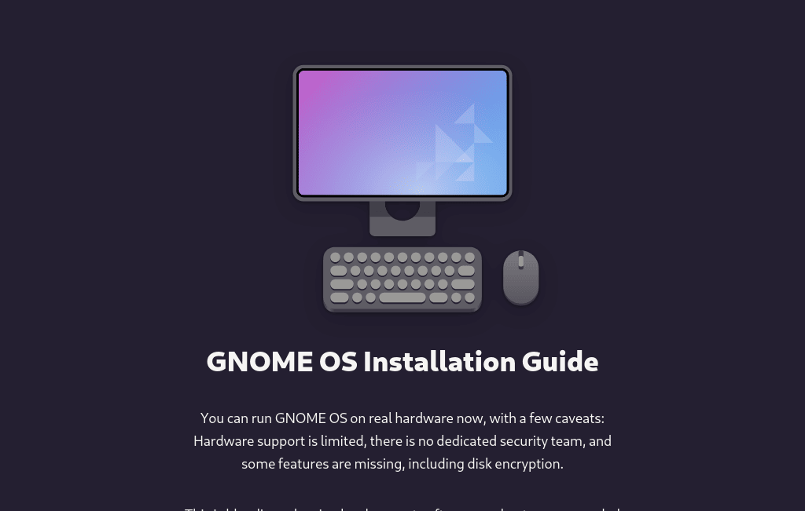
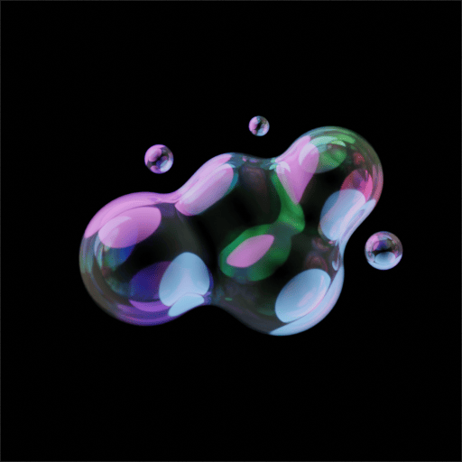
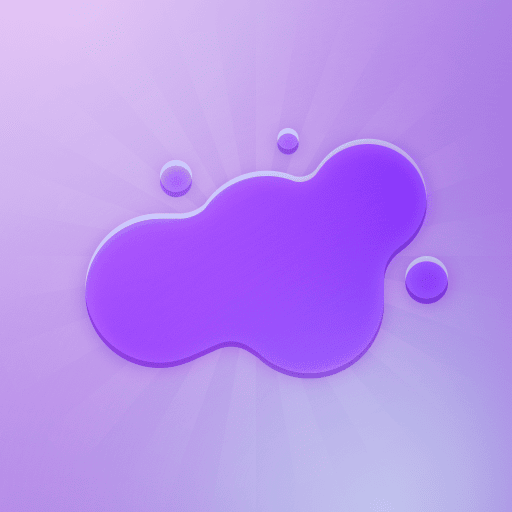
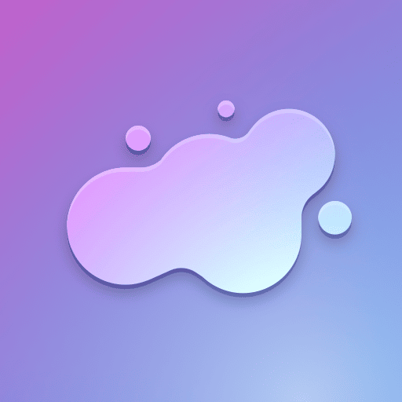
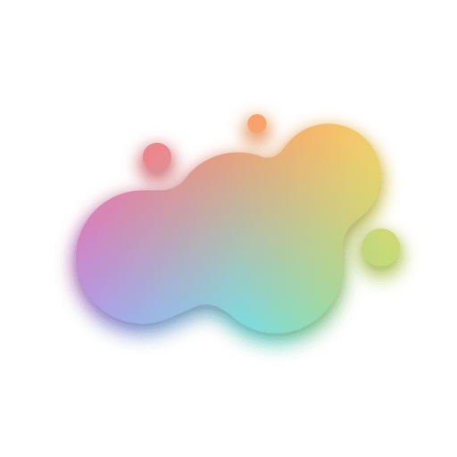
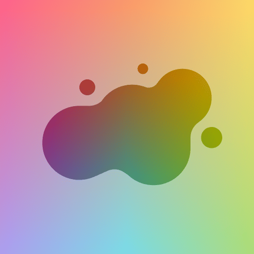
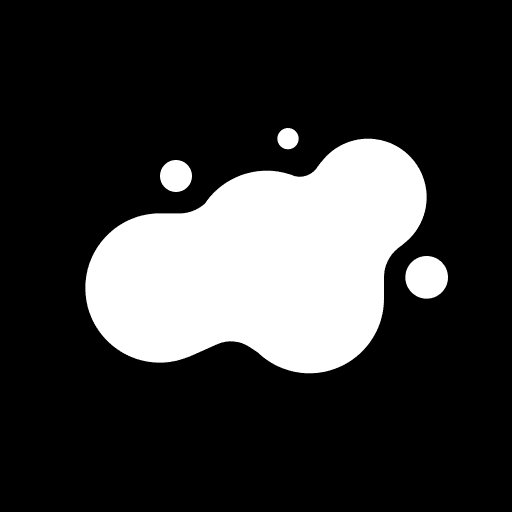
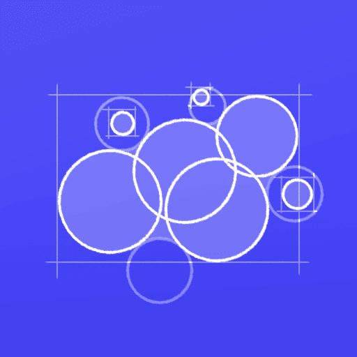

+++
title = "Personal Branding Experiments"
description = "Experimenting with my logo style, colors, textures, and design philosophy."
updated = 2024-08-18
[taxonomies]
tags = ["100DaysToOffload", "Design", "Blender", "Inkscape"]
[extra]
accent_color = ["hsl(240.34483 82% 58%)", "hsl(240.38217 88% 65%)"]
banner = "banner.webp"
toc = true
audio_button = true
[extra.fediverse]
host = "vmst.io"
user = "daudix"
id = "112975067115258952"
+++

Over the past few days I've been experimenting with my logo/avatar/whatever (let's call it... IDK, "logotar") and exploring new styles–because why not? It's fun, quite fun, and honestly, pretty fun. I won't go into the backstory of the logotar, though, because it's outside the scope of this article and it looked like absolute crap, so... WAIT WHAT-

*Sounds of bones being crushed with 2 tons of plush.*

Okay, fiiine.

## Backstory

A while *back*, *back* in August 2019, when I didn't have *back* pain (just kidding), my mom and I drew this logotar on an iPad 2. It's not spectacular by any means, but it's important to me because, well, we drew it with my mom, it's my first logotar, and it captures things I like, like Lego and... yeah, that's it. I was even more boring and annoying than I am now. And damn, that UFO suffix really, really sucked...

Fast forward unknown amount of time when I learned of the existence of Canva, in which I "made" this logotar; by "made" I mean I found this stock metaball thingy and colored it in this blue gradient. (there were earlier versions, but they were just ugly because they had a little "DAUDIX UFO" text underneath the blob, which used uglier shades of blue; BSOD-level ugly blue)

I used this logotar for a while, until-

## Cold Boot

Related: [Animation of it on YouTube](https://www.youtube.com/shorts/53Cv27Sjtgw).

That's right, it's a bold reference to a Portal 2 chapter with the same name, who might've guessed ¯\\\_\(ツ)\_\/¯

Anyway, what I was talki- I mean writing about? Oh yeah, the logotar. One day I was visiting the [GNOME OS website](https://os.gnome.org/install/) and I saw this very cool illustration and I *really* liked the way the purple-blue gradient looked, and I did what I do when I like something. STOLE IT. {{ audio(url="scooby-doo.mp3", name="Rehehehe") }}.

Yeah, that's where this gradient and the whole idea of redesigning my logotar came from. As silly as it sounds.

I've been using this logotar for a while, and still do, but a few days ago I felt like trying something new, something that's been on my to-do list for like forever.

## Experiments

TL;DR: Here's the results of my experiments:

Now, a bit about each of them (in the order in which the logotars appear):

- Bubbles: A while ago I did a silly [experiment](https://raw.githubusercontent.com/daudix/assets/6a9442fb432facba26c74c48043a851dc54d5704/daudix/experiments/metaballs.png) where I remade my logotar in Blender using real meta*balls*, and it turned out pretty decent; I even used it for a day or two on Mastodon. Since I still had the `.blend` file on my PC, I thought why not try to create something I had been wanting to do for a while–soap bubbles! (shout out to [this tutorial](https://www.youtube.com/watch?v=9myqCVH3IKA) for the bubble material)
- Candy: Had some fun with layer blend modes that turned into this skeuomorphic tasty-looking thing. See those "rays" in the background? I like rays like that :P
- Déjà Vu: Reimagining of my current logotar; quite familiar and yet different in some way.
- Mesh: Boldly inspired by [this elementaryOS logo](https://raw.githubusercontent.com/elementary/brand/f4c51a70190b63332e62bb633fe99ac801935aef/logomark-mesh.png). What I like about it is that it doesn't use purple exclusively, but rather a spectrum of colors taken from the [Monokai Pro palette](https://github.com/subtheme-dev/monokai-pro/blob/4978c01ff3116e4dd19825d93e4e6c182d361764/colors/default.yaml); the same colors used in the rainbow strip on the Polaroid picture on the homepage. For me it's kind of important, because I don't want my next logotar to stop me from changing my "brand color", if that makes sense. I'm pretty fed up with the current [Purple 2](https://developer.gnome.org/hig/reference/palette.html) to be honest. What's complicated about not being tied to a single color is that I have no idea what to do with things like my 88x31 button.
- Mesh (alt): Ditto, but inverted(?). I don't like it because it's a little too colorful for my taste.
- Mono: The laziest and most recent experiment, if you can even call it that.

About Bubbles; I went even further and made this shitty animation, again just for fun and I didn't put much effort into it. (I say that so you don't think I'm *that* shitty animator)

<video alt="Bubbles floating towards the center of the screen, forming the logo." controls src="bubbles.webm"></video>

You might've noticed the Mesh variant already being used on Matrix and Déjà Vu on Mastodon and Bluesky, what does that mean?

Well, nothing really, I just throw logotars on profiles and see what sticks.

*Looking away* that didn't sound very professional.

I meant to say that I conduct an A/B testing in the real world scenarios to determine which logotar variant fulfills the desired objectives better.


Silly me just realized that the blueprint logo I made for the banner is actually another experiment! I might explore this direction further, I'm pretty sure it'll look swag in purple.



## Conclusion

That's about it, this was supposed to be a short and silly article that was supposed to be published the following day after I created these logotars, but I was constantly distracted from writing and ended up finishing it five days later. So... yeah, see you in the next one ^^

P.S. I wholeheartedly hate the word "logotar".
