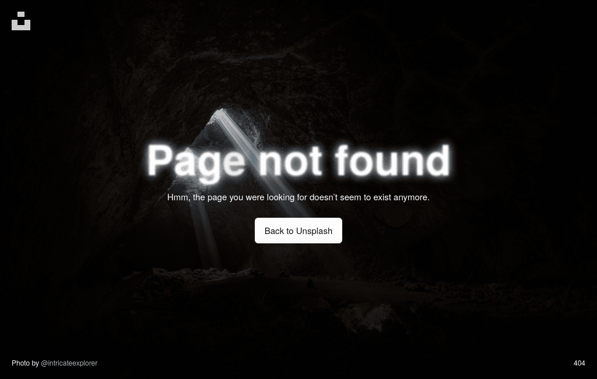
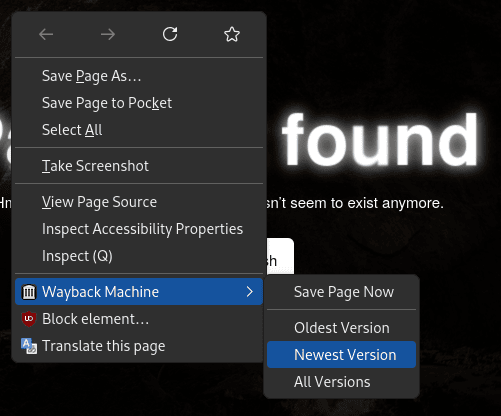
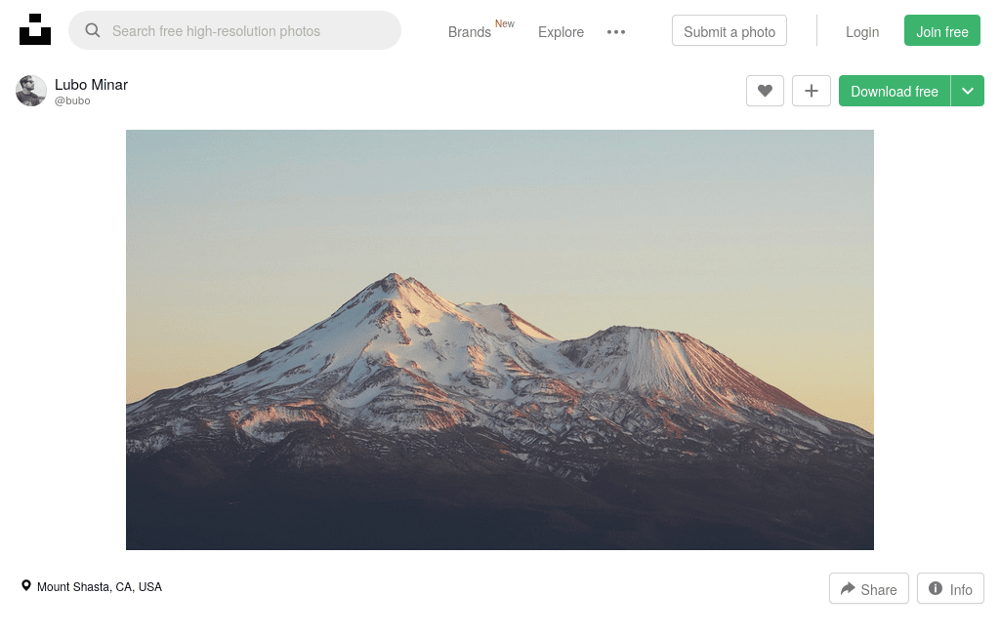

+++
title = "Download Deleted Photos from Unsplash in Original Quality"
description = "Sometimes a link to an Unsplash image returns 404, what can be done in this case?"
updated = 2024-09-26
[taxonomies]
tags = ["100DaysToOffload", "Unsplash"]
[extra]
accent_color = "#404a57"
accent_color_dark = "#989590"
banner = "banner.webp"
toc = true
[extra.comments]
host = "vmst.io"
user = "daudix"
id = "113065883239236763"
+++

## Backstory

I was making a banner for the [Codeberg Pages](@/blog/2024-08-13-deploying-to-codeberg-pages/index.md) post and wanted to use the same mountain image as on the Codeberg landing page. Since I couldn't find the source on their website, I went to the Git history of the somewhat relevant repositories under various Codeberg organizations and found the [homepage renovation pull request](https://codeberg.org/Codeberg-Infrastructure/forgejo/pulls/35), which mentioned the [source](https://codeberg.org/Codeberg-Infrastructure/forgejo/pulls/35#issuecomment-494030). Unfortunately, the page returned a 404.



All I had to do was right-click and open the [last Wayback Machine snapshot](https://web.archive.org/web/20210124002804/https://unsplash.com/photos/3K6ZkYBj2Xo).



Obviously, the download buttons didn't work, so I visited the photo author's Unsplash profile, but it returned a placeholder, so I used the one archived by Wayback Machine.


Unfortunately, [his website](https://www.lubomirminar.com) didn't have the photo I needed, so I had to use what I had: the thumbnail; its size was fine for the banner, so I went ahead and used it.



But the fact that a low quality thumbnail was used for the banner kept bothering me, so I decided to locate the source.

Upon inspecting the link to the thumbnail image on Unsplash, I noticed that you can change some of its attributes to get a higher quality image, so I returned to the mountain photo snapshot and copied the link to it, removed the Wayback Machine prefix, and to my surprise it was still available, probably because `images.unsplash.com` keeps the deleted images anyway to avoid breaking hotlinks.

## The solution

So what's the perfect combination of link attributes to get the original image? It's `?auto=format&q=100`, these individually won't return the original image, but together they will.

The resulting URL should look like this, without all the extra stuff like site tracking.

```txt
https://images.unsplash.com/photo-1575908524891-b0bdd2b99f90?auto=format&q=100
```

The solution, as you guessed, requires the existence of at least one [Wayback Machine](https://web.archive.org) snapshot with the thumbnail; if there is no such snapshot, this hack won't work because the `images.unsplash.com` image ID is different from the one on `unsplash.com`. Still better than nothing, huh?

## Conclusion

Was it worth it? [Maybe](https://codeberg.org/daudix/website/commit/dfcaefd202553b867611254791eaab4bc316a812), maybe not. This shows once again how much I care about stupid little things that no one would ever notice.
