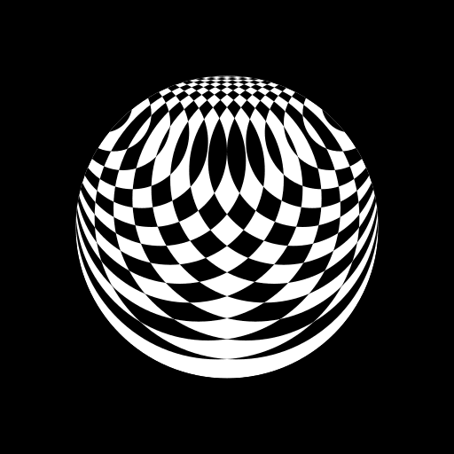
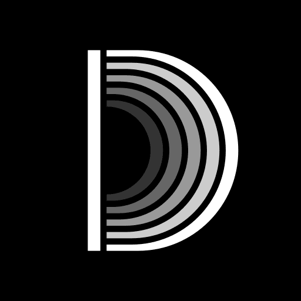

+++
title = "Personal Branding Experiments #2"
description = "Experimenting with my logo once again, with something actually new this time."
[taxonomies]
tags = ["100DaysToOffload", "Design", "Inkscape"]
[extra]
banner = "banner.webp"
[extra.comments]
id = "113165388369757692"
+++

Remember when I wrote in the previous blog post:

> Experimented with my personal branding, this time completely new designs executed in monochrome. About this in the next post later today, I suppose.

Here I am, a week later. Classic me.

This whole "branding experiments" session wasn't planned and happened accidentally when I decided to tweak the [DejaVu design](@/blog/2024-08-17-brand-experiments/index.md) a bit; I got carried away with the blend modes and it turned into a blank black canvas on which I started overlaying white circles in variety of ways, getting some neat results. Some turned out better than the others, but only one of them was logo-shaped.

See that "D"? Yeah, it was the last one in the batch and I kinda liked it, so I made a few more versions, that you might've already noticed on the homepage.

The colored variant looks cool, has retro vibes (Commodore/Apple logos), uses [Monokai Pro palette](https://github.com/subtheme-dev/monokai-pro/blob/4978c01ff3116e4dd19825d93e4e6c182d361764/colors/default.yaml), and has some hidden meaning; it is rainbow shaped if you rotate it, the purple line stands on its own and is bold because it's my favorite color (my little sister successfully noticed these, so I guess these aren't that obscure), but it's too colorful to use everywhere, for my taste, so I made a grayscale variant and it looks more interesting than the completely monochrome one, while still being serious-ish.

After I made these I decided to run them through reverse image search (Yandex is the best at this), and turns out there are some pretty similar logos out there, but I haven't found too-similar-looking "D" so that's nice.

And that's about it. See you in the next one and have a good day/night!
