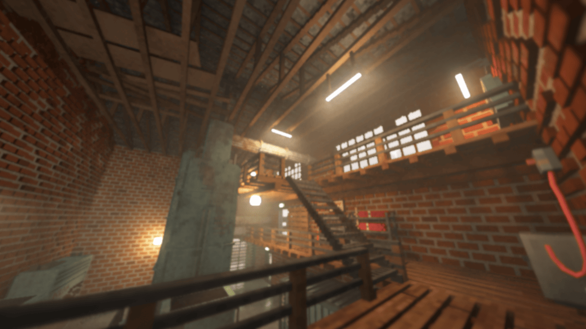
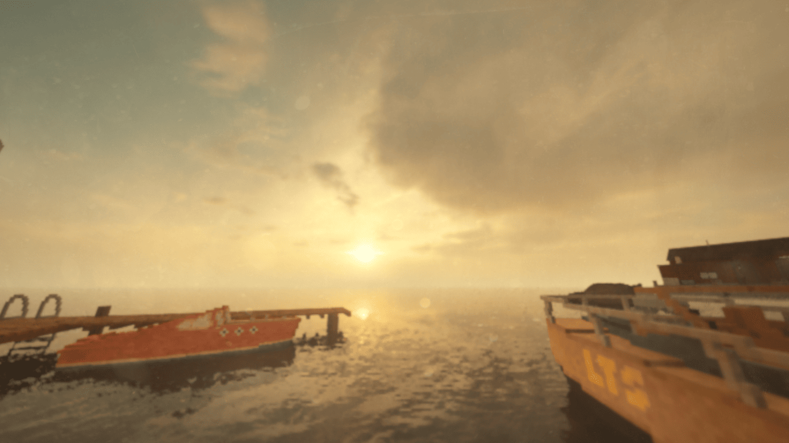
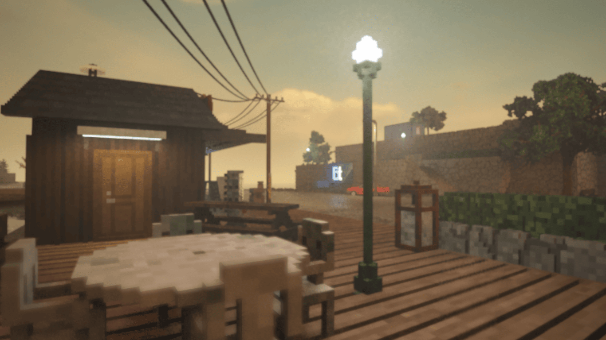
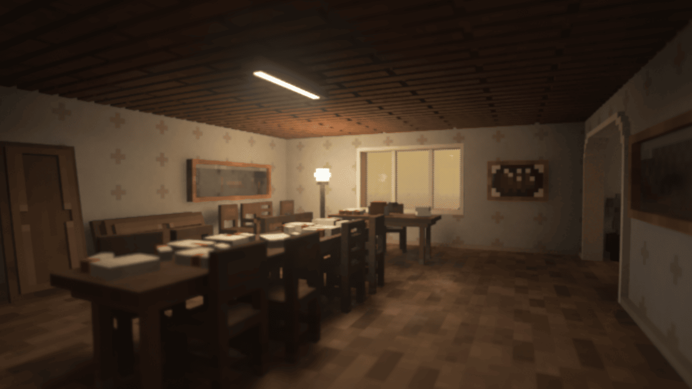
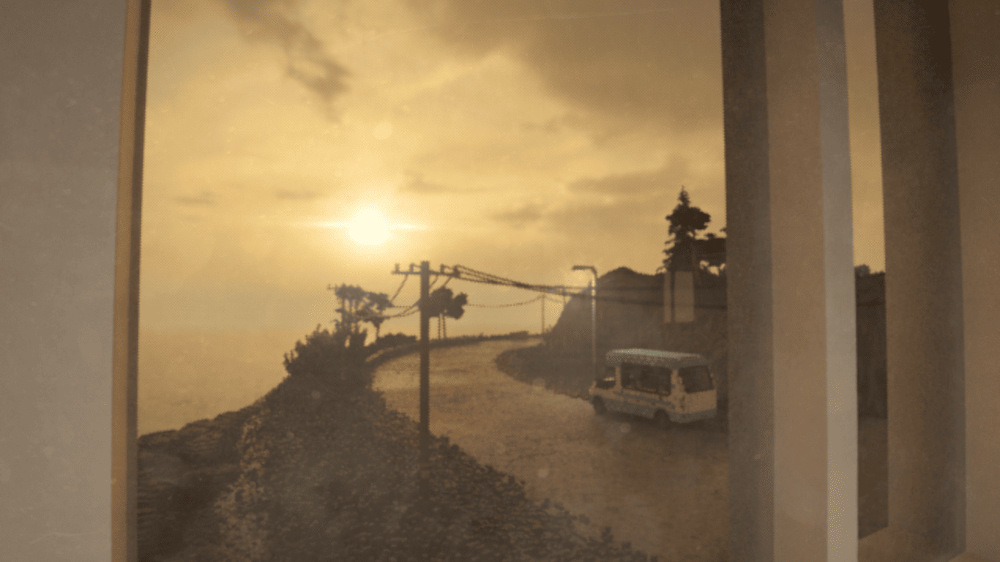
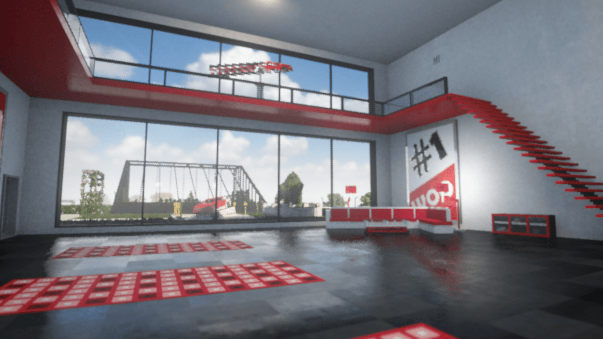
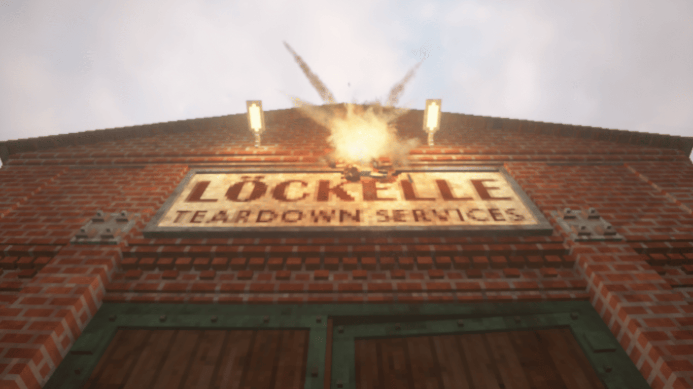
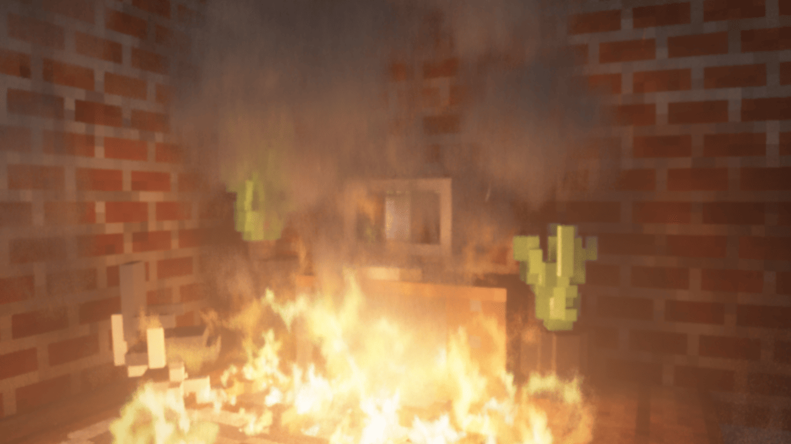
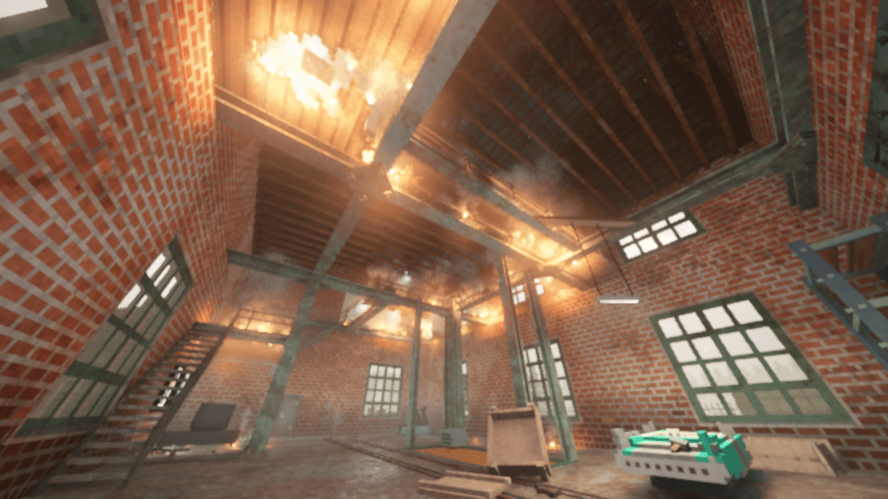
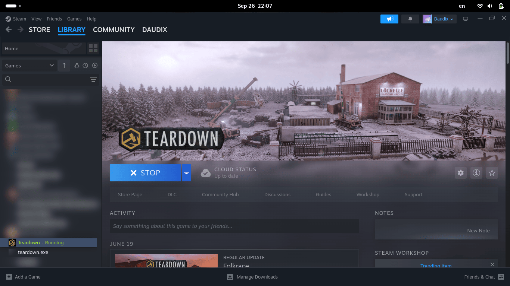

+++
title = "Teardown - The Criminal Simulator"
description = "Playing a fun game about tearing stuff down."
updated = 2024-09-28
[taxonomies]
tags = ["100DaysToOffload", "Gaming", "Teardown"]
[extra]
banner = "banner.webp"
[extra.comments]
id = "113210064391141759"
+++

TL;DR: Fun game.

As you may know, I occasionally play games, which is shocking in itself, but even more shocking is that I've never blogged about it, so let's change that! (well, I just don't know what to blog about xD)

Teardown is a game released back in 2022, but I have played the early access version released in 2020 on YouTube (as in, I watched let's plays). Recently I decided to replay it, and it's been pretty fun, the process of carefully coming up with an optimal route and then executing it in under 60 seconds is pretty entertaining. My little brother seems to enjoy watching all this happen as well.

In terms of visuals, it's pretty fresh, using voxel graphics à la [MagicaVoxel](https://ephtracy.github.io) along with semi-realistic physics that work very well together. It's fun to just walk around and smash stuff with a sledge, toss chairs around, break glass, demolish buildings using propane tanks, and such.

Due to hardware limitations I had to change the rendering quality all the way down to 50%, but even then it looks awesome, here's some shots from built-in photo mode.

The sound design in this game is top notch, from the braking sounds of the various cars to the soundtrack, let alone the track that plays during the escape.

The story side of the game is pretty fun as well. We are playing as an "owner of a financially stricken demolition company, who is caught undertaking a questionable job and becomes entangled between helping police investigations and taking on further dubious assignments" (thanks Wikipedia). What I find funny is how rich guys contact the player and ask to steal some other rich guy's cars or whatever, only for that rich guy to contact us and say that "someone" stole his cars and ask us to take revenge by stealing his paintings or whatever. Working for both sides at its best :P

I'm currently on the level "Crook," which is quite early on, and I think it's going to take a while to complete it at the current rate; 1 mission per gaming session, which takes 40 mins - 1 hour.

Another funny thing is that Steam thinks it's purchased, even though I just added the *legally acquired* version to the library. It seems that the cloud saves work even.

As this is a Windows-only game, I play it through Proton and it... just works? I simply added it to my games library and ticked the "Force the use of a specific Steam Play compatibility tool" checkbox in its settings, nothing more. In fact, I moved all my games to the Steam library to play them through Proton, as it works without the sheganings Bottles has (Bottles is still a very cool app).

And that's about it. See you next time!
