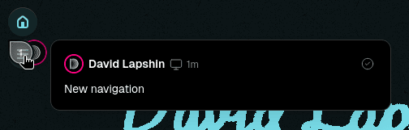

+++
title = "On Move to Vercel"
description = "How and why I've moved this site away from Codeberg Pages."
[taxonomies]
tags = ["100DaysToOffload", "Devlog", "Vercel", "Codeberg"]
[extra]
accent_color = "#007fa4"
accent_color_dark = "#02a4d3"
banner = "banner.png"
toc = true
[extra.comments]
id = "113613291522721129"
+++

*Sigh* I know, yet another devlog after almost a month of radio silence (heh, if only). I could turn this into a long rant/vent, but let's rather not, and instead let me tell you how I moved this site from [Codeberg Pages](https://codeberg.page) to [Vercel](https://vercel.com) for no reason :P

## Backstory

There were actually some reasons why I switched:

- **Bad uptime.** Lately it became much better, but it's still not perfect.
- **Slow builds.** Plus I feel guilty using it for such silly thing as this site.
- **Slow page loading.** Subjective, but it felt pretty slow to me.
- **Lacks some security headers.** [Mozilla Observatory](https://developer.mozilla.org/en-US/observatory) yells that it's unsecure. Doesn't really mean anything for static sites, but still.

Regarding the speed issues; I thought that I will move back to [exozyme](https://exozy.me) after its "Great November Downtime" caused by the fatal SSD failure, but shortly after its revival it was deprecated and is due to shut down soon... So yeah, no way back. <small>(Sadge :<)</small>

## The Move

To my surprise, it was really very easy and smooth. Since I already had an account (I have accounts everywhere) I've gone right to the setup, essentially:

- Followed [this](https://www.markpitblado.me/blog/deploying-to-vercel-from-codeberg) guide; It used an out-of-date syntax for secrets, so I had to change it, plus I added a separate "check" step for pull requests:

```yaml
# Based on https://www.markpitblado.me/blog/deploying-to-vercel-from-codeberg

steps:
  preview:
    image: node
    environment:
      VERCEL_TOKEN:
        from_secret: vercel_token
      VERCEL_ORG_ID:
        from_secret: vercel_org_id
      VERCEL_PROJECT_ID:
        from_secret: vercel_project_id
    commands:
      - npm install --global vercel@latest
      - vercel deploy --token=$VERCEL_TOKEN
    when:
      event: [pull_request]

  deploy:
    image: node
    environment:
      VERCEL_TOKEN:
        from_secret: vercel_token
      VERCEL_ORG_ID:
        from_secret: vercel_org_id
      VERCEL_PROJECT_ID:
        from_secret: vercel_project_id
    commands:
      - npm install --global vercel@latest
      - vercel deploy --prod --token=$VERCEL_TOKEN
    when:
      event: [push, manual]
```

- Got a Vercel access [token](https://vercel.com/account/tokens) to be used in the CI. Keep in mind that you won't be able to reveal it once you create it, so save it somewhere, e.g. in password manager.
- Installed [Vercel CLI](https://vercel.com/docs/cli) using NPM and initialized the project using:

```bash
vercel login
cd <PROJECT FOLDER>
vercel link
```

I was nicely surprised that it automatically detected that I use Zola and set everything up for me.
- Opened `.vercel/project.json` and kept the window around.
- Added respective secrets in [Codeberg CI](https://ci.codeberg.org) with `push` and `manual` events enabled:
	- `VERCEL_TOKEN` with the access token we got earlier.
	- `VERCEL_ORG_ID` from `project.json`.
	- `VERCEL_PROJECT_ID` from the same file.
- Added `daudix.one` as a domain. This has to be the smoothest domain setup I've seen.
- Deleted `pages` branch and `.domains` file.

After all this I tried pushing and seeing if it works and... It didn't. After short search I [found](https://github.com/orgs/vercel/discussions/3181) that Zola builds are currently broken in Vercel, and to fix it you need to either set `ZOLA_VERSION` environment variable to needed Zola version, or change Node.js version to 20.x. I used the Zola version approach and set it latest version. After this everything worked as expected. Weird issue...

Being excited that it all worked, I moved Duckquill to it as well :3c

But wait, I've gone even further and replaced [GoatCounter](https://www.goatcounter.com) analytics with Vercel's, it doesn't change much, but it's nice to have everything in a single place, I like its UI more, and the latest version gets added to the deployment automatically. I also added speed insights while there. It's blocked by AdBlockers just like GoatCounter, but it's still useful to have at least some metrics.

<figure>


<figcaption>Looks like some sort of spaceship control panel haha.</figcaption>
</figure>

Turns out there's also something called Vercel Toolbar, which is basically spaceship controls injected into the site if you're the owner. Craaazy stuff!




All in all, I'm very happy with it so far. I have some weird feeling about it, as, you know, <q>the only free cheese is in the mousetrap</q>. But that's just me, I haven't heard anything bad about it yet.

There's one thing that I couldn't setup and that is preview deployments, as Vercel need to know from which branch to deploy, and since Codeberg isn't yet supported, we can't do that.

## Conclusion

So, were these reasons sufficient enough for me to switch? No.

Did I switch mostly for funnies? Yup.

Can I still recommend Codeberg Pages? Yes.

And that's it for now, see you in the next one! (hopefully soon)

P.S. <abbr title="Members of the Snug Nook chat">Snug Nookers</abbr> knew about this all along. If you want to too, [feel free to join](@/snug-nook/index.md)! We don't bite :3

P.P.S. The color for the banner was chosen there too xD
