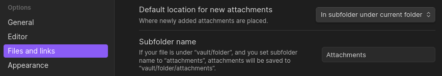
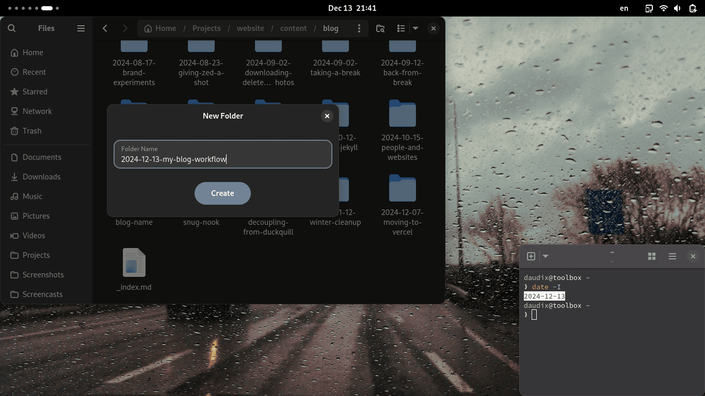
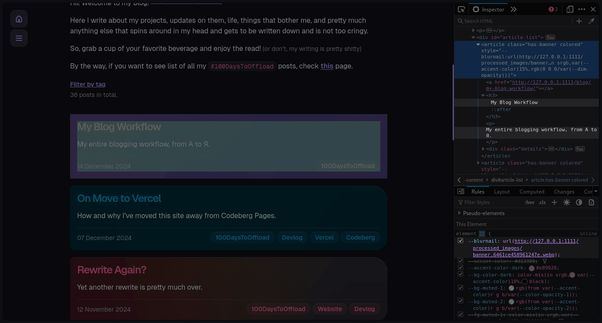

+++
title = "My Blog Workflow"
description = "My entire blogging workflow, from A to Я."
[taxonomies]
tags = ["100DaysToOffload"]
[extra]
accent_color = "#d13300"
accent_color_dark = "#e89928"
banner = "banner.webp"
trigger = "Contains a huge amount of meta, thankfully not the fedi meta."
toc = true
[extra.comments]
id = "113647866479778879"
+++

You know what we do when there's no ideas for a blog post? Write about the blog itself.

This post lists the entire process of writing a blog post, from A to Я, from initial idea to the final result.

## Step 1: Idea

As soon as I come up with a blog idea, I rush to write it down as I will forget it the second something distracts me. I do so in [Obsidian](https://obsidian.md), as it's synced between my phone and laptop using [Syncthing](https://syncthing.net) ([my Silverblue setup](@/blog/2024-02-19-syncthing-in-toolbx/index.md)), this allows me to do so no matter where I am. The idea is usually consists of a title and a single sentence summarizing what the post should be about. All such notes are stored in a "Blog" folder, which has "Attachments" subfolder (this can be configured in Obsidian so that attachments are being put in `current_folder/Attachments`), and an "Archive" folded for older, outdated ideas.



## Step 2: Draft

As soon as I feel like writing, I go thorough said folder in search for something I'd like to write (most ideas are mid so it's pretty hard) and start expanding the short summary to something more post looking. I do so in [Apostrophe](https://apps.gnome.org/Apostrophe/), but at times I forget and write half the post in Obsidian (like I did with this post). Before writing (or sometimes on the first file save if I forget) I create a new folder in my website folder consisting of current date and a short summary of the post, usually it's different from the actual title. I usually just run `date -I` to get the timestamp.



Then, I create a new file with some frontmatter in it, so that I don't have to fill it out manually. GNOME has a not-very-well-known feature called Templates, which is basically a folder in home with any files you want, which you can copy in place from the context menu. I have one called `index.md` with the following contents:

```toml
+++
title = ""
description = ""
draft = true
[taxonomies]
tags = ["100DaysToOffload"]
[extra]
accent_color = ""
accent_color_dark = ""
banner = ""
[extra.comments]
id = ""
+++
```


Afterwards I simply write. Nothing interesting.


## Step 3: Final Touches

After the better part of the post is written, I use [title.sh](https://title.sh) by Vercel to capitalize the title, and check spelling mistakes using [DeepL Write](https://www.deepl.com/write). Worth noting that I keep the changes made by it to minimum, and make sure that my writing style is intact, and only real issues are being fixed. Lately I've beein using it less and less, as the source text is good enough (to DeepL at least). At the start of #100DaysToOffload I used ChatGPT for this purpose, but it required more effort to diff and revert some changes made by it, plus it's more evil and less private than DeepL (I recommend checking out [this](https://ergaster.org/posts/2024/02/26-writing-is-hard/) post comparing different grammar fixing tools).

As for image assets I lossily compress them with [Curtail](https://apps.gnome.org/Curtail). All source images are located under the same path but with `-assets` suffix in the folder name. What I mean is, for exapmle, source `portal-1.png` image is located under `~/Projects/website-assets/content/blog/2007-10-10/`, while compressed version used in the actual post is under `~/Projects/website/content/blog/2007-10-10/`. This way I put the file under the `-assets` folder, and then edit path to remove it and copy files there, compress them, remove the originals and rename compressed files to get rid of `-min` suffix (nautilus can rename multiple files, which is cool).


As for audio (which is very rare), I simply trim it, apply studio fade-in and fade-out, and export as MP3, all using [Audacity](https://www.audacityteam.org).

## Step 4: Banner

Now it's time for a banner. This process is very inconsistent and every banner is unique; some use images from [Unsplash](https://unsplash.com), some are drawn in [Krita](https://krita.org), others are made in Blender, and lately I started using [Inkscape](https://inkscape.org) (I don't know why I didn't earlier). The only consistent thing about them is the resolution and aspect ratio, which is 1920x960px 2:1. As for the file format, it's usually WebP with 92% quality converted from source PNG using [Switcheroo](https://apps.gnome.org/Converter). If the banner is pixel art or dithered image, I use PNG and lossless compression setting in Curtail.


When I'm happy with the banner, I open the downscaled 4x2px version of it (which name I get by inspecting the post card in blog post list) in GIMP and pick colors that look the best, and then I pick another color, but this time make it lighter and more saturated, or vice versa. These two colors are used for page accent color, as you see here. So yeah, all this "Material You" is manual, surprise surprise.

## Step 5: Publication

This is the hardest step, removing `draft = true` from the frontmatter and pushing it to the repo.


Once it's deployed, I post about it on Mastodon using the following template (that I fill out manually):

```txt
#Blog post: <title>

<description>

<post_url>

#100DaysToOffload <additional_hashtags>
```

From where do I get the title and description? No, not from the Markdown file, I extract it using "Inspect Element" from the card on blog posts list. Why? Because Zola actually converts some characters to their proper variants, like three dots to an ellipsis, single quote to apostrophe, and so on. I could automate it and save a lot of time in the long run, but I don't want to spend my time writing the automation.



After all this I copy the post ID from the Mastodon URL and put it in the `extra.comments.id`. One more `git push` later we have comments enabled, yippe!

If I feel like so, I also crosspost said post to Bluesky, but I don't do that often.

## Conclusion

That's it I think, I could forget something, but if I did this means it wasn't all that important.

This post wasn't spellchecked with DeepL and wasn't proofreaded all that much, so apologizes if some typos slipped in.

As always, thanks for reading and see you in the next one!
