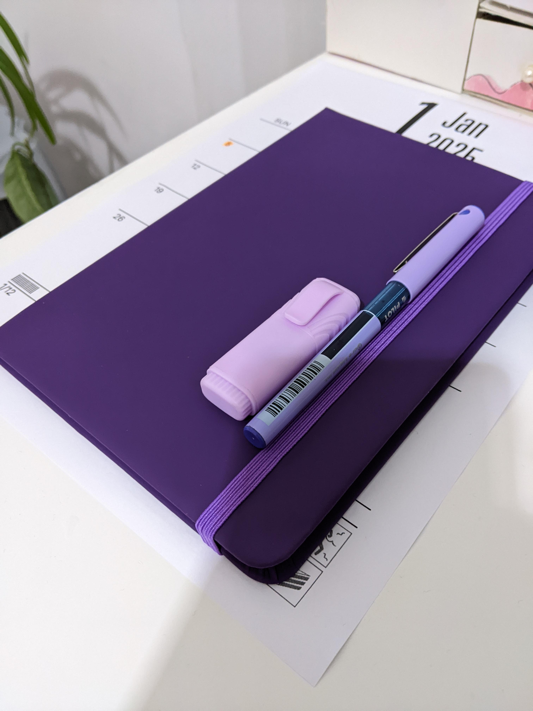
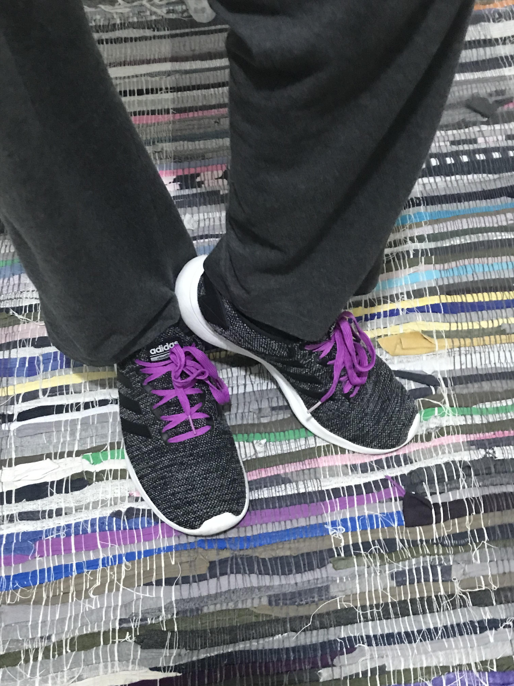

+++
title = "Journal IRL"
description = "My new, purplest journal."
draft = true
[taxonomies]
tags = ["100DaysToOffload", "Life Updates"]
[extra]
bsky = "at://did:plc:2jreyxjktaqqizn7ezvkvdhc/app.bsky.feed.post/3lf6hdnpl6k2y"
+++

Hiya! It was a long time since the last post/entry, and main blog isn't much better, but this post isn't about this, but about my new IRL journal.

Yester-yesterday I've got myself a new journal, not just any but *purple*, which automatically makes it 20% cooler.

And yesterday I got some markers, highlighters, pencils, erasers, bookmarks, and such, and started decorating it. Turned out a bit meh, but who makes something perfect from the first try? I did so together with my sister and mom, who got same journals but dark blue as there weren't any nice colors in stock. Of course theirs turned out much better :P

I'll write it in English and not my native language, Russian, as I read and write (and think 0_0) in English *much* more than in Russian. I doubt I'll actually use it for longer than three days, but maybe a miracle will happen and it won't happen; after all I'm using physical calendar for half a year plus, so it's something.

So yeah, I had lots of fun doing this, though at times it was pretty frustrating, I've done the sleep tracker wrong (I wanted to do it differently but forgot up until I finished the current one), and I still didn't make the yearly goals page. Nonetheless, it's a pretty nice start of moving my planning offline, and thus reducing my screen time more, which I might write about on my main blog.

I'm still unsure on how to move my to-do's from digital to it, in what order, how much pages should I leave for them, should I make daily to-dos, and etc. Hopefully I'll figure it out somehow.

Oh and, barely related fun fact: laces on my shoes are... purple! I absolutely looove the way they look, and I've been going with for 7 months already. Obviously I didn't buy them like that.

Thanks for reading through all this nonsense. See ya next time ^^

P.S. omgomgomg this post is so cringy aaa
