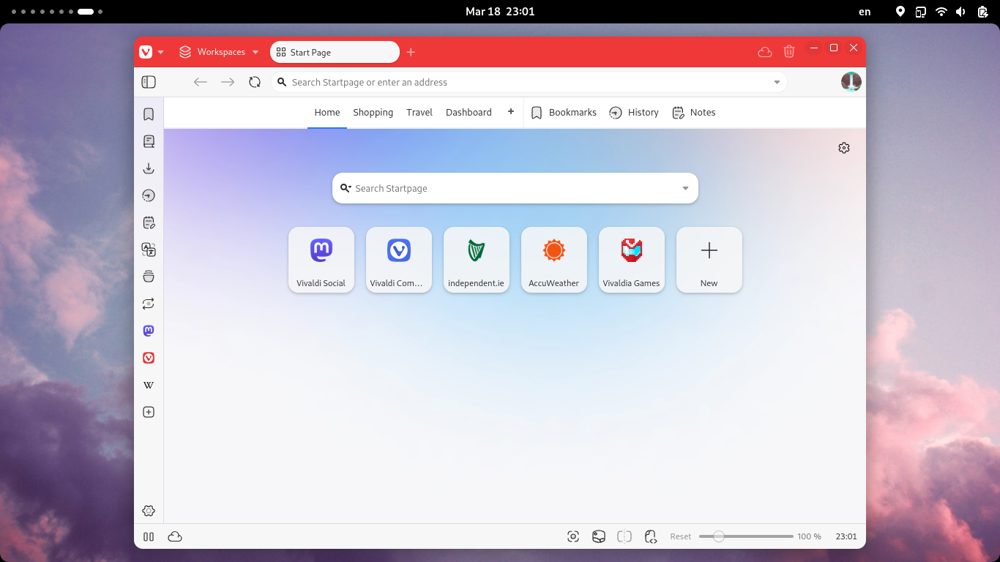
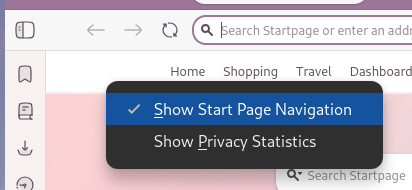
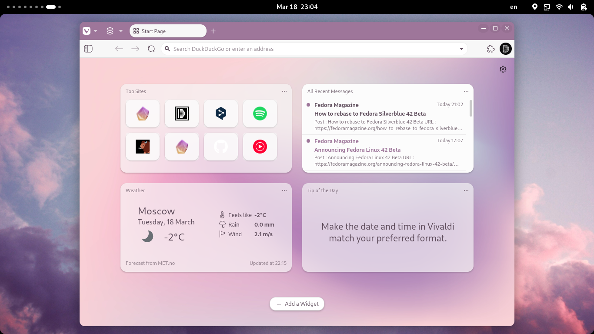

+++
title = "Switching to Vivaldi"
description = "Firefox served me well for almost 3 years, but it's time for a change."
draft = true
[taxonomies]
tags = ["100DaysToOffload", "Vivaldi", "Firefox"]
[extra]
# accent_color = []
# banner = ""
[extra.fediverse]
id = ""
+++

Sometimes, even the nicest things became boring with time and you start wanting to try out something new, in this case though, said thing wasn't even this nice.

## Backstory

I've been using Firefox for over 3 years now (at least that's how long I didn't clear my browsing history), and overall, it served me extremely well; Firefox Sync is great, it supports most modern web standards, integrates relatively well with my GNOME desktop, is open source, and respects user privacy.

However, some of these points didn't age well, notably desktop integration and respect for privacy. The former became bad ever since GNOME moved to libadwaita for its apps, while Firefox stuck with the legacy GTK3 Adwaita look. There's been some recent initiatives to make it more integrated again by making it use libadwaita colors and use system accent colors, and some are even trying to port it to GTK4 (GTK4 ≠ libadwaita), but at the moment it looks rather off, and to be honest, it would be better if it didn't try to integrate altogether. Forcing non-native theme option in `about:config` using `browser.theme.native-theme: false` is very much not perfect; system accent color is still being used half the places, context menus are still using GTK3 style, and so does close button, link previews, checkboxes in dev tools, and more. As for the former, well... you heard all the drama around Mozilla TOS changes that upset literally everyone, so I won't get into this, plus it wasn't the main reason for me to switch over.

One more thing™ that was annoying me all this time is poor performance. Don't get me wrong, it's not that bad on desktop, but on mobile? uh, it's... simply *horrible*, and my phone isn't even that old! Pixel 3XL holds up nicely to this day, and comparing the performance with Chrome-based browsers simply left me in awe. I did not use Chrome-based on desktop all that much though, I only used it for making sure my site, Duckquill, and Ametrine don't look too broken in it.

At some point I briefly tried out Vivaldi as I heard some good stuff about it and no drama about it, but didn't switch to it because it didn't follow my system theme, which for me is quite important as my theme changes depending on the time of day and I really like this behaviour.

Then, "Daudix™ moment" happened and I decided to try using it for real out of the blue. And I did. And still do. And I *love* it!

## The Move

I have tried to document all the steps I did during the migration, it's of course configured to fit my needs, but perhaps someone will find certain step useful.

We start off with this:

There's just so much stuff going on! And so, I turned most of it off, here's a semi-complete list of things I did to make it look and work nicely:

Long list of things I did to make it look and work the way I want it to

- Right-click start page navigation and turn it off
  
- Right-click workspaces button and turn off the name
- Remove default [speed dials](https://help.vivaldi.com/desktop/bookmarks-speed-dial/speed-dials/)
- Navigate to settings and change the following settings:
  - General -> Close and exit
    - [x] Show exit confirmation dialog
    - [ ] Show close window confirmation dialog
  - Appearance -> Window appearance -> Status bar
    - <input type="radio" checked disabled> Status info overlay
  - Themes -> Dark -> Editor -> Color overrides
    - [x] Accent from page
    - [x] Accent on window
  - Themes -> Theme schedule -> Manual schedule -> Light from 07:00 to 19:00
  - Tabs -> Memory saver
    - <input type="radio" checked disabled> Automatic
  - Search -> Allow search suggestions
    - [x] In address field
  - Webpages
    - [ ] Use <kbd>Ctrl + Scroll</kbd> to zoom page
- Navigate to `vivaldi:flags` and enable the following flags:
  - [Fluent Overlay scrollbars](vivaldi:flags/#fluent-overlay-scrollbars)
- Enabled Classic theme under `chrome://settings/appearance` (NOT under `vivaldi:settings/appearance`) to make context menus look nicer and not use GTK3 colors
- Changed history saving period from "3 months" to "forever"
  - [Preferred Ozone platform](vivaldi:flags/#ozone-platform-hint)
- Allowed access to `/tmp` and `~/.mozilla` directores using [Flatseal](https://flathub.org/apps/com.github.tchx84.Flatseal), in order to fix notification icons and medial player cover art and import data from Firefox later on
- Added additional tracker and ad blocking lists from <https://github.com/dayvid3/Vivaldi-Tracker_Ad_Blocking_Lists-Customized>, later on I tunred built-in tracker and ad blocking off and opted to using [uBlock Origin](ublockorigin.com) like before, as ads didn't skip in Spotify and in YouTube it required clicking *skip*
- Copied `~/.var/app/org.mozilla.firefox/.mozilla` to `~/.mozilla`
- Used build-in import utility to import Firefox data
- Installed Vivaldi on mobile
- Selected all open tabs in Firefox mobile and bookmarked them, then on desktop I moved them from whatever folder they landed in to a new one, exported bookmarks as HTML, imported them in Vivaldi, and deleted all bookmarks except for the folder with mobile tabs, as all other bookmarks imported earlier
- Logged in Vivaldi Sync on both desktop and mobile
- Opened mobile tabs bookmarks folder and opened all of them by manually selecting each individual bookmark and then pressing open in a new tab
- Replaced Vivaldi Flatpak with RPM because KeePassXC doesn't work relaiably with browsers installed as a Flatpak. There is a workaroud for this, but I couldn't get it to work. If you don't use KeePassXC or is fine with pasting passwords manually, go with Flatpak

The end result looks like this:

## Things I like

After using it for almost a week, I picked some features that I really like: 

- Tab stacking feature is great, they open as a new tab bar making it very easy to switch tabs.
- Being able to install PWAs is neat
- The whole sidebar is great:
  - Downloads panel? Includes downlload speed graph.
  - Mail? Allows checking the mail quickly, very useful for copying one-time passwords.
  - Translator? Pretty accurate and uses Lingvanex hosted by Vivaldi.
  - Feed reader? Well integrated; if site has a feed a button appears in URL bar. This can be added in Firefox using an extension, but it's nice to have it by default.
  - Sessions? Well, I didn't try using it still, but it seems very promising.
