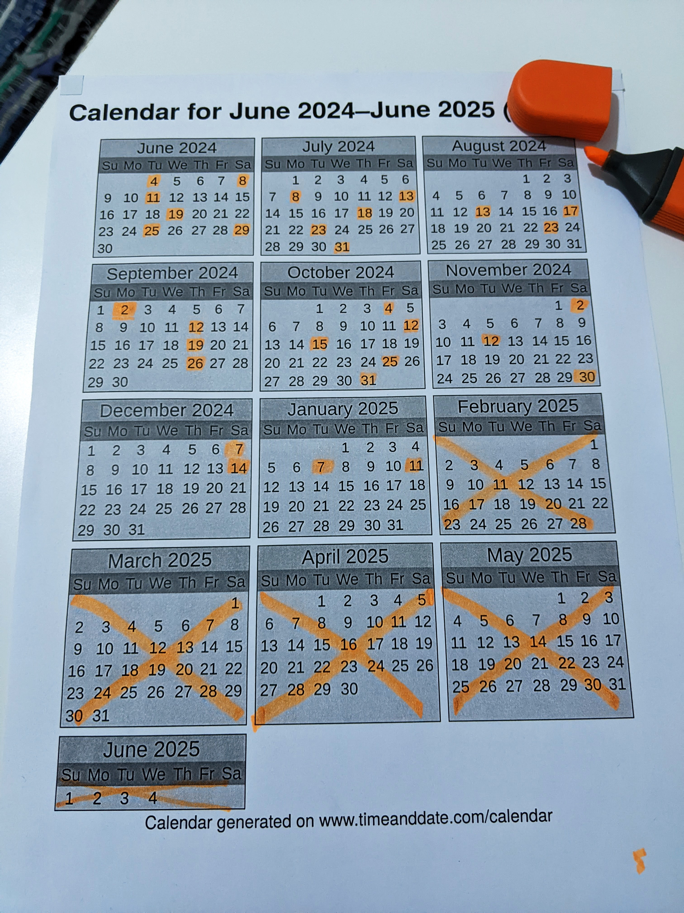
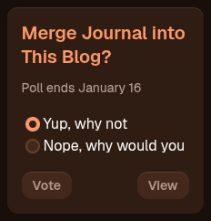
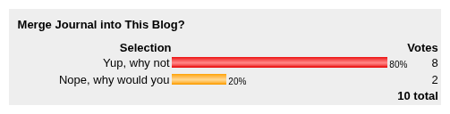
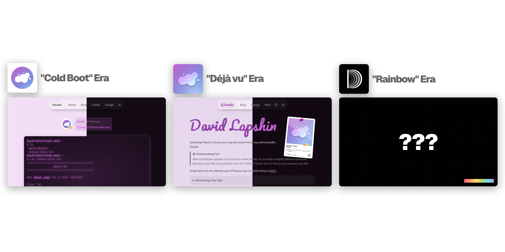
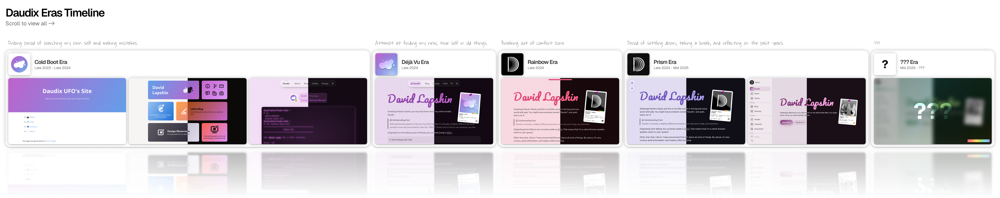

+++
title = "New Era"
description = "World around is is changing, and so do I."
draft = true
[taxonomies]
tags = ["Devlog", "GitHub", "Neocities", "Netlify", "Umami"]
[extra]
accent_color = ""
banner = ""
styles = ["blog/new-era/style.css"]
[extra.comments]
id = ""
+++

- Make sure to replace player screenshot with a variant with transparency, i.e. take the node screenshot in epiphany
- Use footnote for the API hack thing
- Mention heavy focus shift from fedi to bsky

***

Time to talk a bit about my recent changes to this website, plans for this blog, and One More Thing™.

## Website Changes

This website has undergone numerous changes in the past... *looks at wall calendar* ...almost half a year (dear God how did it pass by this fast I'm gonna cry), though most of this time I've been working on Ametrine, and a bit more so procrastinating and trying my best to not fall.

### Ametrine

> [!NOTE]
> [Ametrine](https://ametrine.daudix.one) is a new theme of mine. It’s the successor to Duckquill, with a new look, some features added, and some removed. Its goal is to be more flexible and modular than Duckquill.

One might ask, “hold on, didn’t you *just* [switch away from Duckquill](@/blog/2024-11-02-decoupling-from-duckquill/index.md) to an in-house solution?” And the answer would be... yes.

Actual answer: yes --- and that in-house solution was later frozen, moved into a separate “ametrine” repository, ironed out, wrinkled, ironed again, and finally covered in a fresh coat of compatibility with older browsers (looking at you, Safari).

Now another question arises: why do all this exactly? And well... I don’t really have an answer. Making themes to help people build their websites more easily is just something I seem to enjoy.

Yet another question raises its hand: doesn’t that limit my creativity or make design changes harder? Yes, it does --- but realistically, Ametrine hasn’t changed its look drastically in the past half a year. And since it’s a direct continuation of Duckquill, which had a similar design, one could say things haven’t changed much in the past... two years? More or less. It’s still evolving and gradually improving, but the general idea has stayed the same.

Now that Ametrine is more modular than Duckquill, and since I now know more Zola tricks, it means I can customize a lot without touching the internals too much --- which is exactly what I’ve done. This site has more depth and texture than Ametrine by itself.

Fuzzy, I know, but I’ll talk more about Ametrine itself in a follow-up post soon (hopefully... depression permitting).

<small>One could say that [winter cleanup](@/blog/2024-11-12-winter-cleanup/index.md) went on for a *bit* longer xD</small>

### Pages

We have quite some changes here:

- [100DaysToOffload](@/100daystooffload/_index.md) page has been removed, now it redirects to the tag with the same name, under which all posts with it are listed, serving the same purpose.
- [Badges](@/badges/index.md) page has been introduced, it contains all the badges and stamps (aka Bumps) from my Neocities site, from which these might soon be removed.
- [About](@/about/_index.md) and [online](@/online/_index.md) pages have been merged with [home](@/home/index.md). Useless information has been removed in process, keeping only the essentials. This is to make sure homepage provides all the info at a glance. This decision has been made after looking at statistics, which suggest that subpages get times less visitors than the homepage, and as the purpose of this website is to be a central hub of me on the web, it should fulfill this purpose.
- [Commissions](@/commissions/index.md) have lost most of the services except for a few. Only services that I'm certain I can complete in the best manner have remained.
- [Snug Nook](@/snug-nook/index.md) was completely redone. Essential info is now presented via fully dynamic widget, which by the way uses an interesting Discord widget API hack[^1] that I couldn't find any mentions of online, so we might be the first to use it?
- [Design](@/design/index.md) styling was adjusted to better fit the new design. It now also follows the light/dark mode preference like the rest of the site, instead of being hardcoded to dark mode.
- [Home](@/home/index.md) besides inheriting "about" and "online" pages' info also got a brand new widget: "Now Playing" powered by Last.fm. Not only it displays currently playing track live, but it also switches to "Last Played" if nothing is playing or playback is paused, accompanied by a nice CD (which is taken from elementary OS icon theme :P) animation. I have experimented with using Discord Rich Presence (RPC) to display not only this but also other activities, but it didn't expose last played song and was much, much more complex, so it was scrapped.

### Source Code

Throughout the site's existence, it was always completely open (not necessarily FOSS), nothing was developed behind closed doors, and deployment always matched the source code at any period in time.

Ever since I [moved away from GitHub](@/blog/2023-07-15-migration-from-github-to-codeberg/index.md) it was hosted on Codeberg, I enjoyed it this entire time despite occasional, sometimes unconventional, downtimes. Recently however they introduced new size limits for, and I quote <q>repositories that are for personal use (e.g. 'my website', 'my dotfiles'</q>. And as you could guess, my website falls into that category. The new limit for such repositories is 100MB compared to the old 500MB limit. Mine was 200MB+, so I had to move it to GitHub, first as a private repository to prevent Copilot from training its code on it, but then I gave up and chose continuing being open over integrity of my code's originality (it's not very original, rather a compilation of StackOverflow answers, CSS Tricks, and random Git repositories). I have considered moving to my [friend's Forgejo instance](https://git.rootsource.cc), but it doesn't have any sort of CI, so it's not an option at the moment.

### Branding

I'm planning to design a new profile picture in the near future, but at the moment I don't have anything at hand, so in the meantime I have slightly deemphasized my official "branding" and now combine it with things like Discord profile picture. Other badge/88x31 variants has been added as part of this initiative, they're not new, simply older versions and ones from other sites (Neocities).

### Vercel No More

[Vercel was good](@/blog/2024-12-07-moving-to-vercel/index.md), but with release of Zola v0.20.0 I couldn't update to it, and was always welcomed with an error. Analytics are very restrictive, and integration with Codeberg is absent.

I have recently switched to Netlify, which has much better integration with Zola (getzola.org uses it), and overall is more oriented towards SSGs such as Jekyll and Hugo, rather than Node.js sites.

It also exposes preview URL in workflow, so preview deployments use proper base URL, technical details aside, it means I can actually utilize Git branches to work on features before making them accessible to everyone.

As part of this, I switched to Umami for analytics; they provide 6 months frame for free, which is 6x better than a single month frame Vercel provided.

Duckquill and Ametrine were also moved to Netlify because why not.

TL;DR: I like Netlify and Umami as opposed to Vercel and its built-in analytics so far, we'll see how it goes. I still like Vercel by the way, it's just that it doesn't play well with my current setup.

## 100DaysToOffload No More

For the past year I've been [participating](@/100daystooffload/_index.md) in a challenge called [100DaysToOffload](https://100daystooffload.com), and now it is officially over with 31 questionable posts and severe burnout. A bit sad but honestly it's such a relief; this challenge messed up my mental health quite a bit, even if I didn't write much, the feeling of always being under the pressure and forcing myself to come up with post ideas was exhausting. [Taking breaks](@/blog/2024-09-02-taking-a-break/index.md) did not help, it took me almost half a year of not writing anything to get back in shape.

I wanted to quit it multiple times, but I have set myself a goal to *not* quit it, no matter what, and finish it even if I don't complete it. And so I did, yay. Proving to myself that I am capable of not quitting something prematurely, despite all kinds of obstacles, is valuable to me (it's not just about 100DaysToOffload, is it?).

Now that the results are documented, I can blog at my own pace, with "quality over quantity" approach and...

## Reissue Old Articles

It's no surprise that a big chunk of 100DaysToOffload posts lack quality; they were rushed, are badly written, and don't effectively get the point across. Because of this, I will gradually rewrite such posts, add/remake banners, re-tag them, and replace them with reissues. Title/permalink might change, but I'll try minimize link rot by utilizing redirects, if possible. Some other posts will be unpublished without ever being reissued, but there aren't much such posts.

## A Blog of My Own

Type of promise presidents make during inauguration: "I'll try to blog about whatever I want".

Because, it's my blog, on my own domain, made piece by piece by me.

...That sounded way to narcissist isn't it? That wasn't the intent, but whatever. There was this thing with me trying to keep this site somewhat down to earth, which is the reason I started a "journal" on Neocities, but now thinking about it more, there's no point in it, and I'd rather keep everything here and be myself, because, after all, it's my platform, not a social media.

And so, [journal](https://daudix.neocities.org/journal/) will be discontinued and merged with this blog shortly. There is only one article worth preserving, so it won't make much of a difference. I've been considering this for a while, and ran a [poll](https://poll.pollcode.com/83144997_result_paused) asking readers whether this is a good idea more almost half a year ago, on Jan 9, and closed it on Jan 16.

Poll results suggest that majority is in favor of this.

Yes, it's only 10 votes, but look at it this way: It's a whopping *10* votes!!1

In the end I'm left uncertain as to what to do with Neocities after this, all that is left is a homepage that provides no info and somewhat cool styling, and a fun 404. I don't want it to go down the [gmi.daudix.one](https://gmi.daudix.one) path of dying silently.

## New Era

Behold... the title of this article, finally!

Okay so what's this all about.

I like to split my work and my own self into loosely defined "eras", each era marks a chapter in my life, and is usually accompanied by a profile picture redesign and/or website design refresh.

My first era, titled "Cold Boot". started back in late 2022. Eras were always a "behind the scenes" thing that wasn't really public besides folder names in the ["assets" repository](https://github.com/daudix/assets/tree/main/daudix). I have considered expanding this concept <abbr title="December 10th, 2024">half a year ago</abbr>. This idea didn't go beyond this mockup however, as I deemed it way too silly of an idea. Profile pictures continued using this approach internally though, for example my previous era was called "Prism", which was a continuation of the "Rainbow" era.

Recently however, I came across Vylet's video explaining her eras, which is relatable in so many ways and is pretty much what I was going to do, it's just crazy. It have inspired me to push this idea further, and whilst I won't maintain a spreadsheet of each era like she does, I too will have a more public era separation, and will be naming eras retroactively from now on.

{{ youtube(id="7rZsiF2nckA", start="257") }}

> Each era represents a substantial time in my life, defined by paradigm shifts, life changes, and overall project direction. I intend to name these with retrospect, so every new era will simply begin as three question marks, and then will be named when it becomes apparent when to find that part of my life in work.

And so, here is my current "era timeline".

    

        <picture>
            <source srcset="eras-dark.png"  media="(prefers-color-scheme: dark)" />
            
        </picture>
    

  <a href="eras-hd.png">View in Full Resolution</a>

Current era is blurred and untitled, as this era is still ongoing, the screenshot is not final, and as I already mentioned, era cannot be titled yet as they're titled retroactively. Visually changes between eras aren't huge, but it's not just about website visuals, isn't it?

## Mental Health

It was rough. I survived, however.

## Conclusion

This blog post is a little summary of what I was doing and planning to do for a while, and I hope that this will mark a new, more hopeful chapter in my life and this blog. Thanks for reading, caring, and just being here. Can't wait to see you in the next one!

[^1]: Discord widget API (`https://discord.com/api/guilds/<GUILD_ID>/widget.json`) doesn't expose server icon, description, total member count, and basically any other useful info about the server, however, it does expose an automatically generated invite link (that's being regenerated every now and then), which *does* expose said info via the `https://discord.com/api/invites/<INVITE_CODE>?with_counts=true` endpoint. And so by trimming the `https://discord.com/invite/` bit of the auto-generated invite link we get said invite code. Two API calls, yes, but we get all the info without any additional services or hardcoding anything.