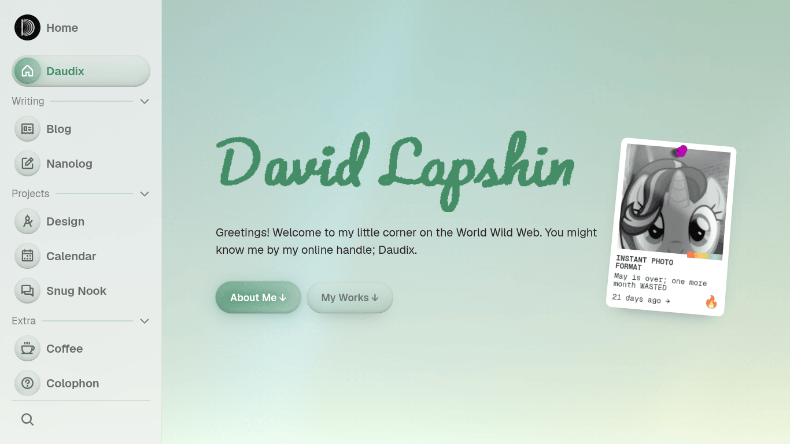
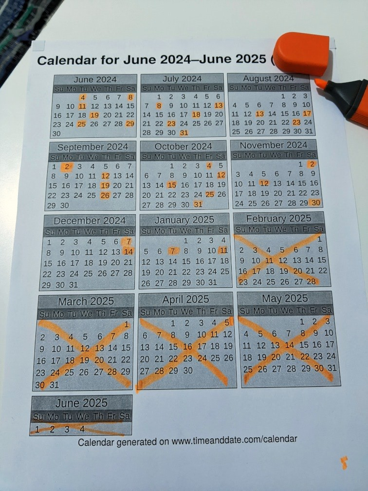
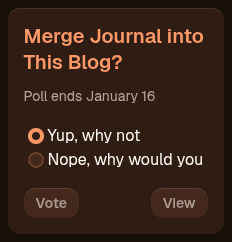
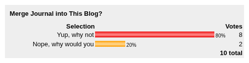
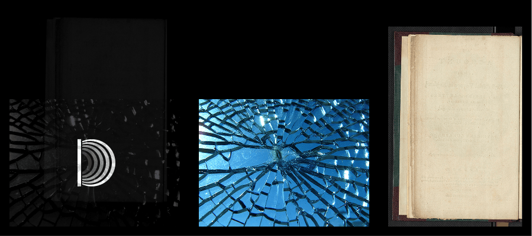
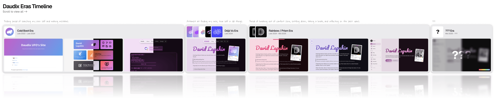

+++
title = "New Era"
description = "The world around us is changing, and so do I."
updated = 2025-08-18
[taxonomies]
tags = ["Devlog", "GitHub", "Neocities", "Netlify", "Umami"]
[extra]
accent_color = ["hsl(270 13% 48%)", "hsl(290 20% 71%)"]
banner = "banner.webp"
styles = ["blog/new-era/style.css"]
[extra.fediverse]
id = "114864922325514289"
+++

Time to talk a bit about my recent changes to this website, plans for this blog, and One More Thing™.


Last edit introduced a couple of additional images and an entirely new section. See [this commit](https://github.com/daudix/daudix.one/commit/637bd7ef6f7acd53f5346104e5cc291ed5cc7968) for a detailed overview.


## Website Changes

This website has undergone numerous changes in the past... *looks at wall calendar* ...half a year (dear God how did it pass by this fast I'm gonna cry), though most of this time I've been working on Ametrine, and a bit more so procrastinating (nothing new haha).

### Ametrine

> [!NOTE]
> [Ametrine](https://ametrine.daudix.one) is a new theme of mine. It’s the successor to Duckquill, with a new look, some features added, and some removed. Its goal is to be more flexible and modular than Duckquill.

Two months ago I have got Ametrine to a state when it has all the features I need, and so I have [ported this site to it](https://github.com/daudix/daudix.one/pull/1).

One might ask, “hold on, didn’t you *just* [switch away from Duckquill](@/blog/2024-11-02-decoupling-from-duckquill/index.md) to an in-house solution?” And the answer would be... yes.

Actual answer: yes --- and that in-house solution was later frozen, moved into a separate “ametrine” repository, ironed out, wrinkled, ironed again, and finally covered in a fresh coat of compatibility with older browsers (looking at you, Safari).

Now another question arises: why do all this exactly? And well... I don’t really have an answer. Making themes to help people build their websites more easily is just something I seem to enjoy.

Yet another question raises its hand: doesn’t that limit my creativity or make design changes harder? Yes, it does --- but realistically, Ametrine hasn’t changed its look drastically in the past half a year. And since it’s a direct continuation of Duckquill, which had a similar design, one could say things haven’t changed much in the past... two years? More or less. It’s still evolving and gradually improving, but the premise remains the same.

Now that Ametrine is more modular than Duckquill, and since I now know more Zola tricks, it means I can customize a lot without touching the internals too much, in fact, that's exactly what I did; at some point during the long process of writing this post, this website had an Aero-like styling, but since it wasn't good enough I have scrapped it a couple days ago.

<picture>
  <source srcset="aero-dark.png"  media="(prefers-color-scheme: dark)" />
  
</picture>

Fuzzy, I know, but I’ll talk more about Ametrine itself in a follow-up post soon (hopefully, unless depression kicks in again).

<small>One could say that [winter cleanup](@/blog/2024-11-12-winter-cleanup/index.md) went on for a *bit* longer xD</small>

### Pages

We have quite some changes on this front:

- [100DaysToOffload](@/100daystooffload/_index.md) page has been removed --- now it redirects to the tag with the same name, under which all posts with it are listed, essentially serving the same purpose.
- [Badges](@/badges/index.md) page has been introduced, it contains all the badges and stamps (aka Bumps) from my Neocities site, from which these might soon be removed.
- [About](@/about/_index.md) and [online](@/online/_index.md) pages have been merged with [home](@/home/index.md). Useless information has been removed in process, keeping only the essentials. This is to make sure homepage provides all the useful info at a glance. This decision has been made after looking at statistics, which suggest that subpages get times less visitors than the homepage, and as the purpose of this website is to be a central hub of me on the web, it should fulfill this purpose.
- [Commissions](@/commissions/index.md) have lost most of the services except for a few. Only services that I'm certain I can complete in the best manner have remained.
- [Snug Nook](@/snug-nook/index.md) was completely redone. Essential info is now presented via a fully dynamic widget, which by the way uses an interesting Discord widget API hack[^1] that I couldn't find any mentions of online, so we might be the first to use it?
- [Design](@/design/index.md) styling was adjusted to better fit the new design. It now also follows the light/dark mode preference like the rest of the site, instead of being hardcoded to dark mode.
- [Home](@/home/index.md), besides inheriting "about" and "online" pages' info also got a brand new widget: "Now Playing" powered by Last.fm. Not only it displays currently playing track live, but it also switches to "Last Played" if nothing is playing or playback is paused, accompanied by a nice CD (which is taken from elementary OS icon theme :P) animation. I have experimented with using Discord Rich Presence (RPC) to display not only this but also other activities, but it didn't expose last played song and was much, much more complex, so it was scrapped.
<a href="/home/#player">
  <picture id="now-playing">
    <source srcset="now-playing-dark.png"  media="(prefers-color-scheme: dark)" />
    
  </picture>
</a>

### Source Code

Throughout the site's existence, it was always completely open (not necessarily FOSS) --- nothing was developed behind closed doors, and deployment always matched the source code at any period in time.

Ever since I [moved away from GitHub](@/blog/2023-07-15-migration-from-github-to-codeberg/index.md) it was hosted on Codeberg, I enjoyed it this entire time despite occasional, sometimes unconventional, downtimes. Recently however they introduced new size limits for, and I quote <q>repositories that are for personal use (e.g. 'my website', 'my dotfiles'</q>. And as you could guess, my website falls into that category. The new limit for such repositories is 100MB compared to the old 500MB limit. Mine was 200MB+, so I had to move it to GitHub --- first as a private repository to prevent Copilot from training its code on it, but then I gave up and chose continuing being open over integrity of my code's originality[^2]. I have considered moving to my [friend's Forgejo instance](https://git.rootsource.cc), but it doesn't have any sort of CI, so it's not an option at the moment.

### Branding

I'm planning to design a new profile picture in the near future, but at the moment I don't have anything at hand, so in the meantime I have slightly deemphasized my official "branding" and now combine it with things like Discord profile picture. Other badge/88x31 variants have been added as part of this initiative, they're not new, simply older versions and ones from other sites (Neocities).

### Vercel No More

[Vercel was good](@/blog/2024-12-07-moving-to-vercel/index.md), but with release of Zola v0.20.0 I couldn't update to it, and was always welcomed with an error. Analytics are very restrictive, and integration with Codeberg is absent.

For this reason I have recently switched to Netlify, which has much better integration with Zola (getzola.org uses it), and overall is more oriented towards SSGs such as Jekyll and Hugo, rather than Node.js sites.

It also exposes preview URL in the workflow, so that preview deployments can use a proper base URL. Technical details aside, it means I can actually utilize Git branches to work on features before making them accessible to everyone.

As part of this, I switched to Umami for analytics; they provide six-month frame for free, which is 6x better than a one-month frame Vercel provided.

Duckquill and Ametrine were also moved to Netlify because why not.

TL;DR: I like Netlify and Umami as opposed to Vercel and its built-in analytics so far, we'll see how it goes. I still like Vercel by the way, it's just that it doesn't play well with my current setup.

## 100DaysToOffload No More

For the past year I've been [participating](@/100daystooffload/_index.md) in a challenge called [100DaysToOffload](https://100daystooffload.com), and now it is officially over with 31 questionable posts and severe burnout. A bit sad but honestly it's such a relief; this challenge messed up my mental health quite a bit --- even if I didn't write much, the feeling of always being under the pressure and forcing myself to come up with post ideas was exhausting. [Taking breaks](@/blog/2024-09-02-taking-a-break/index.md) did not help; it took me half a year of not writing anything[^3] to get back in shape.

I wanted to quit it multiple times, but I have set myself a goal to *not* quit it, no matter what, and finish it even if I don't complete it. And so I did, yay. Proving to myself that I am capable of not quitting something prematurely, despite all kinds of obstacles, is valuable to me (it's not just about 100DaysToOffload, is it?).

Now that the results are documented, I can blog at my own pace, with "quality over quantity" approach and...

## Reissue Old Articles

It's no surprise that a big chunk of 100DaysToOffload posts lack quality; they were rushed, are badly written, and don't effectively get the point across. Because of this, I will gradually rewrite such posts, add/remake banners, re-tag them, and replace them with reissues. Title/permalink might change, but I'll try to minimize link rot by utilizing redirects, if possible. Some other posts will be unpublished without ever being reissued, but there aren't much such posts, if any.

## A Blog of My Own

Type of promise presidents make during inauguration: "I'll try to blog about whatever I want".

Because, at the end of the day, it really is my blog, on my own domain, made piece by piece by me.

...That sounded way to narcissist isn't it? That wasn't the intent, but whatever. There was this thing with me trying to keep this site somewhat down to earth, which is the reason I started a "journal" on Neocities, but now thinking about it more, there's no point in it, and I'd rather keep everything here and be myself, because --- after all --- it's my own platform, not someone's social media.

And so, [journal](https://daudix.neocities.org/journal/) will be discontinued and merged with this blog shortly. There is only one article worth preserving, so it won't make much of a difference. I've been considering this for a while, and even ran a [poll](https://poll.pollcode.com/83144997_result_paused) asking readers whether this is a good idea half a year ago on January 9th.

Poll results suggest that majority is in favor of this.

Yes, it's only 10 votes, but look at it this way: It's a whopping *10* votes!!1

In the end, I'm left uncertain as to what to do with Neocities after retiring the journal, all that is left is a homepage that provides no info and somewhat cool styling, and a fun 404. I don't want it to go down the [gmi.daudix.one](https://gmi.daudix.one) path of dying silently, nor I want to have two nearly-identical sites in terms of content.

## The Sky That Is Blue

Lately, my focus has heavily shifted from Fedi to Bluesky. Fedi is great, but Bluesky suits me better; it doesn't have the whole fedimeta thing, defederations that you have no control over, and such. I plan to add support for Bluesky-powered comments to Ametrine at some point, but I currently lack the required skills to do so. If you've been following me on the Fedi, you might want to follow my bridged Bluesky account as well (if your instance's admin didn't defederate Bridgy Fed :P).

## Overorganization

I was, and still am, trying to reduce the unnecesairy overorganization of... everything; [my social presence](@/blog/2025-01-11-merging-lanes/index.md), my websites (as mentioned earlier I merged a couple of pages with homepage and will retire neocities as a place for journaling), and more that is yet to come. I don't have a plan or anything, it's just a direction I'm going in.

I have wrote a lot about this some time ago (file modification date says January 16th, 2025?) as a reply to questions someone (if you're reading this, hi!) asked me in one group chat, which, while a bit outdated, still conveys the same message as it did back then Here is what I sent, with no edits (I have unfortunately left said group chat and don't have original questions saved anywhere, but it maintains context even without them):

Click to expand

Okay, so, first things first (replying to each paragraph/message)

I completely agree with the "formal/informal personally issue" thing, just like you said it does a bit prevent from having fun and putting any serious effort into the informal stuff. Why it's so hard to just be yourself man...

Over-organization is an issue for me as well, and again I fully agree with you; it's annoying, time wasting, prevents just doing things, and most of the time there's no benefit of doing so. I'm kinda trying to get rid of unnecessary categorization and organization, but being a perfectionist does't help. I've been using two simple markdown to-dos, one for irl stuff and one for website ideas, and it's a good workflow, you just make a new bullet point and call it a day, no need to separate stuff to separate notes, add tags, link all this from a central "hub" to-do, you know what I mean. Same for other things.

The Fediverse thing is complicated though. I am not a social media person per se, quite the opposite; I'm shy to the point I'm thinking it's actually a social anxiety disorder, but I still use it for some reason. Thing is, I very rarely interact with people there and mostly just reblog stuff I like/find funny and post boring stuff, with which no one interacts as well. I've been thinking off and on about minimizing my usage of Mastodon and instead condensing my thoughts into blog posts or nanologs, but the ability to e.g. attach an image/video without having to rename, optimize, and link manually is pretty sweet. Otherwise there's objectively no real point in using it indeed, I get two likes at best, even then it's people that somewhat know me and we regularly interact. The main reason I'm using it however is talented people I follow, I like to get updates on things they do, and just so happens they mostly do so on Mastodon (because I found about them there). I follow just enough people for my timeline to be interesting, but not enough for it to be so active so I can doomscroll, and you know, Mastodon sucks in terms of showing posts from people you don't follow, like there's no "for you" tab and global timeline is an absolute garbage. I see your point and I could def survive without Mastodon account, and instead follow people I care about the most from an RSS reader.

Going back to over-organization... Yeah it's not okay to have stuff this categorized, I ran a poll for about a week and results suggest that 80% of my readers would like the journal and blog to be merged. I'm still not certain on how I'd do so, but yeah this something that spins in my brain.

Yeah nanolog does have an RSS feed, in fact every category and tag does (*cough* over-organization *cough*).

I use microblogging mostly to share my web dev stuff and most short gags/shitposts that in no way deserve a "nanopost".

One thing I'd like to add to the Fediverse and overall microblogging thing, I would really like to be in charge of my posts, because instances regularly die and the experience of viewing Mastodon exports suck. Expanding nanolog somehow to make posting there easier would be cool, but I don't see how I would do so.

## New Era

Behold... the title of this article, at last!

So, what's this all about?

I like to split my work and life into "eras", each marking a new chapter. These eras are usually accompanied by a redesign of my profile picture and/or website, although this tends to happen spontaneously.

My first era --- titled "Cold Boot" --- started back in late 2022, with a bunch of preparation prior to that. Eras were always a "behind the scenes" thing that wasn't really public besides folder names in the ["assets" repository](https://github.com/daudix/assets/tree/main/daudix). I have considered expanding this concept <abbr title="December 10th, 2024">half a year ago</abbr>, but this idea didn't go beyond this mockup as I deemed it too silly of an idea. 

Profile pictures continued to use this approach internally; for example, my previous era was titled "Prism", which was a continuation of the "Rainbow" era.


Prism era's assets had a bit of a hidden meaning behind them; the texture they have is actually monochrome photos of a broken mirror and old book's page, overlaid on top of each other with different opacity and blend modes. A bit cheesy, but it is what it is.



Recently however, I came across Vylet's video explaining her eras, which is relatable in so many ways and is pretty much what I was aiming for, it's just crazy. It have inspired me to push this idea further, and whilst I won't maintain a spreadsheet of each era like she does, I too will have a more public era separation, and will be naming eras retroactively from now on.

{{ youtube(id="7rZsiF2nckA", start="257") }}

Excerpt from the video:

> Each era represents a substantial time in my life, defined by paradigm shifts, life changes, and overall project direction. I intend to name these with retrospect, so every new era will simply begin as three question marks, and then will be named when it becomes apparent when to find that part of my life in work.

And so, here is my current "era timeline".

  

    <picture>
      <source srcset="eras-dark.png"  media="(prefers-color-scheme: dark)" />
      
    </picture>
  

  <a href="eras-hd.png">View in Full Resolution</a>

Current era is blurred and untitled, as this era is still ongoing, the screenshot is not final, and as I already mentioned, era cannot be titled yet as they're titled retroactively. Visually changes between eras aren't huge, but it's not just about website visuals, isn't it?

I'm so excited about this, and I can't wait to see how it all works out!

## Mental Health

It was rough. I survived, however.

## Conclusion

This blog post is a little summary of what I was doing and planning to do for a long time, and I hope that this will mark a new, more hopeful chapter in my life and this blog. Thanks for reading, caring, and just being here. Can't wait to see you in the next one!

<small>Interesting how the phrase "half a year" was used a whopping 6 times in this blog post.</small>

[^1]: Discord widget API (`https://discord.com/api/guilds/<GUILD_ID>/widget.json`) doesn't expose server icon, description, total member count, and basically any other useful info about the server, however, it does expose an automatically generated invite link (that's being regenerated every now and then), which *does* expose said info via the `https://discord.com/api/invites/<INVITE_CODE>?with_counts=true` endpoint. And so by trimming the `https://discord.com/invite/` bit of the auto-generated invite link we get said invite code. Two API calls, yes, but we get all the info without any additional services or hardcoding anything.
[^2]: It's not very original, rather a compilation of StackOverflow answers, CSS Tricks, and code from random Git repositories.
[^3]: Okay, I *did* write one detailed blog post about me moving from Firefox to Vivaldi, but before I could finish it I have already moved to vanilla Chrome.
