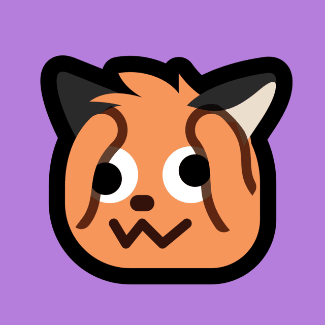
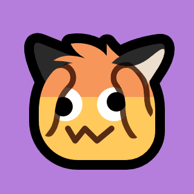
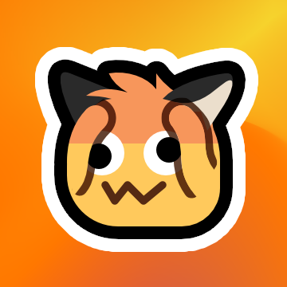
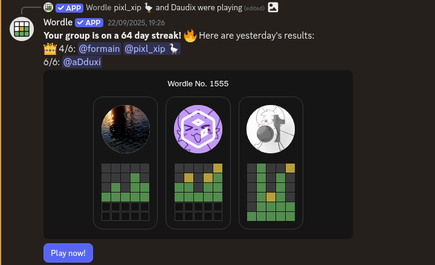
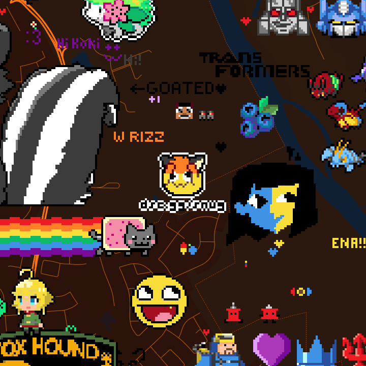
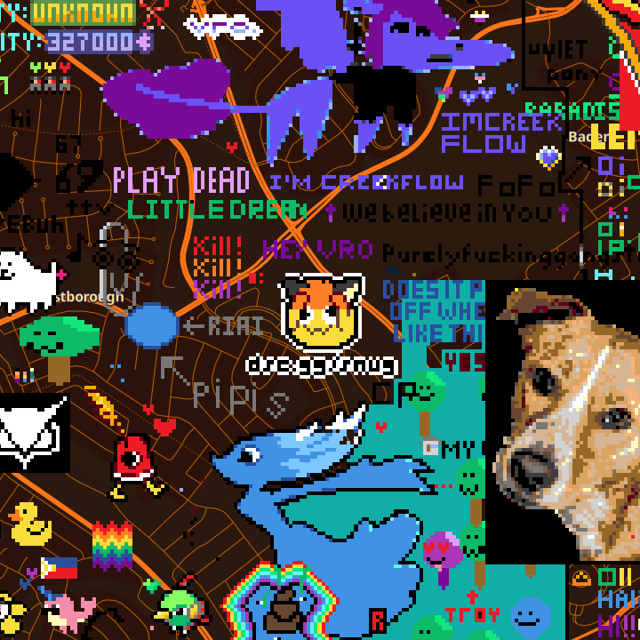
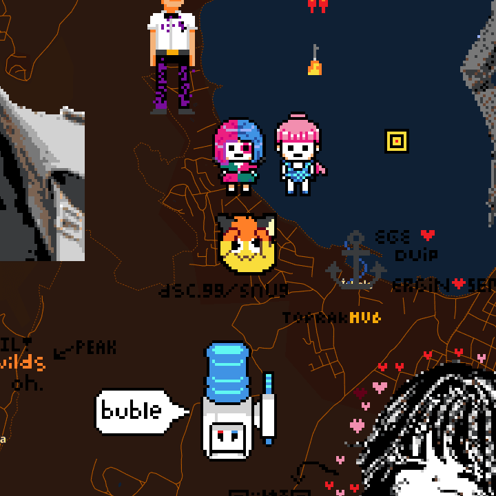
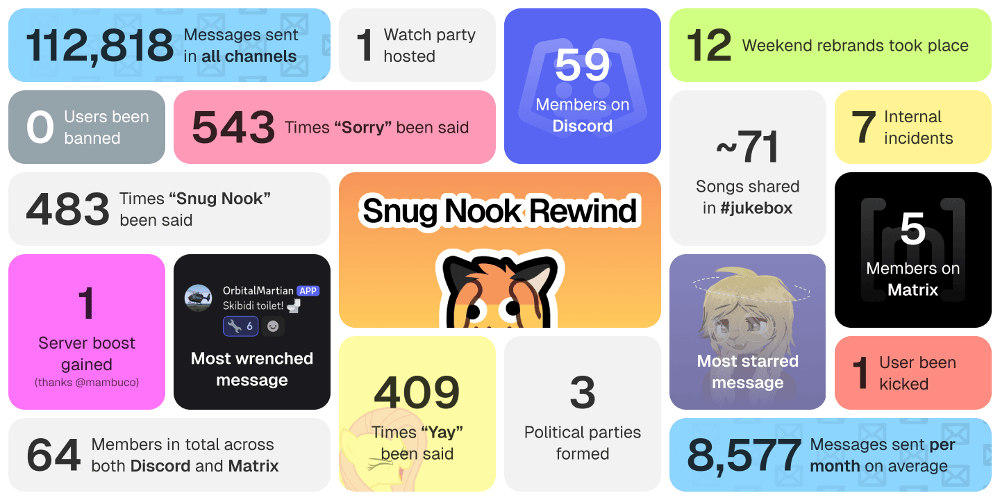

+++
title = "Year of Snug Nook"
description = "It's been one year since Snug Nook's emergence."
authors = ["daudix", "ivanmarkov", "pixl_xip", "kevadesu", "gxbs"]
updated = 2025-11-01
[taxonomies]
tags = ["Snug Nook"]
[extra]
accent_color = "orange"
banner = ""
[extra.fediverse]
id = ""
+++

> [!NOTE]
> This blog post was written collaboratively[^1] by the Snug Nook staff over the course of three days. Some elements from the writing process have been intentionally retained.

Hi, nice to see you here, how you've been doing? hopefully alright.

It's been a year since I have [started the Snug Nook community](@/blog/2024-10-31-snug-nook/index.md), focused around healthy discussions, genuine friendliness, and sensible rules. Many things have changed ever since, so, let's go through some of them!

## New Mascot

Shortly after the server creation, it became clear that having both neofox and neocat emoji variants is very wasteful of the limited amount of emoji slots Discord provides (50), so to halve the amount of emojis I have done something silly - combined neofox and neocat into an unholy combination, neofat. The name sucked and was soon chnaged to neofax, which is part of the Snug Nook brand ever since.

## Channels

The original set of channels have undergone some *major* changes, with a lot of additions and deletions, most of which were suggested by the community in the newly created #suggestion-box forum.

Notably, the initial decision to not include a voice channel due to admin and many other folks being shy was reverted due to the amount of people that *wanted* to have one, so #!walkie-talkie was created. #rules channel became a #handbook, and rules were moved to their own page on this website. #website channel were repurposed from a channel for updates and discussions about this site to general place for discussing personal and indieweb sites. #gallery channel was added, with some detours such as #art-gallery and #darkroom. #blosts channel for sharing blog posts (thus the name) was added, and later renamed to #typewriter to better fit the skeuomorphic approach to naming channels.

## Icycoide Partnership

We ran a short advertisement campaign with Icycoide community, where we advertised each other. This partnership resulted in an ongoing collaboration type thing, newest part of which is a shared bridge to Revolt.

## Workshop

The new workshop category were added, under which everyone can request a channel for their project, and for the community to help improve the project with suggestions along the way. Notably, [Cathodique](https://github.com/cathodique) and [Steno](https://github.com/stenodevs) are part of workshop, and Snug Nook as a whole.

## Prime Minister

[Keva](https://kevadesu.github.io/) have been elected (by themselves :P) as the prime minister of the Snug Nook. Initially it started as a joke, but now they're an important part of the Snug Nook community, who have done many notible contributions to the server. I'm forever grateful for having them on the team.

## Department of gnu_horny

`:gnu_horny:` is no longer part of Snug Nook emoji set, after some *serious* psychological damage it caused over the course of a few months, and a bunch of :wrench: reactions. If you want to see it for yourself... you probably don't.

## Minecraft Server

Hosted by the prime minister, Snug Nook now has a Minecraft server for its members, informally referred to as SNMC or The Snug Nook Empire. At the time of writing it's down, but yeah. See [SNMC page](@/snug-nook/mc/index.md) for more info.

*Waiting for prime minister to provide some screenshots of it.*

## Wordle

Someone has added the Wordle app to the server, and everyone got hooked to it... Everyone started playing Wordle daily, thus spamming unrelated channels with its messages, because of which we had to resort to creating a bot channel called #robots-dot-txt.

With that, we managed to reach an entire stack (64) of days as a streak on Worlde! The Wordle insanity still goes on despite the streak being intentionally broken.

## Wplace

Everyone knows about [Wplace](https://wplace.live); an online event with a world map where you can place pixels anywhere, thus making the globe a giant canvas... or a giant wall of questionable doodles.

Snug Nook actively participated in it in the first few weeks, and we even created 3 Snug Nook advertisements in 3 different countries: Canada, [USA](https://wplace.live/?lat=37.64284061242482&lng=-122.44719759697264&zoom=15.007757622056396) (South San Francisco), and [Turkey](https://wplace.live/?lat=38.36543507634402&lng=26.764364903027307&zoom=14.879252869276947).

## Weekend Rebrands

A tradition that was born randomly, we now rename Snug Nook to something we've been talking or joking about every now and then, during Saturdays and Sundays UTC. Semi-complete list of weekend rebrands is available on the wiki: <https://wiki.snugnook.org/weekend_rebrands>

## Politics

The moderation team, also known as [Het Etanes](https://wiki.snugnook.org/het_etanes) (The Senate) has been split up into (made up) political parties, notably [Silly](https://wiki.snugnook.org/silly_party), [Democratic](https://wiki.snugnook.org/freaky_party), and [OwO](https://wiki.snugnook.org/owo_party) parties. A list of all political parties is available on the wiki: <https://wiki.snugnook.org/list_of_political_parties_in_snugnook>

In additon to the made up politics, Snug Nook gained a channel for very much real politics, called #dumpster-fire (crazy, amirite). It was initally only available to the members of #sillies-only, but after its retirement it was made public for everyone.

## #sillies-only

For the long time, there was an underground community referred to as #sillies-only, consisting of Het Etanes members and some trusted folks referred to as "Sillies". Multiple arguments have taken place in it, last one stabbing it fatally, so it has since been retired. Everyone now has equal access to channels!

> {{ icon(name="user") }} gabs:  
> Communism?? /hj

## snugnook.org

On 2nd November 2025 Gabs have gifted Snug Nook a domain of their own. Words cannot express my gratitude, it's just so cool!!

Shortly after we have set up multiple services under that domain (details on *how* will be available in the next blog post), including but not limited to:

- phpBB forum: [forums.snugnook.org](https://forums.snugnook.org)
- DokuWiki: [wiki.snugnook.org](https://wiki.snugnook.org)
- An Otter Wiki (legacy): [otterwiki.snugnook.org](https://otterwiki.snugnook.org)
- Matrix homeserver with a [mautrix-discord](https://docs.mau.fi/bridges/go/discord/index.html) bridge: [matrix.snugnook.org](https://matrix.snugnook.org)

That's right, we now have a Matrix bridge of our own. For the long time we've been using [t2bot](https://t2bot.io), which is free and avaiable to all, I respect that, but it's been so darn slow, seriously, at times the delay between Matrix and Discord reached half an hour! Our own bridge on the other hand is instanteous and supports much more features, such as custom emoji reactions and threads, at the cost of maintenance, of course.

The wiki was a huge success, multiple people have contributed to it by creating and expanding a number of pages, which is honestly so so cool.

Forum on the other hand wasn't this much of a success, it's inactive for majority of the time. Which is fine, having one in 2025 is nice as is.

## Rewind

Welcome to Snug Nook Rewind. Here is your statistics for the past year.

And now... it's number time!

Messages in all channels, per month:

| Month     | Year | Messages |
|-----------|------|----------|
| October   | 2024 | 236      |
| November  | 2024 | 3,377    |
| December  | 2024 | 3,496    |
| January   | 2025 | 8,623    |
| February  | 2025 | 13,740   |
| March     | 2025 | 10,256   |
| April     | 2025 | 9,911    |
| May       | 2025 | 4,440    |
| June      | 2025 | 13,557   |
| July      | 2025 | 14,997   |
| August    | 2025 | 8,472    |
| September | 2025 | 8,794    |
| October   | 2025 | 11,614   |

Starboard leaderboard (#hall-of-<fame/shame/france> combined):

| Place | User            | XP     |
|-------|-----------------|--------|
| #1    | @daudix         | 567 XP |
| #2    | @kevadesu       | 326 XP |
| #3    | @gabsme         | 247 XP |
| #4    | @pixlxip        | 175 XP |
| #5    | @ivanmarkov.net | 114 XP |
| #6    | @mambuco        | 68 XP  |
| #7    | @getimiskon     | 68 XP  |
| #8    | @Hey            | 47 XP  |
| #9    | @ehternet       | 46 XP  |
| #10   | @aeronook       | 34 XP  |

## #SnugNookToSee

Here is what members of Snug Nook liked you too see:

- <q>this party's getting crazy!</q>---veeronniecaw
- <q>Snug Nook nation when?</q>---mambuco
- <q>silly party are a dictatorship</q>---gabsme
- <q>bring freaky party back</q>---mambuco
- <q>Love yourself, don't stress over silly in retrospect things, get yourself a treat, and fix your posture now!!</q>---daudix

## Conclusion

What a chaotic blog post! Hope you enjoyed it at least a bit. So many things have happened in our little community, which wouldn't be possible without all of you, so thanks for being part of it for, in some cases, a year straight, and in some, only a few days <3

Bwa

Here's to this being the ~~snuggest nook~~ nuggest snook on the interwebs!
 
## Credits

- daudix (ofc lmao why is this even here)
- [the Iván](https://ivanmarkov.net)
- [pixl\_xip 🪿](https://xip.neocities.org)
- [kevadesu](https://kevadesu.github.io)
- [Gabs](https://gxbs.dev)

## Appendix

its not encrypted hurr durr

why the fuck post that will be public tomorrow needs to be encrypted??

Lmao

ivanaddition

> {{ icon(name="user") }} daudix:  
> lol comments are cool

> {{ icon(name="user") }} kevadesu:  
> agreed

> {{ icon(name="user") }} gabs:  
> what about a stat of how many "inchidents" we had. (yes I misspelled that intentionally, IYKYK)

> {{ icon(name="user") }} daudix:  
> why the hell not

> {{ icon(name="user") }} gabs:  
> yay

[^1]: I had this silly idea of writing an anniversary blog post with the team and publishing it on Snug Nook's birthday on the 29th. But a wild migraine had other plans so I couldn't  start work on it until the 30th, which meant that the deadline had to be moved to the 31st. On that day, I added the initial structure/boilerplate, and we iterated on it. On the 31st, we tried to get it finished before midnight UTC to publish the post on the same day as the [initial Snug Nook announcement](@/blog/2024-10-31-snug-nook/index.md), which made us hurry like crazy. We published the blog post just in time (a few seconds before midnight), after which I finalised it and designed the missing Snug Nook Rewind bento.
