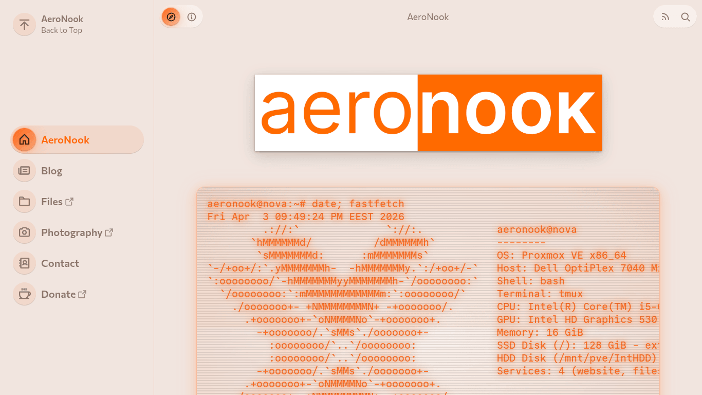
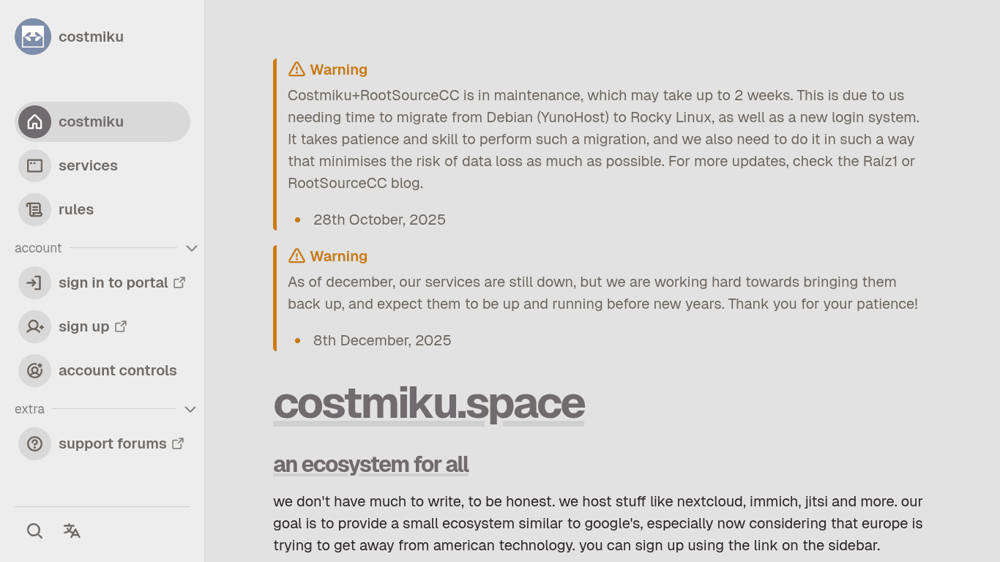
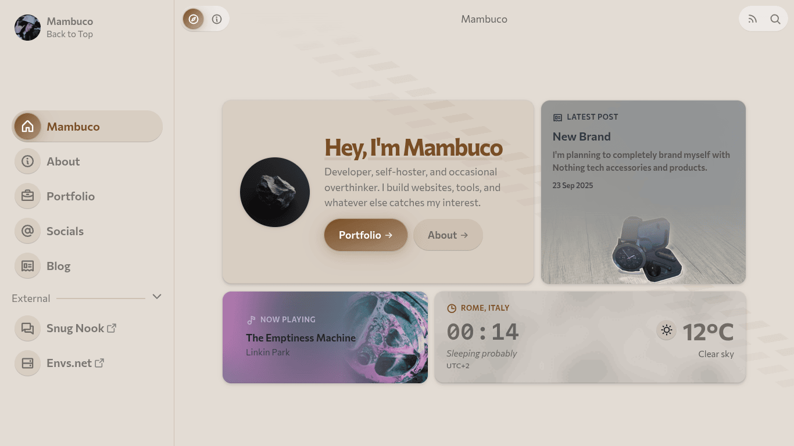
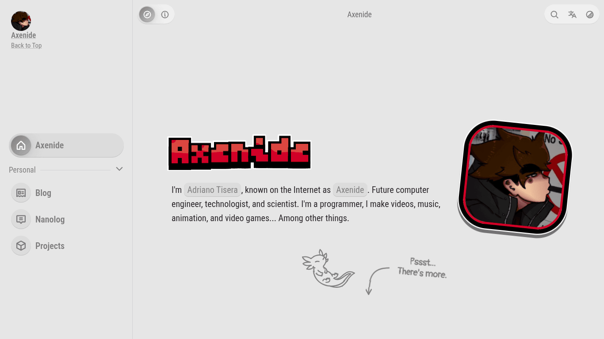

+++
title = "Awesome Ametrine Adventures"
description = "Duckquill got a successor, more than a year ago, actually."
draft = true
[taxonomies]
tags = ["Devlog", "Ametrine"]
[extra]
accent_color = ["purple", "orange"]
banner = "banner.webp"
+++

Greeting and salutations, and welcome back to first half[^1] of a new episode of [#devlog](/tags/devlog), a show where I talk about changes to this website and projects related to it! In this episode, we have a [Duckquill](https://duckquill.daudix.one) successor, a couple enigmas I had to overcome in the process, and some *awful* puns. As always, while this post will likely make the most sense for someone who does web development, I tried to keep it entertaining to non-developer readers as well.

Without further ado,

## Duckquill Succe- What

As I've [mentioned earlier](@/blog/2025-07-16-new-era/index.md), after [decoupling from my Duckquill theme](@/blog/2024-11-02-decoupling-from-duckquill/index.md) I have, uh, turned the hard fork back into a theme. A new one, called Ametrine. <small>(oh my God why am I like this why can't I just stand firmly on my decisions)</small>

The name comes from a certain---quite exquisite---variation of quartz of the same name, which is a mix of citrine (yellow quartz) and amethyst (purple quartz) formed when the crystal grows in an area with temperature difference (although most commercially available ametrines are artificial). <small>(bro really memorized and summarized the Wikipedia article on Ametrine 💀)</small>

The reasoning behind this name is simple: I love [Quartz](https://quartz.jzhao.xyz/) static site generator, from which I borrowed a lot of layout-related design choices early on.

Initially it was supposed to be called Amethyst, since you know, purple quartz, and "daudix x purple" is a cliche at this point, but my buddy [Gabs](https://gxbs.dev) have already claimed this name for his own theme, so I did what I often do: visited a Wikipedia page on various quartz variations and found out about the existence of ametrine! In hindsight I love this name much *much* more than Amethyst, so thanks Gabs for claiming the name.

The development accelerated during [High Seas](https://highseas.hackclub.com), since I wanted to participate in it with it as my project, and it was pretty darn successful! I earned around 250 doubloons, with which I got myself Mini Blåhaj, a couple of piles of stickers, and after shipping an update to Ametrine I got some additional doubloons and got Hack Club socks. It's been a year since and I still haven't got my prizes. Didn't expect any other outcome, but still, kinda bitter.

Anyhow, I won't go over all of the differences between Duckquill, the limbo state between it and Ametrine, and it itself since there's a shipload and a bit of them, but here are some of the technical challenges I had to overcome and some interesting-ish tricks and crimes I came up with or ended up using:

## CSS Hack-A-Buckery

I wouldn't be myself if I didn't commit a bunch of CSS crimes during development, here are some of my favorite ones.

### Dynamic Palette

Duckquill had a very simple color palette, mostly consisting of variations of white and black with different opacity. However, page background was a very light/dark variation of the user-defined accent color, which made the seemingly boring palette more fun. That background color was calculated using modern CSS feature called [`color-mix()`](https://developer.mozilla.org/en-US/docs/Web/CSS/Reference/Values/color_value/color-mix). As the name suggests, it allows to mix two colors with different proportions.

This feature is Baseline (supported in all major browsers) since May 2023, but certain operating system called iOS doesn't allow its users to update the built-in browser---Safari---without also updating iOS itself, which means users of phones with pre-2023 iOS versions---such as iPhone 7 and lower---are screwed. You might think that installing Firefox or Chrome would provide an up-to-date browser and alternative web rendering engine, but you'd be all so wrong; on iOS *every single browser* is Safari (technically WebKit) with different UI. I know, "holy shit", but Apple be Thinking Different y'know.

To solve this horrible web compatibility issue, I had to resign to horrible CSS hacks, the one that worked nicely is as follows:

- An HSL accent color is being set as three different CSS variables, as hue, saturation, and lightness respectively
- Primary accent color variable is defined by simply referencing above mentioned variables, i.e. `hsl(var(--accent-h), var(--accent-s), var(--accent-l))`
- For opacity variants we simply add an alpha channel as we normally would
- For complex calculations we are making use of `calc()` to manually tune every color channel we want by dividing, multiplying, adding, and subtracting variables and factors from one another

Halfway through implementing this I have come across [Color Manipulation With CSS Variables and HSL](https://codesalad.dev/blog/color-manipulation-with-css-variables-and-hsl-16) article by Code Salad, which was precisely what I was going for, but with proper calculations (mine were quite broken). Check that post out for all the calculations for all the different types of color manipulations.

To simplify variable usage and overriding, accent color-related variables and "static" variables are defined as two different mixins:

```scss
@mixin variables($modes: "light") {
  @each $mode in $modes {
    @if $mode == "light" {
      --fg-color: #29242a;
      --fg-contrast: #fcfcfa;
      --red-fg: hsl(342.0779, 72%, 58%);
      --red-h: 342.0779;
      --red-s: 72%;
      --red-l: 58%;
    } @else if $mode == "dark" {
      --fg-color: #fcfcfa;
      --fg-contrast: #29242a;
      --red-fg: hsl(345.18988, 100%, 69%);
      --red-h: 345.18988;
      --red-s: 100%;
      --red-l: 69%;
    }
  }
}

@mixin variables-accent($modes: "light") {
  @each $mode in $modes {
    @if $mode == "light" {
      --accent-color: hsl(
        var(--accent-light-h),
        var(--accent-light-s),
        var(--accent-light-l)
      );
      --accent-h: var(--accent-light-h);
      --accent-s: var(--accent-light-s);
      --accent-l: var(--accent-light-l);

      --bg-color: hsl(
        var(--accent-h),
        calc(var(--accent-s) - var(--accent-s) * 0.6),
        calc(var(--accent-l) + (100% - var(--accent-l)) * 0.8)
      );
    } @else if $mode == "dark" {
      --accent-color: hsl(
        var(--accent-dark-h),
        var(--accent-dark-s),
        var(--accent-dark-l)
      );
      --accent-h: var(--accent-dark-h);
      --accent-s: var(--accent-dark-s);
      --accent-l: var(--accent-dark-l);

      --bg-color: hsl(
        var(--accent-h),
        calc(var(--accent-s) - var(--accent-s) * 0.7),
        calc(var(--accent-l) - var(--accent-l) * 0.9)
      );
    } @else if $mode == "common" {
      --accent-highlight: hsla(
        var(--accent-h),
        var(--accent-s),
        var(--accent-l),
        var(--disabled-opacity)
      );

      --bg-muted-1: hsla(
        var(--accent-h),
        var(--accent-s),
        var(--accent-l),
        var(--color-opacity-1)
      );
    }
  }
}
```

This allows me to import such a mixin on some element along with an accent color different from main one, to do cool stuff like recoloring article cards.

```scss
article {
  &.has-accent-color {
    --accent-light-h: 209.49;
    --accent-light-s: 35.76%;
    --accent-light-l: 32.35%;
    --accent-dark-h: 200;
    --accent-dark-s: 15.19%;
    --accent-dark-l: 69.02%;
    @include variables-accent(("light", "common"));

    @media (prefers-color-scheme: dark) {
      & {
        @include variables-accent("dark");
      }
    }
  }
}
```

Not very efficient, but I am not aware of any other, better approach, and believe me, I researched this topic thoroughly and still do, in hopes for something to pop up. If you happen to know how to improve this, *please* [let me know](/#contacts).

### Immersive Loading Animations

A brilliant idea suggested by [Ivan](https://ivanmarkov.net): what if pages had different loading animations depending on whether the user is navigating up or down in the sidebar.

But wait, you might ask, how can we know from and where the user is going if it's a static site? Save the URL of the previous page in cache and then check whether the anchor element of new page is above or below it?

Nope, everything is simple and genius (as it always is). Since we have an active sidebar item logic already, we can simply define a `navigation_direction` variable with the value of `#up`, loop through all sidebar items and append `#up` to the end of all URLs, and once we hit an active URL, we set the variable to `#down` and append it instead.

| State    | Name    | Path           |
| -------- | ------- | -------------- |
| Inactive | Home    | /home/#up      |
| Active   | Blog    | /blog/         |
| Inactive | Nanolog | /nanolog/#down |

Now the animation itself. We define different animations based on the `:target`, it works by adding invisible elements with `up` and `down` IDs, `:target` state of which we check.

```scss
#main-content {
  animation: fade-in-zoom 0.4; // Normal loading animation

  @keyframes fade-in-zoom {
    from {
      transform: scale(0.95);
      opacity: 0;
    }
  }
}

// Don't play animation when jumping to any section
:target ~ #main-content {
  animation-name: none;
}

// Loading animation when going down in the sidebar
#down:target ~ #main-content {
  animation-name: slide-in-down-longer;
}

// Loading animation when going up in the sidebar
#up:target ~ #main-content {
  animation-name: slide-in-up-longer;
}
```

And that's essentially it! In practice there are also `#right` and `#left` anchors for animating navigation between blog posts using the Next/Previous thingy at the bottom of the page, but they work the same way so no need to mention them separately.

Again, the idea itself and its implementation were suggested by Ivan, kudos to him!!

### Icon Libraryn't

During the Duckquill --> Ametrine limbo state I have switched away from using hand-cleaned and optimized Adwaita icons defined as CSS variables, to using [Phosphor Icons](https://phosphoricons.com), a huge library of well-designed icons for any scenario you can think of.

The richness of the library comes at a very bitter cost, it weights a lot; it requires both an icon font and a CSS file that maps respective glyphs to respective icon classes.

To solve this, I have opted to inlining all the needed icons rather than loading everything at once. This idea was borrowed from [holly's site](https://holly.mlem.systems/), specifically the [`icon()` macros](https://git.gay/holly/pages/src/commit/e3abe82dd69deacc3b2c02751cb6df1c2e9847be/templates/macros/icon.html) (she allowed me to steal it ^^).

Initially I used [Iconify](https://iconify.design) API as well, but I found it rather slow and I didn't like the idea of depending on a remote API for building my website, so I have come up with a silly solution: adding [phosphor-icons/core repo](https://github.com/phosphor-icons/core) as a Git submodule!

It worked great, but I have noticed a pretty annoying issue, the repo was kinda huge, containing unused by me icon weights, typescript maps, Git history, and whatnot. So I have set up an [ametrine-icons repo](https://codeberg.org/Geode/ametrine-icons) which using CI copies all the needed files to it and pushes every week or on demand. I also use [Simple Icons](https://simpleicons.org) specifically for footer socials, and the same treatment was applied to it as well.

The way the macro works is as follows:

- Based on the icon name you provided, it loads a corresponding SVG file
- This SVG is being URL-encoded
- Which then is set as an `--icon` CSS variable in the `style=""` tag on an `<i>` HTML element

The final thingy looks like the following:

```django
<i class="icon {{ name }}" style="--icon: url('data:image/svg+xml,{{ icon | urlencode }}');"></i>
```

Now comes the CSS hackery:

```scss
.icon {
  font-style: normal;
  font-variant: normal;
  font-weight: normal;
  line-height: 1;
  user-select: none;
  text-transform: none;
  -webkit-user-select: none;
  display: inline-block;
  box-sizing: content-box;

  &::before {
    mask-image: var(--icon);
    -webkit-mask-image: var(--icon);
    display: block;
    background-color: currentColor;
    width: 1em;
    height: 1em;
    content: "";
  }
}
```

The trick here is to use masks rather than directly inlining the SVG into HTML, so that we can use currentColor while also having reliable resizing based on current font size. This hybrid `::before` and display `inline-block` on parent and `block` on pseudo element approach makes this possible.

Some readers would point out that it's possible to size the icon to match font size without using `::before`, and recolor too by styling the SVG directly, however there's one nasty issue: viewBox. It's the thingy that defines canvas size of an SVG, and for some reason, it doesn't like the SVG's width and height being altered; icon doesn't change its size, only the space around it is being increased. This is fixable by editing the SVG and could be added as an additional step in the CI, but currently I don't feel like figuring this out.

### The Blue Square That I Hate

If you're a Chrome user on Android you probably know what I'm talking about, if not here's what I'm on: By default, Chrome on Android highlights all interactable elements (links, buttons, checkboxes) with a semi-transparent blue square that covers the entire element when it's being pressed, which makes sense to have if your site doesn't have any :hover and :active states, but if you do it just looks horrible. Thankfully I found a solution to this problem:

```scss
* {
  -webkit-tap-highlight-color: transparent;
}
```

Yes, that's really it!

I find it funny how it was [initially a WebKit thing](https://developer.apple.com/library/archive/documentation/AppleApplications/Reference/SafariWebContent/AdjustingtheTextSize/AdjustingtheTextSize.html#//apple_ref/doc/uid/TP40006510-SW5), and now it's gone from these but is still around in Chrome.

## Abolish C-API-talism

The real highlight is the heavy use of APIs compared to Duckquill, which is cool, but comes at a cost...

### Fediverse Avatar

Ametrine has this neat thingy where, if "sidebar icon" option is set to `true` and Fediverse comments are on, it will automatically pull your pfp from the Fediverse. It works by relying on `.well-known`, webfinger specifically: `example.com/.well-known/webfinger?resource=acct:user@example.com`. There is one field that is of interest of us, and it's the one that has `rel` of `http://webfinger.net/rel/avatar`, which also contains an `href` to the avatar. Yeah it's that simple, the downside is that only Mastodon seems to supports this :\[

<https://wetdry.world/.well-known/webfinger?resource=acct:daudix@wetdry.world>
```json
{
  "subject": "acct:daudix@wetdry.world",
  "aliases": [
    "https://wetdry.world/@daudix",
    "https://wetdry.world/users/daudix"
  ],
  "links": [
    {
      "rel": "http://webfinger.net/rel/profile-page",
      "type": "text/html",
      "href": "https://wetdry.world/@daudix"
    },
    {
      "rel": "self",
      "type": "application/activity+json",
      "href": "https://wetdry.world/users/daudix"
    },
    {
      "rel": "http://ostatus.org/schema/1.0/subscribe",
      "template": "https://wetdry.world/authorize_interaction?uri={uri}"
    },
    {
      "rel": "http://webfinger.net/rel/avatar",
      "type": "image/jpeg",
      "href": "https://media.wetdry.world/accounts/avatars/111/681/676/609/615/060/original/27babb84280475a6.jpg"
    }
  ]
}
```

### Comments QR

In Duckquill, the QR code displayed in comments section to open the fedi post under which one would reply for it to display as a comment was loaded from the [QR generator api](https://goqr.me/api/) for every visitor, on every page load, which well, works but isn't very nice of me to spam it, it likely costs money to run that thing, so I did what any normal person would do right away, and opted to loading the QR SVG on page build. This way, everyone's happy; users get one less remote image to load, and api owner gets less requests, cool.

Now, it would be even cooler and more bandwidth efficient to load a gif rather than svg, however because Zola is cool but not perfect, it can't load and cache remote images or anything, only text data, which SVGs count as since it's pretty much just XML. Now, it's rude to call it that, but we're treating it as such because there isn't a better option and it's true.

### Last.fm

I hate, and absolutely despise, Last.fm API. Gosh why Paramount couldn't spend two minutes skimming over its output to ensure it's not saying bullshit, and is actually saying what it's supposed to instead of being all shy sometimes and instead of returning a null *sometimes* just not return anything.

Why would I care in the first place? Well, there's this little and simple feature someone requested: what if there was a way to display a song/album/combos of the former two as some sort of widget, which would tell the reader which songs author listened to while writing the article, in addition to weather, of course, cuz how else one is supposed to flex that they listened to The Sharpest Lives while it was raining outside.

Besides, very cool idea, but pretty complex to implement; it took me two months in total to ship it (most of which was spent scratching my head how to do it right) 👍

The least amount of info we would need to query Last.fm for details of some track are:

- Type (track or album)
- Track/album name
- Artist name
- API key

To keep things more standardized (but not necessarily reliable, because Last.fm) we also allow to pass a MusicBrainz ID (MBID for short), either as an addition to song name and artist, or a replacement, though setting song/album names in addition to it is still recommended, as some of them lack an MBID on Last.fm.

As for API key, we set it in `config.toml`... Ha, gotcha silly, we set it as an environment variable on build (`$ LAST_FM_API_KEY=63cdc(...) zola build`)!

Pretty cool that Zola can access these, ones set by user and even ones set by OS, like `$USER`, `$LANG`, and even `$XDG_SESSION_DESKTOP`. One can imagine an easter egg in Ametrine that, if `zola serve` is used, tells user "Hello <abbr title='$USER'>daudix</abbr> on <abbr title='$XDG_SESSION_DESKTOP'>gnome</abbr>, are you really using <abbr title='$EDITOR | split(pat="/") | last'>nano</abbr> as your editor?? Laaame!".

Someone *evil* could even use this to send out their users' telemetry with a bit of JavaScript, but even though I'm evil, I'm not evil *evil* so don't worry. Or worry and check source code for any suspicious `get_env()` instances, you do you.

Oh right, Last.fm.

With these in mind, we can construct an object in front matter:

```toml
[extra]
music = [
  {
    type = "album",
    mbid = "dd8ce89b-e385-4886-83b8-4d06b55539a4",
    artist = "Artifyber",
    name = "Lazuli"
  }
]
```

Pretty neat. As mentioned earlier, we can omit artist and track/album names, or drop MBID, or even make a typo in either of names and still have a high chance of Last.fm autocorrecting it (via `&autocorrect=1` query):

```toml
[extra]
music = [
  # No song and artist names
  {
    type = "track",
    mbid = "480835fa-368f-4916-948b-7e6e617ca64e"
  },
  # Malformed artist name, should autocorrect itself
  {
    type = "track",
    artist = "my chemicla romance",
    name = "dead"
  },
]
```

Now we can do the following on template side:

<small>Item: song/album.</small>

- Load Last.fm API key from `LAST_FM_API_KEY` environment variable (duuh)
- Loop through all items in front matter's `extra.music`
- For each item, query Last.fm for its info using all the available user-supplied info
- If item is a song and it has a cover art, use it, if not, check if it's part of an album and if it has a cover art, if it does, use it, if not, fallback to missing image image (there's surely a better way to word this)
- Check our position in a loop, and ensure that it's less than a maximum number, if it's equal to a maximum (7, so that we have 6 items max), silently break the loop and don't load any more info
- Use same loop index logic to construct a paginator, which is a list of links that link to `#music-item-1`, `#music-item-2`, and so on, which scroll relevant items into view

[Template in question](https://codeberg.org/daudix/ametrine/src/commit/e777facd2b74c5d7d48b32f2f89997ff07aa944b/templates/partials/sidebar.html#L203-L280)

This might not sound all too complicated, but it required lots of trial and error to get it right. It would've been easier and faster if Last.fm wasn't shit, but I bet you already noticed how much I hate it.

{{ video(url="music-pagination.mp4", alt="Showcase of music widget pagination.", controls=true) }}

Enough APIs, let's do some small talk.

## Good Weather Mate, Innit?

Sorry readers from the Overcast Island, didn't mean to come across as offensive or something, in fact I much prefer your English over.. uh, Simplified English. Although my favorite flavor is still Canadian English :]

Anyhoo, I got sidetracked, what are we talking abo- oh right, this joke is already way too overused throughout this blog. Um, yea, let's jump right into the internals of the weather widget.

Instead of relying on some APIs, I opted to allowing the user to define four distinct settings:

- Temperature
- Weather condition name
- Weather condition icon
- Background image type (one of three; cloudy, showers, or snowing)

Pretty easy right? Well mostly yeah, though I had to buck around a lot to get background image animations right. For foggy I used two (heavily compressed/dithered) Perlin noise images with alpha, one for light mode, and one inverted one for dark mode. Rain one uses rain droplet sprite from [Nimbus](https://github.com/danirabbit/nimbus), a weather app for elementary OS, and for snow I took the rain sprite and put randomly sized (randomized by just eyeballing) circles at the ends of the water droplet lines.

More on Perlin noise, I used [Kitfox' Perlin Noise Maker](http://kitfox.com/projects/perlinNoiseMaker/) to create a sprite with settings I needed. I then adjusted the opacity until it looked good, did the same for dark variant except that I inverted the image before adjusting opacity. The final result was then dithered to make sprites even more tiny.


Oh right, what was so hard about getting animations right? Mostly background position for the rain animation, since I needed to maintain a nice speed while also keeping the animation loop seamless, all while looking natural, so that droplets don't fall in s straight line but also shift downwards slightly.

<div class="media-grid">
{{ video(url="weather-cloudy.mp4", alt="", controls=true) }}
{{ video(url="weather-showers.mp4", alt="", controls=true) }}
{{ video(url="weather-snowing.mp4", alt="", controls=true) }}
</div>

One last thing is the actual degree° symbol. Some put space between it and the actual temperature, some don't. I tried to find which approach is actually correct, but I didn't find any cohesive info, so I went with what looks nicer and didn't put space in between :]

## My Faithful Test Subjects

I'm lucky enough to have some awesome friends, and I'm even more lucky that some of them took the initiative and risk and ported their sites to Ametrine, which was super cool but also super valuable, as it exposed some really nasty issues that couldn't be easily caught if you're not starting your site from scratch. These site are as follows, in order:

1. [rootsource.cc](https://rootsource.cc)
2. [mambuco.dev](https://mambuco.dev)
3. [aeronook.eu](https://aeronook.eu)
4. [costmiku.space](https://costmiku.space)

<div class="media-grid-markdown">

[](https://rootsource.cc)
[](https://aeronook.eu)
[](https://costmiku.space)
</div>

However, these are not the only Ametrine sites, but these are first, and thus special to me.

Do I have any favorite Ametrine sites though? Of course I do, [mambuco.dev](https://mambuco.dev) and [axeni.de](https://axeni.de)!

[](https://mambuco.dev)
[](https://axeni.de)

Both are made by pretty cool guys, make a bunch of modifications, and have nice content. I really love seeing how different sites can be while using the same base.

All in all, it's very fun helping early adopters with setting up Ametrine, point them to correct config options, or implement some features for them, although I sometimes wonder if all these "not production ready, don't use" disclaimers on Ametrine's site make any difference :P

## Major Changes During Development

During this year+ of active development, many things inevitably changed, and while it would be nearly impossible to list all of them, here are some of the major ones:

- [New sidebar](https://codeberg.org/daudix/ametrine/pulls/29) with cool new features (compare it to [old.daudix.one](https://old.daudix.one))
- Retirement of the collapsed sidebar state
- New* header (well, return of it)
- New fonts: [Commissioner](https://github.com/kosbarts/Commissioner) for UI and [Commit Mono](https://commitmono.com) for code ([Geist](https://vercel.com/font) is made by Vercel, whose CEO is *evil*)
- Custom alerts
- [SCSS reorganization and refactor](https://codeberg.org/daudix/ametrine/pulls/26)

## Initial Release and Some Plans

Even though Ametrine is in a seemingly good state right now, it's still far from done; many things are still yet to be implemented, there's a number of annoying issues, and there's a bunch of things that I want to rewrite as I feel they're not done correctly right now. Still though, my short term plan looks something like this:

- Make build times as short as possible
  - Replace Last.fm API with something else, it's simply too slow
  - Reconsider the need for comments QR code
- Make things more modular
  - Make color palette easily overrideable, Monokai Pro isn't everyone's cup of tea
  - Utilize blocks in templates so that it's possible to partially override them. Will have to wait for Zola rewrite in tera2 as currently it's very fragile
- Become less Fediverse-focused, i.e. comments are currently Fediverse-only, and lately I've been pretty much exclusively using Bluesky
- Take a step back and carefully consider which features should stay and which ones should go

Once the [v0.1.0 milestone](https://codeberg.org/daudix/ametrine/milestone/12016) is completed, we'll tag said release and submit Ametrine to Zola's themes page. I wouldn't be optimistic on this one, since v0.1.0 was supposed to be released like 3 months into development.

## Conclusion

During this year+ of Ametrine development, many things were done, and while one could wish more was done in this period, I'm personally fine with it.

I hope it was at least a bit interesting and that at least some joke made you chuckle. Have a good day, stay safe, and see you in the next one next week (I really really hope so, can't promise it though).

[^1]: This post was initally going to include this site's #devlog with changes made since the New Era post, however it was getting too long, and well, no one's going to read 40 minutes worth of text written by daudix, so I've split it into a separate post.
