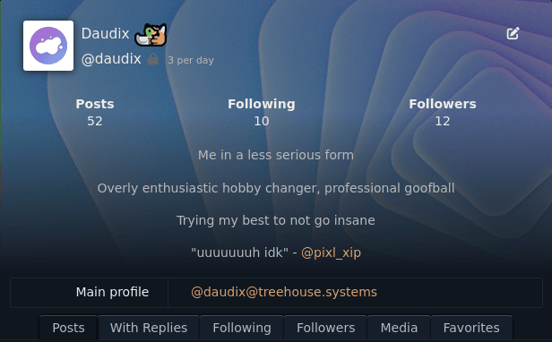

+++
title = "Splitting Myself to Pieces (Just Two, Actually)"
description = "Now I have an alt Fediverse profile. But why?"
date = 2024-01-23
[taxonomies]
tags = ["Akkoma", "Mastodon"]
[extra]
toc = true
+++

## What?

This is a little bit of spontaneous post, but I still liked to write it, thought be prepared for weird writing style, since as always, I'm experimenting with it :)

## Backstory

You might know me online as a Daudix (*what a terrible nickname, but it's too late to change it*), less known is that this is actually my silly side, while the David Lapshin one is... Well, more grounded.

The thing is, these two have been living under the same roof (aka Mastodon profile) all this time, which made Daudix a little uncomfortable being silly in the presence of David Lapshin.

So what did I do?

## Splitting

Earlier this month I decided to try out a new instance - no, a whole new software even - Akkoma; in short, I fell in love with it. What I liked about it is that it's more lightweight yet has more features than Mastodon, even the glitch-soc edition (e.g. it can render MFM-Misskey Flavoured Markdown), plus it has slightly skeuomorphic look.

I wasn't sure if I should switch my home server from [treehouse](https://social.treehouse.systems/@daudix) or keep it as a backup, but then I thought "what if I keep my current main profile for the boring David and use the new instance for Daudix's needs?", and... I did it! and this is the official announcement, if you want to follow the new profile it is at [@daudix@pleroma.envs.net](https://pleroma.envs.net/users/daudix) (Seirdy, the instance admin, rocks btw).

Sometimes I might boost stuff from this new profile on the main, but otherwise I expect the main to be less active.

I still don't quite understand the relationship between Akkoma and Pleroma; they look just as maintained to me, but I guess there was a reason ¯\\\_\(ツ)\_\/¯

Oh and one more thing: why not \*key!!! (e.g. Sharkey).

The answer is simple: just because!

Slightly more detailed: because it's too slow and buggy for my taste, even though Sharkey is faster than Firefish it's still quite slow.

## TL;DR

I tried Akkoma and it clicked, now I will post goofy stuff there, follow it (if you want) at [@daudix@pleroma.envs.net](https://pleroma.envs.net/users/daudix)

<figcaption>Screenshot of the header of my Akkoma profile</figcaption>
