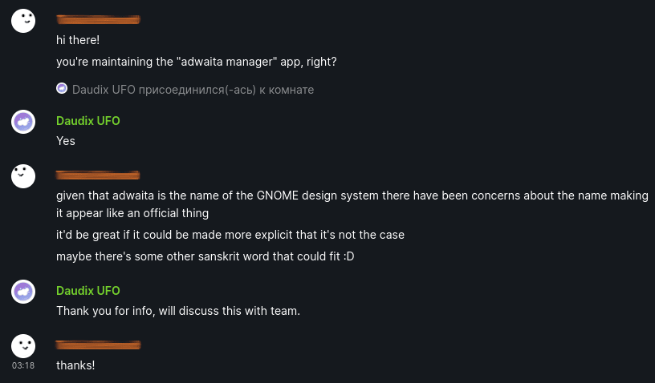

+++
title = "Gradience Was Quite a Ride, Now It’s Time to Move On"
description = ""
date = 2024-07-18
draft = true
[taxonomies]
tags = ["100DaysToOffload"]
[extra]
disclaimer = """
- This post doesn't provide any names; this post isn't made to offend anyone but to give an idea what was going on.
- This post doesn't link to mentioned posts since I was a different person two years ago and find it very cringy."""
+++

Two years ago today, a project called AdwCustomizer emerged: A libadwaita app that allowed users to recolor their libadwaita and GTK3 apps if `adw-gtk3` theme was present using an easy to use interface.

> **Note:** My stance on the theming didn't change; I still believe that distributions should *not* ship any theming out of the box. It's up to the user to decide whether they're okay with broke napplications or not. See ["please don’t theme our apps"](https://stopthemingmy.app).
> 
> Personally, I stopped theming my desktop for a while; for more than a year I'm using vanilla GNOME with only a few extensions that add missing some features that I desperately need, like automatic dark mode on sunset.

I was super exited to be one of the first to find it, since I thought about such app literally a few days before I found it. The same day, I opened an issue regarding changing the project name, since it didn't follow the [GNOME HIG](https://developer.gnome.org/hig/guidelines/app-naming.html). Dev quickly responded stating that Adwaita Manager sounds quite good, and very soon, the project was renamed.

Then, I created an issue regarding the app icon, and even tried designing something (in retrospect: the icon turned out to be a complete shit, like any icon from that period), participated in a little heated argument with other designer, and even did some UI mockups (which, you guessed it, looked like shit).

Then something unexpected happened: Developer announced that he's looking for a new (co-)maintainer. This was shocking for me, since I really liked the project, so what I did is what any sensible human being would do: Commented that I would like to maintain it, and no, I didn't say that I'm no programmer and joke of a designer.

To make things worse, I took responsibility in my own hands and... made an announcement on r/gnome and r/linux that project looks for a maintainer!? without asking the dev first!? *deep sigh* kill me please.

No one came to maintain it from the Reddit post, but one guy commented under the initial announcement from the dev and said that he would like to maintain it, an so, soon I and this guy got added to the AdwCustomizer Team GitHub organisation.

Since then, we continued working on the project; the new maintainer implemented a lot of the requested features like Material You preset generation and new UI (following my mockups)

A month later, the app was somewhat feature-complete, so we thought a bit and decided to make an announcement about it on [TWIG](https://gitlab.gnome.org/Teams/Websites/thisweek.gnome.org/-/blob/main/README.md). Short afterwards, I got contacted by one of the GNOME designers asking if the project could use a name that is less likely to be mistaken with an official GNOME app.

In retrospect, this makes plenty of sense, but back then I got ...offended!? Anyhow, I promptly opened a new discussion on GitHub and we started brainstorming the new name.

Since I was ugh, um, dumber and didn't understand English well enough, it was an awkward experience. In the end, we got a few name candidates, so we made a Reddit poll for people to decide. And they have chosen... Gradience!

Again, since I was a dumb fuck, I really disliked the name, but people have chosen so I couldn't do anything about it. Eventually I realized that it's freaking perfect, good thing it wasn't changed.

Time passed, new features were added, I did more UI mockups, icons, translated the project to Russian, spent a lot of time in project's chat, and overall, got deeply involved in it. Gradually, I got more power and responsibility laid on my shoulders, but I didn't complain, since it's cool to "maintain" a big project, r-right?

New GNOME versions came out, more and more presets (just a fancy name for Gradience color themes) were made, the app got more polished and powerful, and then all of sudden... maintainer disappeared. Alright, it didn't happen suddenly, but gradually, it was still noticeable.

Some time later (I forgor 💀), the maintainer completely disappeared, and I was left alone to triage the issue tracker, answer all the questions in the support chat (there was lots, lots of them). I stated to dislike all this, and eventually completely burned out and simply muted all Gradience chats. I would still came over and answer a question or two, but I really didn't want to spend much time there.

I understood that this can't continue forever, people *will ask* the same questions over and over, they *will ask* for new release date, and I *will need* to answer this over and over again.

Last month, I collected all the courage and social energy I had and did what I have planned for a while; announced that project looks for a new maintainer. Again. Just like the first time.

But no one have responded in two weeks, so I have did what I thought about doing and one comment suggested: archiver the project (actually the entire GitHub organisation).

What does this mean? In short, it won't get any updates anymore, and I will have a solid answer to all the questions that will be asked in the support chat.

I'm glad that I finally did it, but also I feel kinda bad and sad about it. After all, this project indirectly allowed to meet a lot of wonderful people, communities, and become a better self. Special thanks goes to Gradience's off-topic "Water Cooler" room; a nice place to chit-chat with cool people.

This is the end. For now.