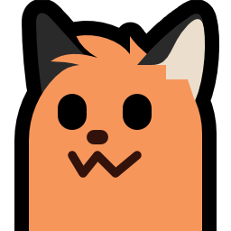

+++
title = "Buy Me a Coffee"
description = "Just in case you want to do so for some reason."
[extra]
stylesheets = ["coffee.css"]
+++

	

		
	

	

		
Hewwo~ 0w0

		
		
	

	<strong id="title">David Lapshin</strong>
	
If you'd like to buy me a coffee (thanks ^_^), you can use one of these options. If you'd like to use some other option feel free to <a href="https://daudix.one/find/#contacts">ask</a>, maybe I do have it.

	<input type="checkbox" id="skeuo-switch">
	<label for="skeuo-switch">Skeuomorph</label>
	

		<a id="ko-fi" class="inline-button" href="https://ko-fi.com/daudix">Ko-fi</a>
		<a id="liberapay" class="inline-button" href="https://liberapay.com/daudix">Liberapay</a>
		<a id="monero" class="inline-button" href="monero.txt">Monero</a>
	

