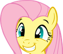

+++
title = "Home"
description = "The central hub."
[extra]
styles = ["home/style.css"]
scripts = ["home/script.js"]
no_header = true
badges = [
  { name = "adhd.gif", url = "https://en.wikipedia.org/wiki/Attention_deficit_hyperactivity_disorder" },
  { name = "blue-team.gif", url = "https://512kb.club" },
  { name = "dark-mode.gif", url = "https://developer.mozilla.org/en-US/docs/Web/CSS/@media/prefers-color-scheme" },
  { name = "mobilefriendly.gif", url = "https://developer.mozilla.org/en-US/docs/Learn_web_development/Core/CSS_layout/Responsive_Design" },
  { name = "righttorepair.gif", url = "https://www.ifixit.com/Right-to-Repair" },
  { name = "saynotoweb3.gif", url = "https://yesterweb.org/no-to-web3/" },
  { name = "snug-nook.gif", url = "https://daudix.one/snug-nook/" },
  { name = "standwith.gif", url = "https://decolonizepalestine.com" },
  { name = "vscodium.gif", url = "https://vscodium.com" },
]
games = [
  { name = "Portal 2", id = "620" },
  { name = "OneShot", id = "420530" },
  { name = "Celeste", id = "504230" },
  { name = "Teardown", id = "1167630" },
  { name = "Superliminal", id = "1049410" },
  { name = "Machinarium", id = "40700" },
  { name = "Stardew Valley", id = "413150" },
  { name = "Untitled Goose Game", id = "837470" },
  { name = "The Stanley Parable", id = "221910" },
]
contacts = [
  { name = "Discord", url = "https://discord.com/users/650757995378114581" },
  { name = "Signal", url = "https://signal.me/#eu/b4KzM1OB3uW52mMywHUJa8h6yD4ATY_KXJJiuJtWUxOVAJP22PVO_qoNGFnf32W7" },
  { name = "Telegram", url = "https://t.me/ddaudix" },
  { name = "Matrix", url = "https://matrix.to/#/@daudix:envs.net" },
  { name = "XMPP", url = "xmpp:daudix@disroot.org" },
  { name = "Email", url = "mailto:me@daudix.one" },
]
socials = [
  { name = "Bluesky", url = "https://bsky.app/profile/daudix.one" },
  { name = "Mastodon", url = "https://wetdry.world/@daudix" },
  { name = "SpaceHey", url = "https://spacehey.com/daudix" },
  { name = "Tumblr", url = "https://www.tumblr.com/ddaudix" },
  { name = "Pixelfed", url = "https://pixelfed.social/Daudix" },
  { name = "YouTube", url = "https://www.youtube.com/@ddaudix" },
]
forges = [
  { name = "Codeberg", url = "https://codeberg.org/daudix" },
  { name = "GitHub", url = "https://github.com/daudix" },
  # { name = "GitLab", url = "https://gitlab.com/daudix" },
]
+++

{{ polaroid() }}

# David Lapshin

Greetings! Welcome to my little corner on the World Wild Web. You might know me by my online handle; Daudix.

  <a class="suggested" href="#about">About Me ↓</a>
  <a href="#works">My Works ↓</a>

## About

Thing I hate doing the most; telling about myself.

<ul class="masonry">
<!-- Card Start -->
<li>
<article>

**I'm originating from Siberia,** but currently residing in <abbr id="abyss" title="If you know, you know">abyss</abbr>. That means that I'm a native Russian speaker, что в каком-то смысле довольно прикольно..?
</article>
</li>
<!-- Card End -->

<!-- Card Start -->
<li>
<article class="fancy-list">

**Random things I like:**

- Purple <small>(lavender in particular)</small>
- Monokai Pro <small>(it got this sweet purple tint)</small>
- Photography <small>(mostly view from my window)</small>
- Amethysts and Ametrines
- Emoticons (but not emojis)
- Minor details and references
- Retro(futuristic) and vintage stuff
- Making this list look like a staircase
</article>
</li>
<!-- Card End -->

<!-- Card Start -->
<li>
<article class="window">
{{ window() }}
</article>
</li>
<!-- Card End -->

<!-- Card Start -->
<li>
<article>

**I'm rather shy.** Quoting [hyperreal](https://hyperreal.coffee) as I can't say it better:

> I'm <button id="shy">shy</button> and might come across as reserved and standoffish at first, but I open up when I get more comfortable with people.
</article>
</li>
<!-- Card End -->

<!-- Card Start -->
<li>
<article class="games fancy-list">

**Games I like:**

{{ games() }}
</article>
</li>
<!-- Card End -->
</ul>

## Online

Where and when to find me online.

<!-- 

  <button onclick="togglePlaying()">Toggle Playing State</button>
  <button onclick="toggleTitleMarquee()">Toggle Title Marquee</button>
  <button onclick="toggleArtistMarquee()">Toggle Artist Marquee</button>
  <button onclick="forceReload()">Force Reload Player</button>

 -->

<ul class="masonry">
<!-- Card Start -->
<li>
{{ now_playing() }}
</li>
<!-- Card End -->

<!-- Card Start -->
<li>
<article class="online fancy-list">

<strong id="socials" class="title">Socials</strong>

{{ online(type="socials") }}
</article>
</li>
<!-- Card End -->

<!-- Card Start -->
<li>
<article class="online fancy-list">

<strong id="forges" class="title">Forges</strong>

{{ online(type="forges") }}
</article>
</li>
<!-- Card End -->

<!-- Card Start -->
<li>
<article class="online fancy-list">

<strong id="contacts" class="title">Contacts</strong>

For me it's currently <time id="clock"><noscript>NO:JS</noscript></time> <small>(UTC+3)</small> and I'm <noscript>N/A</noscript>.

Feel free to reach me out on any of these! Although I'm usually too shy to start the conversation, I'm happy to chat once someone messages me first.

{{ online(type="contacts") }}
</article>
</li>
<!-- Card End -->
</ul>

## Works

  
  
  
  

I ocasionally contribute to various FOSS projects by creating/improving icons, translating them into Russian, or crafting logos. Other times I make wallpapers for myself that I share with others. <small>(one is in [GNOME](https://www.gnome.org))</small>

  <a href="/design/">My Designs →</a>

## IndieWeb

{{ badges() }}

Simply put, IndieWeb is anything on the web that is hand-crafted and feels personal, at least that's what it is for me.

Everything about it is awesome, from 88x31 buttons to webrings. It also feels cozy and is hella fun, quite refreshing after the sterile corporate web.

I'm even a member of several [tildes](https://envs.net) and [CS clubs](https://exozy.me), even though I don't do much there, I still like being a part of them:

Better yet, I have a website on [neocities](https://neocities.org); It doesn't have any purpose except for being there and looking dated. [Check it out](https://daudix.neocities.org) if you want.

