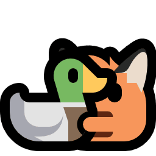

+++
title = "Home"
[extra]
styles = ["home/style.css"]
scripts = ["home/statuscafe.js", "home/fluttershy.js", "home/rizz.js"]
no_header = true
badges = [
  { name = "blue-team.gif", url = "https://512kb.club" },
  { name = "doskel.gif", url = "https://doskel.net" },
  { name = "ersei.gif", url = "https://ersei.net" },
  { name = "free.gif", url = "https://freeplay.floof.company" },
  { name = "georgemoody.gif", url = "https://moody.im" },
  { name = "getimiskon.gif", url = "https://getimiskon.xyz" },
  { name = "graphite.gif", url = "https://gra.phite.ro" },
  { name = "immjs.gif", url = "https://immjs.dev" },
  { name = "lyra.gif", url = "https://lyra.horse" },
  { name = "marchintosh.gif", url = "https://libreivan.com/writing/" },
  { name = "melankorin.gif", url = "https://melankorin.net" },
  { name = "nek0zyx.gif", url = "https://nek0zyx.pages.gay" },
  { name = "pixlxip.gif", url = "https://xip.neocities.org" },
  { name = "righttorepair.gif", url="https://www.ifixit.com/Right-to-Repair" },
  { name = "ronbutton.gif", url = "https://veeronniecaw.space" },
  { name = "saynotoweb3.gif", url = "https://yesterweb.org/no-to-web3/" },
  { name = "seirdy.gif", url = "https://seirdy.one" },
  { name = "standwith.gif", url = "https://decolonizepalestine.com" },
  { name = "volpeon.gif", url = "https://volpeon.ink" },
  { name = "vscodium.gif", url = "https://vscodium.com" },
]
+++

<noscript id="noscript">
  

    <small>JavaScript is off huh? Good for you!</small>
     
    <small>Here's an exclusive cute fox hugging a duck for you x3</small>
     
    
  

</noscript>

{{ polaroid() }}

# David Lapshin { #header }

Greetings! Name's David, and this is my little corner on the big, scary World Wild Web. You might know someone online with the nickname "Daudix", and yeah, that's me :P


Daudix is a slightly different persona of sorts; more cringe and silly, but authentic.


Originating from Siberia, but currently residing in <abbr id="abyss" title="If you know, you know">abyss</abbr>. That means that I'm a native Russian speaker, which is cool, I guess?

Other than that, I like to "mess around and find out" about all sorts of things. I'm very curious, quite enthusiastic, and maybe a little annoying.

I'm also trying to learn something new every day, and sometimes I happen to come across something that consumes me completely, but that doesn't happen all that often, sadly.

One such thing is design; it's my hobby and I'm learning more about it every day. As you can see, I also do some web development! I looove working with CSS/SCSS, HTML, and its templating, but that's about it; JS is a bit of a mystery for me.

And lastly, to quote [Jeffrey](https://hyperreal.coffee/about/) as I can't say it better:

> I'm <button id="shy">shy</button> and might come across as reserved and standoffish at first, but I open up when I get more comfortable with people.

Some things that I like

- Purple <small>(lavender in particular)</small>
- Design
- Games:
  - 

      

        

          Portal
          Portal
        

      

    

    <small>(all-time favorite)</small>
  - Celeste <small>(such a lovely game)</small>
  - Teardown <small>(fun destructions)</small>
  - Superliminal <small>(F-Stop if it wasn't scrapped)</small>
  - Stardew Valley <small>(was fun until sis spoiled *everything*)</small>
  - Untitled Goose <small>(*honk-honk!* I love geese, by the way)</small>
  - The Stanley Parable&nbsp;Adventure Line™ <small>(fake feeling of choice, just like irl)</small>
- Aesthetics:
  - [Cyberpunk](https://aesthetics.fandom.com/wiki/Cyberpunk)
  - [Vaporwave](https://aesthetics.fandom.com/wiki/Vaporwave)
  - [Liminal Space](https://aesthetics.fandom.com/wiki/Liminal_Space)
- Monokai Pro <small>(I know, very random, but hear me out, it got this sweet purple tint)</small>
- Photography <small>(although I don't have much opportunity to shoot anything else than a view from my window)</small>
- Small/indie web
- Emoticons (but not emojis)
- Minor details and references
- Retro(futurism) and vintage stuff
- Making this list look like a staircase

## Works

{{ window() }}

I contribute to various FOSS projects from time to time, either by creating and improving icons, translating them into Russian, or even crafting a logo.

Have a look at my [design page](@/design/index.md) for my design-related works; mostly icons, some wallpapers (one of them is part of GNOME), and a few logos.

## IndieWeb

{{ badges() }}

Simply put, IndieWeb is anything on the web that is hand-crafted and feels personal, at least that's what it is for me.

Everything about it is awesome, from 88x31 buttons to webrings. It also feels cozy and is fun; quite refreshing after the sterile corporate web.

I'm even a member of several tildes and CS clubs, even though I don't do much there, I still like being a part of them:

- [exozyme](https://exozy.me)
- [envs](https://envs.net)

Better yet, I have a website on [neocities](https://neocities.org); essentially it's my playground where I can make bolder design choices than here, and write less interesting and more cringe stuff. [Check it out](https://daudix.neocities.org) if you want to.

I also have a [Gemini capsule](gemini://gmi.daudix.one) on [flounder](https://flounder.online). It's very empty and I have no idea what to use it for ;\_; <small>(you can also _finger_ me at `daudix@flounder.online`)</small>
