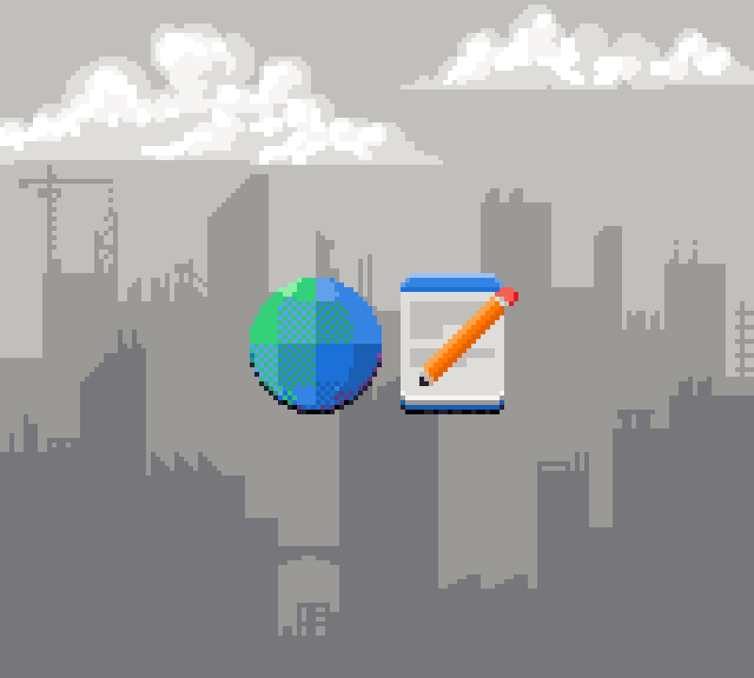

<!-- {:.full.pixels} -->

```
         *                 *                  *              *
                                                      *             *
                        *            *                             ___
  *               *                                          |     | |
        *              _________##                 *        / \    | |
                      @\\\\\\\\\##    *     |              |--o|===|-|
  *                  @@@\\\\\\\\##\       \|/|/            |---|   |d|
                    @@ @@\\\\\\\\\\\    \|\\|//|/     *   /     \  |w|
             *     @@@@@@@\\\\\\\\\\\    \|\|/|/         |  U    | |b|
                  @@@@@@@@@----------|    \\|//          |  S    |=| |
       __         @@ @@@ @@__________|     \|/           |  A    | | |
  ____|_@|_       @@@@@@@@@__________|     \|/           |_______| |_|
=|__ _____ |=     @@@@ .@@@__________|      |             |@| |@|  | |
____0_____0__\|/__@@@@__@@@__________|_\|/__|___\|/__\|/___________|_|_
```

Hi there! this is my little snug nook, take your cup of coffee and let's dive in!

## Posts

[Gemini: Exploring the Cozy World of Capsules and Space](posts/Gemini: Exploring the Cozy World of Capsules and Space.md){: .page-link}

[Migration from GitHub to Codeberg](posts/Migration from GitHub to Codeberg.md){: .page-link}
