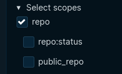
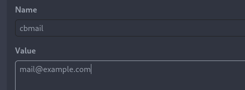

# Migration from GitHub to Codeberg

## Backstory

On January 8, 2021, I have joined GitHub, back then I knew very little about FOSS and how it works, haven't done design _ever_ and had awful knowledge of English, to point that I used Google Translate to understand the text.

Things have changed since then, but this post is not about this (or is it).

GitHub is biggest Git service that every developer knows about, a lot of open source projects use it because it provides free hosting and very convenient tools such as Actions and Pages, but not everything is perfect, and where there are Microsoft there are bad stuff.

It is owned by Microsoft for a long time, which is the first red sign. ~~When [Russo-Ukrainian War](https://en.wikipedia.org/wiki/Russo-Ukrainian_War) began, GitHub started [suspending accounts and deleting repositories](https://www.jessesquires.com/blog/2022/04/19/github-suspending-russian-accounts) of Russian developers who has nothing to do with war but the fact that they were in Russia~~ (info varies). Last year they launched [Copilot](https://github.com/features/copilot) - an AI code completion and suggestion software [trained on FOSS projects](https://githubcopilotinvestigation.com), violating the GPL license. Microsoft itself has not the cleanest history with FOSS and Linux, if I will list every incident here it will take a lot of time.

Recently I were contributing to [some](https://codeberg.org/Bavarder/Bavarder) [projects](https://codeberg.org/Imaginer/Imaginer) hosted on Codeberg, and I had to create an account and use it for some time, and... I liked it! The UI of Codeberg; the workflow and the overall _vibe_ were really nice, the fact that Codeberg is very open with Community helped a lot too.

> Codeberg is non-profit powered by [Forgejo](https://forgejo.org) - a soft-fork of [Gitea](https://about.gitea.com) created after some suspicious stuff happened with it.

And I have started thinking of and preparing for migration.

_Why not GitLab?_

Because... I don't know, I just liked Codeberg so much :)

## Migration

Finally, after deciding that I'll migrate my personal repositories to Codeberg I have created a [poll](https://mstdn.social/@Daudix/110680533037666405),in which asked what to do with repositories on GitHub, people decided that adding small note in README that tells about migration and gives a link to repository on Codeberg, and then archiving were the best approach, [and so I did it!](https://mstdn.social/@Daudix/110685982530642051)

### Repositories

The [migration of repositories](https://docs.codeberg.org/advanced/migrating-repos) were very simple - I have created GitHub [Fine-grained personal access token](https://github.com/settings/tokens?type=beta) which I used to give Codeberg access to GitHub repositories

You can fine-tune the migration - enable migration of pull requests, issues, labels, releases, milestones and wiki, all by simply checking a box.

### Redirect

To make the migration as smooth as possible for everyone, I have [added redirect](https://mstdn.social/@Daudix/110682189578914151) from GitHub pages to Codeberg pages right before archiving, so all the links will continue work just like before.

To do so, add this line to `<head>` of HTML

```html
<meta http-equiv="refresh" content="0; URL=https://daudix-ufo.codeberg.page" />
<link rel="canonical" href="https://daudix-ufo.codeberg.page" />
```

_Of course with your URLs in place of mine_

### GitHub pages → Codeberg pages

Speaking of Codeberg pages, I have successfully recreated the workflow of GitHub pages with said Codeberg pages and Woodpecker - CI service that Codeberg provides (you need to request access), which allows running various jobs on changes, the one I needed were Jekyll - Static site generator from Markdown (and not only) that are used by GitHub pages and this blog is powered by.

#### Woodpecker

> See [blog post](https://jan.wildeboer.net/2022/07/Woodpecker-CI-Jekyll/) by Jan Wildeboer for better understanding how the CI works, since this guy created the workflow used here

First, request and wait for approval access to Woodpecker CI by opening an issue [here](https://codeberg.org/Codeberg-e.V./requests/issues/new/choose) and selecting _Woodpecker CI Access_.

After approval, create `blog-source` and `blog` repositories, the later will contain the generated static site, and create `.woodpecker.yml` file in the `blog-source` repository.

Then copy and paste the contents of [Jekyll workflow example](https://codeberg.org/Codeberg-CI/examples/src/branch/main/Jekyll/jekyll.yml) in `.woodpecker.yml`

```yml
# Jekyll on Woodpecker to codeberg pages
#
# This file would typically be .woodpecker.yml in the root of your repository.
#
# Takes a repository with jekyll source, generates the static site and
# pushes the result to codeberg pages
#
# Needs a codeberg access token (cbtoken) as secret in woodpecker config
# Also uses another secret (cbmail) with email address for git config
#
# CBIN must be replaced with the source repo
# CBOUT must be replaced with the target codeberg pages repo
# CBUSER must be replaced with the user/org
#
# See the _config.yml file for the important keep_files: line to preserve
# git metadata during build
#
# We also assume a domains file in the source repo that gets copied to
# .domains in the target repo so codeberg pages works for custom domains
#

steps:
  build:
    # Use the official jekyll build container
    image: jekyll/jekyll
    secrets: [cbtoken, cbmail]
    commands:
      # Avoid permission denied errors
      - chmod -R a+w .
      # Set up git in a working way
      - git config --global --add safe.directory /woodpecker/src/codeberg.org/CBUSER/CBIN/_site
      - git config --global user.email "$CBMAIL"
      - git config --global user.name "CI Builder"
      - git config --global init.defaultBranch pages
      # clone and move the target repo
      - git clone -b pages https://codeberg.org/CBUSER/CBOUT.git
      - mv CBOUT _site
      - chmod -R a+w _site
      - cd _site
      # Prepare for push
      - git remote set-url origin https://$CBTOKEN@codeberg.org/CBUSER/CBOUT.git
      - cd ..
      # Run Jekyll build stage
      - bundle install
      - bundle exec jekyll build
      # Only needed for custom domains
      - cp domains _site/.domains
      # Push to target
      - cd _site
      - git add --all
      - git commit -m "Woodpecker CI Jekyll Build at $( env TZ=Europe/Berlin date +"%Y-%m-%d %X %Z" )"
      - git push
```

After that, open it in your favorite text editor (e.g [VSCodium](https://vscodium.com)) and replace:

- `CBIN` with source repository (`blog-source`)
- `CBOUT` with output repository (`blog`)
- `CBUSER` with your Codeberg username

Push all the changes and [Generate an Access Token](https://docs.codeberg.org/advanced/access-token), you need to generate token named `cbtoken` with the `repo`, `user` and `package` scopes selected



Then copy the resulted token and save it to safe place, as it won't be shown again.

Go to [Woodpecker](https://ci.codeberg.org), navigate to _Repositories_ tab and add new repository (`blog-source`)


Navigate to _Settings_ and go to _Secrets_ tab


Here create two secrets, `cbmail` and `cbtoken`

`cbmail` should contain your Codeberg account email as a value



And `cbtoken` should contain the secret we saved earlier


Make sure these two secrets have successfully created and make some changes in `blog-source` to trigger the CI, it should finish successfully.

> If you don't want to trigger the CI (the change doesn't affect content for example) you can add `[CI SKIP]` to your commit message to skip the CI


Now it's up to you to choose Jekyll theme and write something ;)

In my case I already had blog based on [jimmac/os-component-website](https://github.com/jimmac/os-component-website) (this blog) so it were all I needed to do.

## Conclusion

The migration from GitHub to Codeberg were simple and smooth, but not without issues, I had difficulties understanding how to make Woodpecker secrets work and how to create them in first place, this is why I wrote this post in first place.

Guys over Codeberg seem to be very nice so if you value your code then you may want to do the same :)

This is all for now, take ~~cake~~ care!

[Go Back](<javascript:window.history.go(-1);>){: .inline-button}
